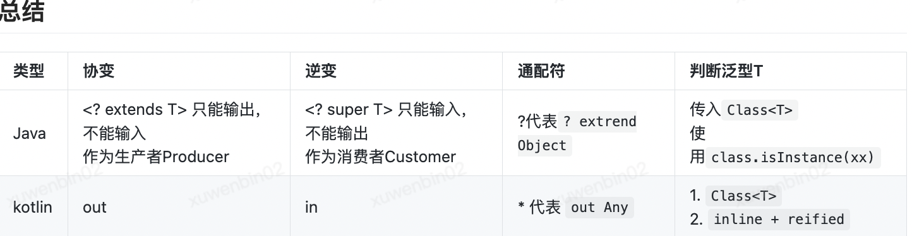

- ## 什么是泛型
  collapsed:: true
	- 泛型，即“泛化类型”。
	- 那“泛化类型”是什么？先从参数说起，我们都知道参数是方法中要传递的值，定义方法填写的是形参，调用方法传入的是实参。泛化类型就是将原来具体的类型抽象化，此时类型也定义成参数形式，然后在使用/调用时传入具体的类型
	- ```
	  //a,b是形参
	  int plusNumber(int a,int b){
	      return a + b;
	  }
	  
	  //调用传入的值为实参
	  plusNumber(1,2)
	  
	  //泛型方法
	  T plusNumber(T a, T b){
	      return a + b;
	  }
	  ```
	- 泛型的本质是为了参数化类型（在不创建新的类型的情况下，通过泛型指定的不同类型来控制形参具体限制的类型）。也就是说在泛型使用过程中，操作的数据类型被指定为一个参数。这种参数类型可以用在类、接口和方法中，分别被称为泛型类、泛型接口、泛型方法。
	- 在我们使用较多的集合类，如ArrayList,HashSet,HashMap等就是泛型类。就像上面说的，我们在使用这些集合类时不会为每一个类型去实现一个具体集合类，因此JDK为我们抽象了传入类型设计了诸多集合类。
	- 还需要说明的一点是泛型是Java在1.5时引入的，当时为了兼容之前的版本，就选用了在编译时通过类型擦除这种比较别扭的方式来实现泛型。编译器在编译时会擦除类型实参，在运行时不存在任何类型相关的信息，泛型对于 JVM 来说是透明的，有泛型和没有泛型的代码通过编译器编译后所生成的二进制代码是完全相同的
- ## 类型擦除
  collapsed:: true
	- 我们在接触到泛型时就会听到有类型擦除这个名词。
	- 类型擦除是指在编译期间，所有的指定的泛型信息都会被编译器抹去，变为Object类型，在生成的字节码中是不包含泛型中类型信息的。
	- 举个例子，在代码中定义的List<Object>和List<String>等类型，在编译时都会变成List。JVM识别的只是List，而我们在定义该List<String>等设置的泛型信息对于JVM是看不到的。
	- 1
	  collapsed:: true
		- ```
		  public class Test {
		      public static void main(String[] args) {
		          //String列表
		          ArrayList<String> list1 = new ArrayList<>();
		          list1.add("a string");
		  
		          //Integer列表
		          ArrayList<Integer> list2 = new ArrayList<>();
		          list2.add(1);
		  
		          //判断两个List类型是否相等
		          System.out.println(list1.getClass() == list2.getClass());
		      }
		  }
		  ```
	- 这里最后的输出是true，两个list的class是相同的，在编译后泛型String和Integer都被擦除掉了，只剩下原始类型
	- 我们将上述代码转为class文件查看一下
	  collapsed:: true
		- ```
		  //Test.class
		  public class Test {
		      public Test() {
		      }
		  
		      public static void main(String[] var0) {
		          //这里仅剩ArrayList的声明
		          ArrayList var1 = new ArrayList();
		          var1.add("a string");
		          //这里仅剩ArrayList的声明
		          ArrayList var2 = new ArrayList();
		          var2.add(1);
		          //两个类型都是ArrayList，所以输出true
		          System.out.println(var1.getClass() == var2.getClass());
		      }
		  }
		  ```
	- 按照上文说的ArrayList在编译后会将泛型擦除，只剩下原始类型。那能否在ArrayList<String>列表添加原始类型数据呢。
	- 事实上通过反射是可以添加不同类型数据的，看下面这个例子：
	  collapsed:: true
		- ```
		  public class Test {
		  
		      public static void main(String[] args) throws Exception {
		  
		          ArrayList<Integer> list = new ArrayList<Integer>();
		  
		          list.add(1);  //这样调用 add 方法只能存储整形，因为泛型类型的实例为 Integer
		  
		          list.getClass().getMethod("add", Object.class).invoke(list, "string");
		  
		          for (int i = 0; i < list.size(); i++) {
		              System.out.println(list.get(i));
		          }
		      }
		  }
		  ```
	- 这个代码会输出：
	  collapsed:: true
		- ```
		  1
		  string
		  ```
	- Java 泛型对于类型的约束只在编译期存在，运行时仍然会按照 Java 5 之前的机制来运行，泛型的具体类型在运行时已经被删除了，所以 JVM 是识别不到我们在代码中指定的具体的泛型类型的
	  collapsed:: true
	  例如，虽然List<String>只能用于添加字符串，但我们只能泛化地识别到它属于List<?>类型，而无法具体判断出该 List 内部包含的具体类型
		- ```
		  public <T> void filter(T data) {
		          //正常
		          if (data instanceof String) {
		  
		          }
		          //👇报错 ：Expression expected
		          if (T instanceof String) {
		  
		          }
		          //👇报错 ：Class<T> is not a functional interface
		          Class<T> tClass = T::getClass;
		      }
		  ```
	- 初步看，泛型擦除好像是没什么大的问题，但是仔细想想，在强制类型转换的时候，由于会丢掉类型的一些信息，会导致一些不符合预期的事情。比如有个基类 A，和它的两个子类 B 和 C ，然后我们有下面的一段代码。
	  collapsed:: true
		- ```
		  List<A> listA = new ArrayList<A>();
		  listA.add(new B()); // 错误的，
		  ```
	- 第二行代码是不符合预期的，因为 listA 里面期望放的是 A 而不是 B。 但是这个好像不太符合预期，我们有时候希望子类是可以放进容器里面的。但是如果支持这个操作的话，会发生什么呢？取出来来的是 B 还是 C ？如果不能明确，那么就没有实现“泛型”。
	- 为了解决这个问题， Java 大佬们想了个方法，提出了一些通配符来解决这些问题。
- ## ?通配符
	- ? 通配符称为无限通配符，表示不确定类型
- ## 上界通配符 extends
  collapsed:: true
	- extends一般称为上界通配符，表示的意思是：取值范围为 (某个类的子类, 某个类]。<? extends E> 的类能保证从这个定义类中拿到的数据E，一定是E的子类。它限定了泛型的父类型。
	- 在继承关系树中，子类继承自父类，可以认为父类在上，子类在下。可以将父类作为上界，子类作为下界来说的话。
	- 因此extends被称为上界通配符.
	- 不过 extends只能用于输出，不能用于输入。
	- 举个例子：
	  collapsed:: true
		- ```
		  List<Dog> dogs = new ArrayList<>();
		  List<? extends Animal> animals = dogs;
		  Animal animal = animals.get(0);
		                          //👆 可以直接取出
		  animals.add(new Dog());
		              //👆 报错：Required type:capture of ? extends Animal   Provided:Dog
		  ```
	- 声明了上界通配符泛型的集合，不再允许 add 新的对象，子类不行，父类也不行。拓展开来说：不止是集合，自己写的泛型类也不行。
	- 由于只能输出，向外部提供数据，从这个角度来说，向外提供数据的一方被称为生产者 Producer，即PECS原则中的Producer-Extends。生产者对于的消息者 Customer，对应Java里面另一个泛型通配符：？ super E
- ## 下界通配符 super
  collapsed:: true
	- 下界通配符表示的意思是：取值范围为 [某个类，这个类的父类)，与extends仅能输出相反，? super E只能输入数据，不能输出。
	- ```
	  List<? super Dog> dogs = new ArrayList<>();
	  dogs.add(new Dog());
	  //👆 可以直接添加
	  Object obj = dogs.get(0);
	                  //👆 get出的Object类型，在 Java 里任何对象都是 Object 的子类
	  Animal animal = dogs.get(0);
	                      //👆 报错：Required type:Animal Provided:capture of ? super Dog
	  ```
	- 下界通配符 ? super 的泛型，只能读取到 Object对象，一般没有什么实际的使用场景，通常也只拿它来添加数据，也就是消费已有的List<? super E>，往里面添加数据，因此这种泛型类型声明称之为消费者 Consumer即PECS原则中的Consumer-Super。
- ## 协变、逆变？
  collapsed:: true
	- 在我们学习泛型时可能会听到什么：协变、逆变，甚至还有个”不变“？？？下面来介绍一下这几个名词是用来干嘛的。
	- 协变和逆变都是术语，它们都是用来描述数据在存取过程中显示的类型。
	- 举个例子：
	  collapsed:: true
		- ```
		  List<Dog> dogs = new ArrayList<>();
		  List<Animal> animals = dogs;
		          //👆 报错：Required type: List<Animal>  Provided:List<Dog>
		  ```
	- Dog是Animal的子类，但List<Dog>不是List<Animal>子类，上面的赋值出现了错误。这是因为Java的泛型本身具有不可变性：Invariance。
	- ### 协变
	  collapsed:: true
		- covariant[koʊˈveriənt,koʊˈværiənt]  在参数类型中父类和子类在构造过程中使用了派生程度更大的父类，叫做协变
		- 例如上个例子里，不能将List<Dog>赋值给List<Animal>，是因为他们俩不具有继承关系。但我们可以通过上界通配符 extends使得List<Dog>是List<? extends Animal>子类，改变了上述中的不可变性，来使泛型支持可变，这种可变叫做协变。
			- ```
			  List<Dog> dogs = new ArrayList<>();
			  List<? extends Animal> animals = dogs;
			          //👆 赋值通过
			  ```
		- 但是extends只能读取不能修改，这里的修改仅指对泛型集合添加元素，如果是 remove(int index) 以及 clear 当然是可以的。
	- ### 逆变
		- contravariant [kɔntrə'væriənt] 在参数类型中父类和子类在构造过程中逆转了父类，使用了比父类派生程度更小的子类，叫做逆变
		- 例子：
		  collapsed:: true
			- ```
			  List<Animal> animals = new ArrayList<>();
			  List<? super Dog> dogs = animals;
			          //👆 赋值通过
			  ```
		- 这个例子Animal是Dog的父类，但使用了泛型通配符? super，List<Animal>是List<? super Dog>的子类。协变还比较好理解，毕竟其继承关系是相同的，但逆变就比较反直觉了，整个继承关系都倒过来了。
		- 使用? super来使泛型支持逆变，但是只能修改不能读取。
		- 这里说的不能读取是指不能按照泛型类型读取，你如果按照 Object 读出来再强转当然也是可以的。
	-
- ## Kotlin中的泛型
  collapsed:: true
	- kotlin也是支持泛型的，和Java上下界通配符一样，kotlin中使用in和out来标识上下界。
	- ### in，out关键字
		- out 和 in 都是 Kotlin 的关键字，其作用都是为了来应对泛型问题。in 和 out 是一个对立面，同时它们又与泛型不变相对立，统称为型变
		- out 出去的意思，本身带有倾向于取值操作，用于泛型协变，等同于 Java 中的上界通配符 ? extends
		  in 进来的意思，本身带有倾向于存值操作，用于泛型逆变，等同于 Java 中的下界通配符 ? super
	- ### 支持协变的List
	  collapsed:: true
		- 对 Kotlin 有一定了解的同学应该知道，Kotlin 中的集合框架分为两种大类：可读可写和只能读不能写
		  以 Java 中的 ArrayList 为例，Kotlin 将之分为了 MutableList 和 List 两种类型的接口。而 List接口中的泛型已经使用 out关键字进行修饰了，且不包含任何传入值并保存的方法，即 List 接口只支持读值而不支持写值
		- ```
		  / Collections.kt
		  // E被声明为out
		  public interface List<out E> : Collection<E> {
		  
		      override val size: Int
		      override fun isEmpty(): Boolean
		  
		      // E作为函数形参类型，而且还加上了@UnsafeVariance注解，下面会解释
		      override fun contains(element: @UnsafeVariance E): Boolean
		  
		      // E作为函数返回值的类型Iterator泛型的类型实参
		      override fun iterator(): Iterator<E>
		  
		      // E作为函数形参的类型Collection泛型的类型实参，而且还加上了@UnsafeVariance注解，下面会解释
		      override fun containsAll(elements: Collection<@UnsafeVariance E>): Boolean
		  
		      // E作为函数返回值的类型
		      public operator fun get(index: Int): E
		  
		      // E作为函数形参类型，而且还加上了@UnsafeVariance注解，下面会解释
		      public fun indexOf(element: @UnsafeVariance E): Int
		  
		      // E作为函数形参类型，而且还加上了@UnsafeVariance注解，下面会解释
		      public fun lastIndexOf(element: @UnsafeVariance E): Int
		  
		      // E作为函数返回值的类型ListIterator泛型的类型实参
		      public fun listIterator(): ListIterator<E>
		  
		      // E作为函数返回值的类型ListIterator泛型的类型实参
		      public fun listIterator(index: Int): ListIterator<E>
		  
		      // E作为函数返回值的类型List泛型的类型实参
		      public fun subList(fromIndex: Int, toIndex: Int): List<E>
		  
		  }
		  ```
		- @UnsafeVariance
		  在上面说的List源码中，我们发现虽然List是协变的，但是有时出现的位置是逆变的位置，这是为什么呢？其实是可以出现在任何位置上，但是要保证以下两点定义：协变保证泛型内部操作类型时是只读的，逆变保证泛型内部操作类型时是只写的，大体上要遵循上面说的那几个out协变点和in逆变点。
		- 我们可以通过加上@UnsafeVariance注解告诉编译器这个地方是合法、安全，让其通过编译，如果不加的话，编译器会认为你这里是不合法，编译不通过。
		- 例如上面说的List源码中，有一个contains函数，这个函数的作用是检查此元素是否包含在此集合中，它的实现方法没有出现写操作，所以这里就可以加上@UnsafeVariance注解，让其通过编译器。
			- ```
			  // Collections.kt
			  public interface MutableList<E> : List<E>, MutableCollection<E> {
			  
			      // E作为函数形参类型
			      override fun add(element: E): Boolean
			  
			      // E作为函数形参类型
			      override fun remove(element: E): Boolean
			  
			      // E作为函数形参的类型Collection泛型的类型实参
			      override fun addAll(elements: Collection<E>): Boolean
			  
			      // E作为函数形参的类型Collection泛型的类型实参
			      public fun addAll(index: Int, elements: Collection<E>): Boolean
			  
			      // E作为函数形参的类型Collection泛型的类型实参
			      override fun removeAll(elements: Collection<E>): Boolean
			  
			      // E作为函数形参的类型Collection泛型的类型实参
			      override fun retainAll(elements: Collection<E>): Boolean
			      override fun clear(): Unit
			  
			      // E作为函数形参类型
			      public operator fun set(index: Int, element: E): E
			  
			      // E作为函数形参类型
			      public fun add(index: Int, element: E): Unit
			  
			      // E作为函数返回值的类型
			      public fun removeAt(index: Int): E
			  
			      // E作为函数返回值的类型MutableListIterator泛型的类型实参
			      override fun listIterator(): MutableListIterator<E>
			  
			      // E作为函数返回值的类型MutableListIterator泛型的类型实参
			      override fun listIterator(index: Int): MutableListIterator<E>
			  
			      // E作为函数返回值的类型MutableList泛型的类型实参
			      override fun subList(fromIndex: Int, toIndex: Int): MutableList<E>
			  
			  }
			  ```
	- ### * 号
	  collapsed:: true
		- 前面讲到了 Java 中单个 ? 号也能作为泛型通配符使用，相当于 ? extends Object。
		  它在 Kotlin 中有等效的写法：* 号，相当于 out Any。
		- 👇
		  var list: List<*>
		  Kotlin和 Java 不同的地方是，如果你的类型定义里已经有了 out 或者 in，那这个限制在变量声明时也依然在，不会被 * 号去掉。
		- 比如你的类型定义里是 out T : Number 的，那它加上 <*> 之后的效果就不是 out Any，而是 out Number。
	- ## where 关键字
	  collapsed:: true
		- Java 中声明类或接口的时候，可以使用 extends 来设置边界，将泛型类型参数限制为某个类型的子集：
		- 如果这个边界是可以设置多个，用 & 符号连接：
		  collapsed:: true
			- ```
			  //                            👇  T 的类型必须同时是 Animal 和 Food 的子类型
			  class Monster<T extends Animal & Food>{ 
			  }
			  ```
		- Kotlin 只是把 extends 换成了 : 冒号。
		  collapsed:: true
			- ```
			                 👇
			  class Monster<T : Animal>
			  ```
		- Kotlin设置多个边界可以使用 where 关键字：
		  collapsed:: true
			- ```
			  class Monster<T> where T : Animal, T : Food
			  ```
	- ### reified
		- 前面有说到，由于 Java 中的泛型存在类型擦除的情况，任何在运行时需要知道泛型确切类型信息的操作都没法用了。比如你不能在Java中通过instanceof或kotlin中使用as关键字检查一个对象是否为泛型类型 T 的实例。
		- 这个问题在Java中解决方式通常是传入当前类型的Class类型的参数，然后通过Class.isInstance方法来检查是否是泛型类。
		- ```
		                                // 👇传入Class<T>
		  <T> void check(Object item, Class<T> type) {
		      if (type.isInstance(item)) {
		              //👆 判断是否是泛型T
		      }
		  }
		  ```
		- Kotlin 中同样可以这么解决，不过还有一个更方便的做法：使用关键字 reified 配合 inline 来解决：
		  collapsed:: true
			- ```
			  //👇inline关键字  👇reified关键字
			  inline fun <reified T> printIfTypeMatch(item: Any) {
			      if (item is T) { // 👈 这里就不会在提示错误了
			  
			      }
			  }
			  ```
	-
- 总结
	- 
- 参考文章：
  https://juejin.cn/post/6935322686943920159
- https://rengwuxian.com/kotlin-generics/
- https://mp.weixin.qq.com/s/peSwYSpaWgN9YYPjwE3rnA
- https://mp.weixin.qq.com/s/g9bufOxbgaZtqxMYowyxdQ
- https://xander_wang.gitee.io/android-note/2021/02/06/android_note/android_note_01/
- https://docs.microsoft.com/zh-cn/dotnet/standard/generics/covariance-and-contravariance