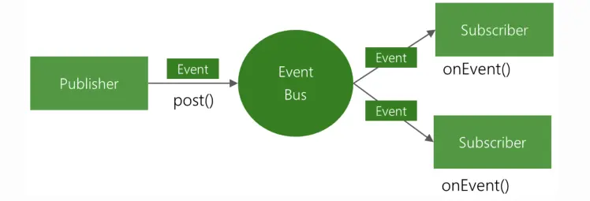
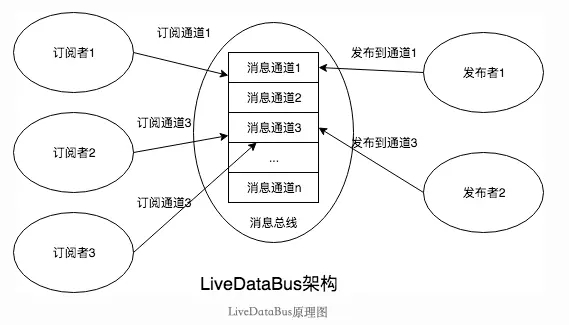
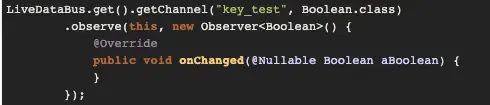
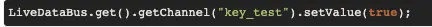
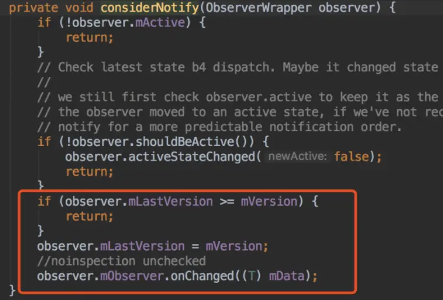
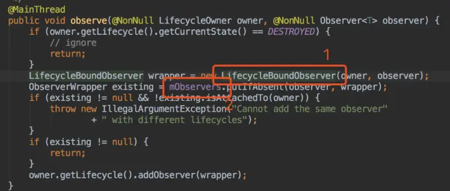
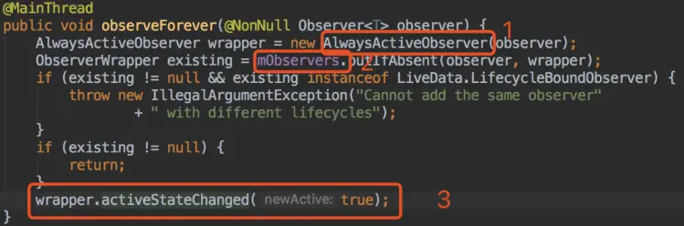
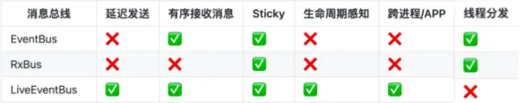

- 我们常用的消息总线，包括EventBus，RxBus，以及本次侧重为大家介绍的LiveEventBus，接下来给大家介绍在这几种消息总线在设计思想和使用方式的异同
- ## 设计思想
	- 消息总线的设计思想都是观察者模式（订阅/发布模式）
	  collapsed:: true
		- 
	- 订阅发布模式定义了一种“一对多”的依赖关系，让多个订阅者对象同时监听某一个主题对象。这个主题对象在自身状态变化时，会通知所有订阅者对象，使它们能够自动更新自己的状态。
- ## 普通用法
  collapsed:: true
	- ## EventBus
	  collapsed:: true
		- ### 1.定义消息
			- EventBus需要定义一个Java Object作为消息事件
			  collapsed:: true
				- ```
				  public class MessageEvent {
				  
				      public String msg;
				  
				      public MessageEvent(String msg) {
				          this.msg = msg;
				      }
				  }
				  ```
		- ### 2.订阅和取消订阅
		  collapsed:: true
			- EventBus需要在一个生命周期中订阅和取消订阅消息，然后用注解定义接收消息的方法
				- ```
				  @Override
				  protected void onCreate(Bundle savedInstanceState) {
				      super.onCreate(savedInstanceState);
				      setContentView(R.layout.activity_eventbus_demo);
				      EventBus.getDefault().register(this);
				  }
				  
				  @Override
				  protected void onDestroy() {
				      super.onDestroy();
				      EventBus.getDefault().unregister(this);
				  }
				  
				  @Subscribe(threadMode = ThreadMode.MAIN)
				  public void onMessageEvent(MessageEvent event) {
				      Toast.makeText(this, "receive massage: " + event.msg, Toast.LENGTH_SHORT).show();
				  }
				  ```
		- ### 3.发送消息
		  collapsed:: true
			- ```
			  public void sendMsg(View v) {
			      EventBus.getDefault().post(new MessageEvent("msg from event bus"));
			  }
			  ```
	- ## RxBus
		- ## 2.消息的订阅和取消订阅
		  collapsed:: true
			- ```
			    private Subscription mIMKickOffSubscription;  
			  @Override
			  protected void onCreate(Bundle savedInstanceState) {
			      super.onCreate(savedInstanceState);
			      setContentView(R.layout.activity_eventbus_demo);
			         mIMKickOffSubscription = RxDataManager.getBus().observeEvents(IMKickOff.class) 
			                  .observeOn(AndroidSchedulers.mainThread()) //订阅者消费的线程
			                  .subscribe(new RxWubaSubsriber<IMKickOff>() {
			                      @Override
			                      public void onNext(IMKickOff imKickOff) {
			                          IMLoginManager.getInstance().showLoginIMDialog(getActivity());
			                      }
			                  });
			  
			  }
			  
			  @Override
			  protected void onDestroy() {
			      super.onDestroy();
			          RxUtil.safeUnsubscribe(mIMKickOffSubscription);
			  }
			  ```
		- ## 3发送消息
		  collapsed:: true
			- ```
			  public void sendMsg(View v) {
			                      RxDataManager.getBus().post(new IMKickOff(true));
			  }
			  ```
		- ## RxBus原理
		  collapsed:: true
			- 在RxJava中有个Subject类，它继承Observable类，同时实现了Observer接口，因此Subject可以同时担当订阅者和被订阅者的角色，我们使用Subject的子类PublishSubject来创建一个Subject对象（PublishSubject只有被订阅后才会把接收到的事件立刻发送给订阅者），在需要接收事件的地方，订阅该Subject对象，之后如果Subject对象接收到事件，则会发射给该订阅者，此时Subject对象充当被订阅者的角色。
			- 完成了订阅，在需要发送事件的地方将事件发送给之前被订阅的Subject对象，则此时Subject对象作为订阅者接收事件，然后会立刻将事件转发给订阅该Subject对象的订阅者，以便订阅者处理相应事件，到这里就完成了事件的发送和处理。
			- 最后就是取消订阅的操作，RxJava中，订阅操作会返回一个Subscription对象，以便在合适的时机取消订阅，防止内存泄漏，如果一个类产生多个Subscription对象，我们可以用一个CompositeSubscription存储起来，以进行批量的取消订阅。
			- RxBus有很多的实现
			- 基于RxJava1的RxBus实现：
				- ```
				  public final class RxBus {
				  
				      private final Subject<Object, Object> bus;
				  
				      private RxBus() {
				          bus = new SerializedSubject<>(PublishSubject.create());
				      }
				  
				      private static class SingletonHolder {
				          private static final RxBus defaultRxBus = new RxBus();
				      }
				  
				      public static RxBus getInstance() {
				          return SingletonHolder.defaultRxBus;
				      }
				  
				      /*
				       * 发送
				       */
				      public void post(Object o) {
				          bus.onNext(o);
				      }
				  
				      /*
				       * 是否有Observable订阅
				       */
				      public boolean hasObservable() {
				          return bus.hasObservers();
				      }
				  
				      /*
				       * 转换为特定类型的Obserbale
				       */
				      public <T> Observable<T> toObservable(Class<T> type) {
				          return bus.ofType(type);
				      }
				  }
				  
				  ```
- ## 引入LiveDataBus
	- LiveData是一个可以观察的数据持有类，它可以感知并遵循Activity，Fragment或Service等组件的生命周期。正是由于LiveData对组件生命周期可感知特点，因此可以做到仅在组件处于生命周期的激活状态时才更新UI数据。
	- LiveData需要一个观察者对象，一般是Observer类的具体实现。当观察者的生命周期处于STARTED或RESUMED状态时，LiveData会通知观察者数据变化；
	- 在观察者处于其他状态时，即使LiveData的数据变化了，也不会通知。
	- ## LiveData的优点
		- UI和实时数据保持一致
		- 避免内存泄漏
		- 不会再产生由于Activity处于stop状态而引起的崩溃
	- LiveEventBus不需要为每一个事件都定义一个Java Object，只需要维护一个String类型的消息名字即可，每一个消息可以携带任何类型的Java Object作为消息的payload，十分灵活。
	- 并且如果是在Activity这种LifecycleOwner中使用LiveEventBus，只需要订阅消息，不需要手动取消订阅，消息会在观察者生命周期结束的时候自动取消订阅。
	- ## 2.订阅消息
	  collapsed:: true
		- ```
		  @Override
		  protected void onCreate(Bundle savedInstanceState) {
		      super.onCreate(savedInstanceState);
		      setContentView(R.layout.activity_eventbus_demo);
		      LiveEventBus
		              .get(TEST_KEY, String.class)
		              .observe(this, new Observer<String>() {
		                  @Override
		                  public void onChanged(@Nullable String s) {
		                      Toast.makeText(LiveEventBusDemo.this, "receive massage: " + s, Toast.LENGTH_SHORT).show();
		                  }
		              });
		  }
		  ```
	- ## 3发送消息
		- ```
		  public void sendMsg(View v) {
		      LiveEventBus
		              .get(TEST_KEY)
		              .post("msg from liveeventbus");
		  }
		  ```
	- 1.LiveEventBus for Android，消息总线，基于LiveData，具有生命周期感知能力，支持Sticky，支持AndroidX，支持跨进程，支持跨APP
	- LiveEventBus优势
	- 生命周期感知
	- 消息随时订阅，自动取消订阅
	- 告别消息总线造成的内存泄漏
	- 告别生命周期造成的崩溃
	- LiveDataBus依赖方支持更好 LiveDataBus只依赖Android官方Android Architecture Components组件的LiveData，相比RxBus依赖的RxJava和RxAndroid，依赖方支持更好。
	  collapsed:: true
	  LiveDataBus具有生命周期感知 LiveDataBus具有生命周期感知，在Android系统中使用调用者不需要调用反注册，相比EventBus和RxBus使用更为方便，并且没有内存泄漏风险       
	  LiveDataBus原理图
		- 
		- 
	- 核心实现了通信总线的功能，具有生命周期感知能力，使用简单。
		- 注册订阅
		  collapsed:: true
			- 
		- 发送消息
		  collapsed:: true
			- 
	- 存在问题
		- 粘性消息，订阅者会收到订阅前发送的消息，因为LiveData的粘性问题
		- 具体代码中指的是，先setValue/postValue,后调用observe(),如果成功收到了回调，即为粘性事件。
			- 
		- 如果ObserverWrapper的mLastVersion小于LiveData的mVersion，就会去回调mObserver的onChanged方法。而每个新的订阅者，其version都是-1，LiveData一旦设置过其version是大于-1的（每次LiveData设置值都会使其version加1），这样就会导致LiveDataBus每注册一个新的订阅者，这个订阅者立刻会收到一个回调，即使这个设置的动作发生在订阅之前
	- 复现场景
		- 使用同一个LiveData
	- 解决方案
	  collapsed:: true
		- 看看LiveData的observe方法，他会在步骤1创建一个LifecycleBoundObserver，LifecycleBoundObserver是ObserverWrapper的派生类。然后会在步骤2把这个LifecycleBoundObserver放入一个私有Map容器mObservers中。无论ObserverWrapper还是LifecycleBoundObserver都是私有的或者包可见的，所以无法通过继承的方式更改LifecycleBoundObserver的version。
		- 那么能不能从Map容器mObservers中取到LifecycleBoundObserver，然后再更改version呢？答案是肯定的，通过查看SafeIterableMap的源码有一个protected的get方法。因此，在调用observe的时候，通过反射拿到LifecycleBoundObserver，再把LifecycleBoundObserver的version设置成和LiveData一致
		- {:height 312, :width 716}
		- 对于非生命周期感知的observeForever方法来说，实现的思路是一致的，但是具体的实现略有不同。observeForever的时候，生成的wrapper不是LifecycleBoundObserver，而是AlwaysActiveObserver（步骤1），没有机会在observeForever调用完成之后再去更改AlwaysActiveObserver的version，因为在observeForever方法体内，步骤3的语句，回调就发生了。
		- 
	- 那么对于observeForever，如何解决这个问题呢？既然是在调用内回调的，那么我们可以写一个ObserverWrapper，把真正的回调给包装起来。把ObserverWrapper传给observeForever，那么在回调的时候我们去检查调用栈，如果回调是observeForever方法引起的，那么就不回调真正的订阅者。
	- 最终实现
	  collapsed:: true
		- ```
		  public final class LiveDataBus {
		  
		      private final Map<String, BusMutableLiveData<Object>> bus;
		  
		      private LiveDataBus() {
		          bus = new HashMap<>();
		      }
		  
		      private static class SingletonHolder {
		          private static final LiveDataBus DEFAULT_BUS = new LiveDataBus();
		      }
		  
		      public static LiveDataBus get() {
		          return SingletonHolder.DEFAULT_BUS;
		      }
		  
		      public <T> MutableLiveData<T> with(String key, Class<T> type) {
		          if (!bus.containsKey(key)) {
		              bus.put(key, new BusMutableLiveData<>());
		          }
		          return (MutableLiveData<T>) bus.get(key);
		      }
		  
		      public MutableLiveData<Object> with(String key) {
		          return with(key, Object.class);
		      }
		  
		      private static class ObserverWrapper<T> implements Observer<T> {
		  
		          private Observer<T> observer;
		  
		          public ObserverWrapper(Observer<T> observer) {
		              this.observer = observer;
		          }
		  
		          @Override
		          public void onChanged(@Nullable T t) {
		              if (observer != null) {
		                  if (isCallOnObserve()) {
		                      return;
		                  }
		                  observer.onChanged(t);
		              }
		          }
		  
		          private boolean isCallOnObserve() {
		              StackTraceElement[] stackTrace = Thread.currentThread().getStackTrace();
		              if (stackTrace != null && stackTrace.length > 0) {
		                  for (StackTraceElement element : stackTrace) {
		                      if ("android.arch.lifecycle.LiveData".equals(element.getClassName()) &&
		                              "observeForever".equals(element.getMethodName())) {
		                          return true;
		                      }
		                  }
		              }
		              return false;
		          }
		      }
		  
		      private static class BusMutableLiveData<T> extends MutableLiveData<T> {
		  
		          private Map<Observer, Observer> observerMap = new HashMap<>();
		  
		          @Override
		          public void observe(@NonNull LifecycleOwner owner, @NonNull Observer<T> observer) {
		              super.observe(owner, observer);
		              try {
		                  hook(observer);
		              } catch (Exception e) {
		                  e.printStackTrace();
		              }
		          }
		  
		          @Override
		          public void observeForever(@NonNull Observer<T> observer) {
		              if (!observerMap.containsKey(observer)) {
		                  observerMap.put(observer, new ObserverWrapper(observer));
		              }
		              super.observeForever(observerMap.get(observer));
		          }
		  
		          @Override
		          public void removeObserver(@NonNull Observer<T> observer) {
		              Observer realObserver = null;
		              if (observerMap.containsKey(observer)) {
		                  realObserver = observerMap.remove(observer);
		              } else {
		                  realObserver = observer;
		              }
		              super.removeObserver(realObserver);
		          }
		  
		          private void hook(@NonNull Observer<T> observer) throws Exception {
		              //get wrapper\'s version
		              Class<LiveData> classLiveData = LiveData.class;
		              Field fieldObservers = classLiveData.getDeclaredField("mObservers");
		              fieldObservers.setAccessible(true);
		              Object objectObservers = fieldObservers.get(this);
		              Class<?> classObservers = objectObservers.getClass();
		              Method methodGet = classObservers.getDeclaredMethod("get", Object.class);
		              methodGet.setAccessible(true);
		              Object objectWrapperEntry = methodGet.invoke(objectObservers, observer);
		              Object objectWrapper = null;
		              if (objectWrapperEntry instanceof Map.Entry) {
		                  objectWrapper = ((Map.Entry) objectWrapperEntry).getValue();
		              }
		              if (objectWrapper == null) {
		                  throw new NullPointerException("Wrapper can not be bull!");
		              }
		              Class<?> classObserverWrapper = objectWrapper.getClass().getSuperclass();
		              Field fieldLastVersion = classObserverWrapper.getDeclaredField("mLastVersion");
		              fieldLastVersion.setAccessible(true);
		              //get livedata\'s version
		              Field fieldVersion = classLiveData.getDeclaredField("mVersion");
		              fieldVersion.setAccessible(true);
		              Object objectVersion = fieldVersion.get(this);
		              //set wrapper\'s version
		              fieldLastVersion.set(objectWrapper, objectVersion);
		          }
		      }
		  }
		  ```
	- ## 线程分发
	- ### EventBus
		- EventBus可以为你处理线程：事件可以被发布到与发布线程不同的线程中。一般用法是处理UI，在安卓中UI的处理需要在主线程中完成。
		- 底层采用Handler消息机制实现线程间通信
		- 设置接收消息的线程需要在订阅的时候用threadMode设置：
		- EventBus支持的线程模式有：
		- 1.POSITION    2.MAIN  3.MAIN_ORDERED 4.BACKGROUND  5.ASYNC
	- ## RxBus
		- RxBus以Rxjava的模式实现线程切换，例如：
		  collapsed:: true
			- ```
			  RxBus.getInstance()
			          .toObservable(MessageEvent.class)
			          .observeOn(AndroidSchedulers.mainThread())
			          .subscribe(new Consumer<MessageEvent>() {
			              @Override
			              public void accept(MessageEvent event) throws Exception {
			                  Toast.makeText(RxBusDemo.this, "receive massage: " + event.msg, Toast.LENGTH_SHORT).show();
			              }
			          }));
			  ```
	- ## LiveEventBus
		- LiveEventBus基于LiveData实现，接收消息只能在主线程完成，发送消息可以在主线程或者后台线程发送。
	- ## 跨进程/跨APP发送消息
		- EventBus和Rxbus不可跨进程发送消息。
		  LiveEventBus实现原理，广播实现跨进程发消息
		- 
- # 总结
	- 