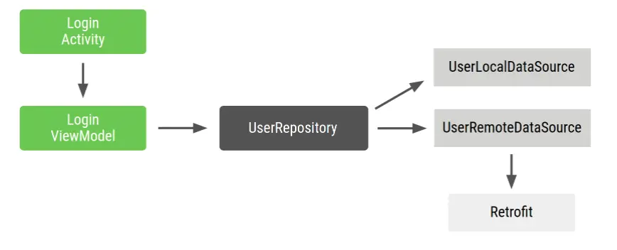

- # 前言 Hilt是什么
  collapsed:: true
	- hilt是一个功能强大且用法简单的依赖注入框架，那么为什么要使用hilt？为什么要使用依赖注入框架？
- # Android中的依赖项注入
	- ## 什么是依赖项注入
		- 具体含义是：当某个角色（可能是一个Java实例，调用者）需要另一个角色（另一个Java实例，被调用者）的协助时，在传统的程序设计过程中，通常由调用者来创建被调用者的实例。而在依赖注入框架中，创建被调用者的工作不再由调用者来完成，创建被调用者实例的工作由依赖注入框架容器来完成。然后注入调用者，因此称为依赖注入。
		- 下面是一个示例，Car创建自己的Engine依赖项
		  collapsed:: true
			- ```
			  class Car {
			  
			     private val engine = Engine()
			  
			     fun start() {
			         engine.start()
			     }
			  }
			  
			  fun main(args: Array) {
			     val car = Car()
			     car.start()
			  }
			  ```
		- 问题：Car和Engine密切相关，Car的实例使用一种类型的Engine，无法轻松使用子类或替代实现，如果Car要构造自己的Engine，而不是直接将同一Car重用于Gas和Electrics类型的引擎
		  collapsed:: true
		  如果使用依赖项注入，代码是什么样子？Car的每个实例在其构造函数中接收Engine对象作为参数，而不是在初始化时构造自己的Engine对象：
			- ```
			  class Car(private val engine: Engine) {
			     fun start() {
			         engine.start()
			     }
			  }
			  
			  fun main(args: Array) {
			     val engine = Engine()
			     val car = Car(engine)
			     car.start()
			  }
			  ```
		- Android中有两种主要的依赖项注入方式：
		- 构造函数注入
		  将某个类的依赖项传入其构造函数。
		- 字段注入android框架类（如Activity和Fragment）由系统实例化，无法通过构造函数注入
		  collapsed:: true
			- ```
			  class Car {
			     lateinit var engine: Engine
			  
			     fun start() {
			         engine.start()
			     }
			  }
			  
			  fun main(args: Array) {
			     val car = Car()
			     car.engine = Engine()
			     car.start()
			  }
			  ```
		- ## 手动依赖项注入
		  collapsed:: true
			- 
			- 这是一个典型的Android登录流程，LoginActivity依赖于LoginViewModel，LoginViewModel依赖于UserRepository,UserRepository依赖于UserLocalDataSource和UserRemoteDataSource，而后者又依赖于Retrofit服务
			  Repository和DataSource类如下所示：
			- ```
			  class UserRepository(
			         private val localDataSource: UserLocalDataSource,
			         private val remoteDataSource: UserRemoteDataSource
			     ) { ... }
			  
			     class UserLocalDataSource { ... }
			     class UserRemoteDataSource(
			         private val loginService: LoginRetrofitService
			     ) { ... }
			  ```
			- LoginActivity如下所示
			  collapsed:: true
				- ```
				  
				  ```
			- 存在以下问题：
			  1.大量样板代码
			  2.必须按顺序声明依赖项
			  3.很难重复使用对象，如需在多项功能中重复使用UserRepository，必须使其遵循单例模式。
		- ## 使用容器管理依赖项
			- 如需解决重复使用对象的问题，可以创建自己的依赖项容器，用于获取依赖项。此容器提供的所有实例可以是公共实例。在该示例中，由于您仅需要UserRepository的一个实例，
			  collapsed:: true
			  您可以将其依赖项设为私有，并且可以在将来需要提供依赖项时将其公开
				- ```
				  // Container of objects shared across the whole app
				     public class AppContainer {
				  
				         // Since you want to expose userRepository out of the container, you need to satisfy
				         // its dependencies as you did before
				         private Retrofit retrofit = new Retrofit.Builder()
				                 .baseUrl("https://example.com")
				                 .build()
				                 .create(LoginService.class);
				  
				         private UserRemoteDataSource remoteDataSource = new UserRemoteDataSource(retrofit);
				         private UserLocalDataSource localDataSource = new UserLocalDataSource();
				  
				         // userRepository is not private; it'll be exposed
				         public UserRepository userRepository = new UserRepository(localDataSource, remoteDataSource);
				     }
				  ```
			- 由于这些依赖项在整个应用中使用，因此需要将它们放置在所有Activity都可以使用的通用位置：应用类。创建一个包含AppContainer实例的自定义应用类
			  collapsed:: true
				- ```
				  / Custom Application class that needs to be specified
				     // in the AndroidManifest.xml file
				     public class MyApplication extends Application {
				  
				         // Instance of AppContainer that will be used by all the Activities of the app
				         public AppContainer appContainer = new AppContainer();
				     }
				  ```
			- 现在可以从应用中获取AppContainer的实例并获取共享UserRepository实例：
			  collapsed:: true
				- ```
				  public class MainActivity extends Activity {
				  
				         private LoginViewModel loginViewModel;
				  
				         @Override
				         protected void onCreate(Bundle savedInstanceState) {
				             super.onCreate(savedInstanceState);
				             setContentView(R.layout.activity_main);
				  
				             // Gets userRepository from the instance of AppContainer in Application
				             AppContainer appContainer = ((MyApplication) getApplication()).appContainer;
				             loginViewModel = new LoginViewModel(appContainer.userRepository);
				         }
				     }
				  ```
			- 所有Activity共享AppContainer，并且没有使用单例，如果要在更多位置使用LoginViewModel，可以将LoginViewModel的创建移至容器，并为工厂提供该类型的新对象。LoginViewModelFactory
			  collapsed:: true
				- ```
				  // Definition of a Factory interface with a function to create objects of a type
				     interface Factory {
				         fun create(): T
				     }
				  
				     // Factory for LoginViewModel.
				     // Since LoginViewModel depends on UserRepository, in order to create instances of
				     // LoginViewModel, you need an instance of UserRepository that you pass as a parameter.
				     class LoginViewModelFactory(private val userRepository: UserRepository) : Factory {
				         override fun create(): LoginViewModel {
				             return LoginViewModel(userRepository)
				         }
				     }
				  ```
			- 您可以在AppContainer中添加LoginViewModelFactory并让LoginActivity使用它：
			  collapsed:: true
				- ```
				  // AppContainer can now provide instances of LoginViewModel with LoginViewModelFactory
				     class AppContainer {
				         ...
				         val userRepository = UserRepository(localDataSource, remoteDataSource)
				  
				         val loginViewModelFactory = LoginViewModelFactory(userRepository)
				     }
				  
				     class LoginActivity: Activity() {
				  
				         private lateinit var loginViewModel: LoginViewModel
				  
				         override fun onCreate(savedInstanceState: Bundle?) {
				             super.onCreate(savedInstanceState)
				  
				             // Gets LoginViewModelFactory from the application instance of AppContainer
				             // to create a new LoginViewModel instance
				             val appContainer = (application as MyApplication).appContainer
				             loginViewModel = appContainer.loginViewModelFactory.create()
				         }
				     }
				  ```