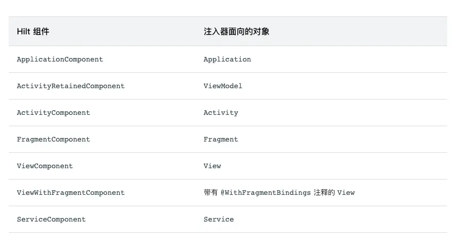
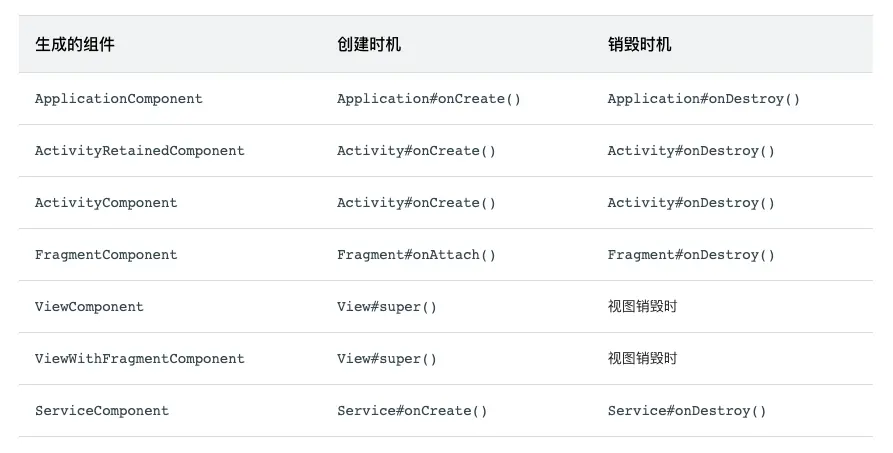
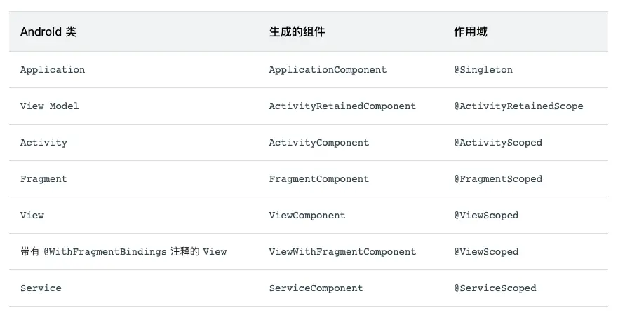

# 前言 Hilt是什么
	- hilt是一个功能强大且用法简单的依赖注入框架，那么为什么要使用hilt？为什么要使用依赖注入框架？
- # Android中的依赖项注入
	- ## 什么是依赖项注入
		- 具体含义是：当某个角色（可能是一个Java实例，调用者）需要另一个角色（另一个Java实例，被调用者）的协助时，在传统的程序设计过程中，通常由调用者来创建被调用者的实例。而在依赖注入框架中，创建被调用者的工作不再由调用者来完成，创建被调用者实例的工作由依赖注入框架容器来完成。然后注入调用者，因此称为依赖注入。
		- 下面是一个示例，Car创建自己的Engine依赖项
			- ```
			  class Car {
			  
			     private val engine = Engine()
			  
			     fun start() {
			         engine.start()
			     }
			  }
			  
			  fun main(args: Array) {
			     val car = Car()
			     car.start()
			  }
			  ```
		- 问题：Car和Engine密切相关，Car的实例使用一种类型的Engine，无法轻松使用子类或替代实现，如果Car要构造自己的Engine，而不是直接将同一Car重用于Gas和Electrics类型的引擎
		  如果使用依赖项注入，代码是什么样子？Car的每个实例在其构造函数中接收Engine对象作为参数，而不是在初始化时构造自己的Engine对象：
			- ```
			  class Car(private val engine: Engine) {
			     fun start() {
			         engine.start()
			     }
			  }
			  
			  fun main(args: Array) {
			     val engine = Engine()
			     val car = Car(engine)
			     car.start()
			  }
			  ```
		- Android中有两种主要的依赖项注入方式：
		- 构造函数注入
		  将某个类的依赖项传入其构造函数。
		- 字段注入android框架类（如Activity和Fragment）由系统实例化，无法通过构造函数注入
			- ```
			  class Car {
			     lateinit var engine: Engine
			  
			     fun start() {
			         engine.start()
			     }
			  }
			  
			  fun main(args: Array) {
			     val car = Car()
			     car.engine = Engine()
			     car.start()
			  }
			  ```
		- ## 手动依赖项注入
			- 
			- 这是一个典型的Android登录流程，LoginActivity依赖于LoginViewModel，LoginViewModel依赖于UserRepository,UserRepository依赖于UserLocalDataSource和UserRemoteDataSource，而后者又依赖于Retrofit服务
			  Repository和DataSource类如下所示：
			- ```
			  class UserRepository(
			         private val localDataSource: UserLocalDataSource,
			         private val remoteDataSource: UserRemoteDataSource
			     ) { ... }
			  
			     class UserLocalDataSource { ... }
			     class UserRemoteDataSource(
			         private val loginService: LoginRetrofitService
			     ) { ... }
			  ```
			- LoginActivity如下所示
				- ```
				  
				  ```
			- 存在以下问题：
			  1.大量样板代码
			  2.必须按顺序声明依赖项
			  3.很难重复使用对象，如需在多项功能中重复使用UserRepository，必须使其遵循单例模式。
		- ## 使用容器管理依赖项
			- 如需解决重复使用对象的问题，可以创建自己的依赖项容器，用于获取依赖项。此容器提供的所有实例可以是公共实例。在该示例中，由于您仅需要UserRepository的一个实例，
			  您可以将其依赖项设为私有，并且可以在将来需要提供依赖项时将其公开
				- ```
				  // Container of objects shared across the whole app
				     public class AppContainer {
				  
				         // Since you want to expose userRepository out of the container, you need to satisfy
				         // its dependencies as you did before
				         private Retrofit retrofit = new Retrofit.Builder()
				                 .baseUrl("https://example.com")
				                 .build()
				                 .create(LoginService.class);
				  
				         private UserRemoteDataSource remoteDataSource = new UserRemoteDataSource(retrofit);
				         private UserLocalDataSource localDataSource = new UserLocalDataSource();
				  
				         // userRepository is not private; it'll be exposed
				         public UserRepository userRepository = new UserRepository(localDataSource, remoteDataSource);
				     }
				  ```
			- 由于这些依赖项在整个应用中使用，因此需要将它们放置在所有Activity都可以使用的通用位置：应用类。创建一个包含AppContainer实例的自定义应用类
				- ```
				  / Custom Application class that needs to be specified
				     // in the AndroidManifest.xml file
				     public class MyApplication extends Application {
				  
				         // Instance of AppContainer that will be used by all the Activities of the app
				         public AppContainer appContainer = new AppContainer();
				     }
				  ```
			- 现在可以从应用中获取AppContainer的实例并获取共享UserRepository实例：
				- ```
				  public class MainActivity extends Activity {
				  
				         private LoginViewModel loginViewModel;
				  
				         @Override
				         protected void onCreate(Bundle savedInstanceState) {
				             super.onCreate(savedInstanceState);
				             setContentView(R.layout.activity_main);
				  
				             // Gets userRepository from the instance of AppContainer in Application
				             AppContainer appContainer = ((MyApplication) getApplication()).appContainer;
				             loginViewModel = new LoginViewModel(appContainer.userRepository);
				         }
				     }
				  ```
			- 所有Activity共享AppContainer，并且没有使用单例，如果要在更多位置使用LoginViewModel，可以将LoginViewModel的创建移至容器，并为工厂提供该类型的新对象。LoginViewModelFactory
				- ```
				  // Definition of a Factory interface with a function to create objects of a type
				     interface Factory {
				         fun create(): T
				     }
				  
				     // Factory for LoginViewModel.
				     // Since LoginViewModel depends on UserRepository, in order to create instances of
				     // LoginViewModel, you need an instance of UserRepository that you pass as a parameter.
				     class LoginViewModelFactory(private val userRepository: UserRepository) : Factory {
				         override fun create(): LoginViewModel {
				             return LoginViewModel(userRepository)
				         }
				     }
				  ```
			- 您可以在AppContainer中添加LoginViewModelFactory并让LoginActivity使用它：
				- ```
				  // AppContainer can now provide instances of LoginViewModel with LoginViewModelFactory
				     class AppContainer {
				         ...
				         val userRepository = UserRepository(localDataSource, remoteDataSource)
				  
				         val loginViewModelFactory = LoginViewModelFactory(userRepository)
				     }
				  
				     class LoginActivity: Activity() {
				  
				         private lateinit var loginViewModel: LoginViewModel
				  
				         override fun onCreate(savedInstanceState: Bundle?) {
				             super.onCreate(savedInstanceState)
				  
				             // Gets LoginViewModelFactory from the application instance of AppContainer
				             // to create a new LoginViewModel instance
				             val appContainer = (application as MyApplication).appContainer
				             loginViewModel = appContainer.loginViewModelFactory.create()
				         }
				     }
				  ```
			- 思考：使用了AppContainer之后，我们需要重点关注：针对不同的业务场景如何管理AppContainer中的依赖项，并且为依赖项创建工厂
	- ## 管理应用流程中的依赖项
		- 如需在项目中添加更多功能，AppContainer会变得非常复杂。当应用变大并且可以引入不同功能流程时，还会出现更多问题：
		- 官方示例业务场景：
		  登录流程由一个Activity（LoginActivity）和多个Fragment（LoginUsernameFragment和LoginPasswordFragment），这些试图需要：
			- 1.访问需要共享的同一LoginUserData实例，直至登录流程完成。
			- 2.当登录流程再次开始，创建一个新的LoginUserData实例。
			  使用登录流程容器实现这一目标，此容器需要能够在登陆流程开始时创建，在流程结束从内存中移除。
				- ```
				  class LoginContainer(val userRepository: UserRepository) {
				  
				         val loginData = LoginUserData()
				  
				         val loginViewModelFactory = LoginViewModelFactory(userRepository)
				     }
				  
				     // AppContainer contains LoginContainer now
				     class AppContainer {
				         ...
				         val userRepository = UserRepository(localDataSource, remoteDataSource)
				  
				         // LoginContainer will be null when the user is NOT in the login flow
				         var loginContainer: LoginContainer? = null
				     }
				  ```
		- 拥有某个流程专用的容器后，必须决定何时创建和删除容器实例。由于登录流程在Activity（LoginActivity）中是独立的，因此该Activity是管理该容器生命周期的Activity。LoginActivity可以在onCreate()中创建实例并在onDestroy()中将其删除。
			- ```
			  class LoginActivity: Activity() {
			  
			         private lateinit var loginViewModel: LoginViewModel
			         private lateinit var loginData: LoginUserData
			         private lateinit var appContainer: AppContainer
			  
			         override fun onCreate(savedInstanceState: Bundle?) {
			             super.onCreate(savedInstanceState)
			             appContainer = (application as MyApplication).appContainer
			  
			             // Login flow has started. Populate loginContainer in AppContainer
			             appContainer.loginContainer = LoginContainer(appContainer.userRepository)
			  
			             loginViewModel = appContainer.loginContainer.loginViewModelFactory.create()
			             loginData = appContainer.loginContainer.loginData
			         }
			  
			         override fun onDestroy() {
			             // Login flow is finishing
			             // Removing the instance of loginContainer in the AppContainer
			             appContainer.loginContainer = null
			             super.onDestroy()
			         }
			     }
			  ```
		- 与LoginActivity一样，登录Fragment可以从AppContainer访问LoginContainer并使用共享的LoginUserData实例。
	- ## 依赖注入框架的作用
	  collapsed:: true
		- 在上面的简单示例中，自行创建，提供并管理不同类的依赖项，不依赖于库。这种称为手动依赖项注入或者人工依赖项注入。如果依赖项和类越多，手动依赖项注入越繁琐。
		- 对于大型项目，获取所有依赖项并正确的连接他们需要大量样板代码。而依赖注入框架通过自动执行创建和提供依赖项，分为两大类：
		- 1.基于反射的解决方案，在运行时连接依赖项
		  2.静态解决方案，可生成在编译时连接依赖项的代码
		  Hilt是采用第二种解决方案，在dagger的基础上构建而成，受益于Dagger提供的编译时正确性。
		- ## Android常用的依赖注入框架，绕不开的Dagger
			- Dagger是由Square公司开发的使用反射实现的依赖注入，我们在编译期无法得知依赖注入的用法对不对，只能在运行时，通过程序是否崩溃判断，容易将一些bug
			- 隐藏的很深。
			  Google开发了Dagger2，通过注解，Dagger2会在编译期自动生成用于依赖注入的代码，不会增加任何运行耗时，另外，Dagger2会在编译期检查开发者的依赖注入用法是否正确，如果不正确的话直接编译失败。Hilt是在依赖项注入库Dagger的基础上构建而成，提供了一种将Dagger纳入Android应用的标准方法。
- # 使用Hilt实现依赖项注入
	- 添加依赖项
		- 首先，将hilt-android-gradle-plugin插件添加到项目的根级build.gradle文件中：
		  collapsed:: true
			- ```
			  buildscript {
			     ...
			     dependencies {
			         ...
			         classpath 'com.google.dagger:hilt-android-gradle-plugin:2.28-alpha'
			     }
			  }
			  ```
		- 然后，应用Gradle插件并在app/build.gradle文件中添加以下依赖项：
		  collapsed:: true
			- ```
			  ...
			  apply plugin: 'kotlin-kapt'
			  apply plugin: 'dagger.hilt.android.plugin'
			  
			  android {
			     ...
			  }
			  
			  dependencies {
			     implementation "com.google.dagger:hilt-android:2.28-alpha"
			     kapt "com.google.dagger:hilt-android-compiler:2.28-alpha"
			  }
			  ```
	- Hilt支持的依赖注入注解有：
	- @HiltAndroidApp
	  @AndroidEntryPoint
	  @Module
	  @InstallIn
	  @Provides等
	- ## 使用步骤
		- ### 1.在工程Application添加@HiltAndroidApp注解
		  collapsed:: true
			- ```
			  @HiltAndroidApp
			  public class ExampleApplication extends Application { ... }
			  ```
		- 2.确定哪个类使用依赖注入，添加@AndroidEntryPoint注解。Hilt支持的Android入口类有：Activity、Fragment、View、Service、BroadcastReceiver
		  collapsed:: true
		  比如在Activity中注入某个类：
			- ```
			  @AndroidEntryPoint
			  public class ExampleActivity extends AppCompatActivity { ... }
			  ```
	- ## 如何实现注入
		- ## 注入类
			- 在组件中获取依赖项，需要使用@Inject注解标记构造函数注入：
			  collapsed:: true
				- ```
				  class AnalyticsAdapter @Inject constructor(
				   private val service: AnalyticsService
				  ) { ... }
				  ```
		- ## 也可以使用字段注入：
		  collapsed:: true
			- ```
			  @AndroidEntryPoint
			  public class ExampleActivity extends AppCompatActivity {
			  
			   @Inject
			   User currentUser;
			   ...
			  }
			  ```
		- ## Hilt模块
		  collapsed:: true
			- ​ 对于简单无参的构造函数类，可以直接使用@Inject注解进行注入对象，但对于有参数的类、接口或我们无法修改的第三方类，就需要自定义一个带有@Module注解的类来告知Hilt如何在外部进行初始化该类对象。同时需要对该模块类添加@InstallIn注解，告知Hilt这个模块类应用在哪个Android类中。
			  collapsed:: true
				- ```
				  @Module
				  @InstallIn(ApplicationComponent::class)
				  class UserData {
				     String name = "";
				     int age = 0;
				  
				     @Provides
				     public UserData getUserData() {
				         return new UserData(name,age);
				     }
				  
				  }
				  ```
		- ## 接口注入
		  collapsed:: true
			- 接口注入和普通类注入不太相同，接口注入需要将Hilt模块类声明为抽象类，使用Binds注解修饰获取对象的方法。以一个简单的例子：
			  collapsed:: true
				- ```
				  interface Driver {
				     val name: String
				  }
				  class DriverImp @Inject constructor(): Driver {
				     override val name:String
				     get() = "mage"
				  }
				  class Car @Inject constructor(val driver: Driver) {
				     fun drive(){
				        print("老司机¥{driver.name} 在线开车")
				     }
				  }
				  ```
			- 创建一个抽象类模块，添加@Module和@InstallIn注释，将DriverImp设置到方法参数中，返回值为接口类，使用@Binds注解修饰
			  collapsed:: true
				- ```
				  @Module
				  @InstallIn(ActivityComponent::class)
				  abstract class DriverModule {
				     @Binds
				     abstract fun bindDriver(driver: DriverImp): Driver
				  }
				  ```
			- 使用@Binds注入接口实例，向Hilt提供以下信息：
			  1.函数返回类型会告知Hilt函数提供哪个接口的实例
			  2.函数参数会告知Hilt要提供哪种实现
		- ## Provides注入实例
		  collapsed:: true
			- 来自外部库，比如Retrofit，必须使用构造器模式创建实例。
			  collapsed:: true
				- ```
				  @Module
				  @InstallIn(ActivityComponent::class)
				  object AnalyticsModule {
				  
				   @Provides
				   fun provideAnalyticsService(
				     okHttpClient：OkHttpClient
				   ): Retrofit{
				       return Retrofit.Builder()
				                .baseUrl("https://example.com")
				                .build()
				                .create(AnalyticsService::class.java)
				   }
				  }
				  ```
		- ## 为同一类型提供多个绑定
		  collapsed:: true
			- 获取同一个接口的不同实例，讲到了使用@Binds注入接口实例，需要多个不同的实例，不能通过设置不同的方法名来注入多个实例。
			- 1.首先要使用@Qualifier和@Retention注解来自定义注释的限定符，这个限定符用于模块的@Binds、@Provides注解
			  collapsed:: true
				- ```
				  @Qualifier
				  @Retention(RetentionPolicy.RUNTIME)
				  private annotation class AuthInterceptorOkHttpClient
				  
				  @Qualifier
				  @Retention(RetentionPolicy.RUNTIME)
				  private annotation class OtherInterceptorOkHttpClient
				  ```
			- 2.然后，Hilt需要知道如何提供与每个限定符对应的类型的实例。限定符将它们标记为两个不同的绑定
			  collapsed:: true
				- ```
				  @Module
				  @InstallIn(ApplicationComponent::class)
				  class NetworkModule {
				     @AuthInterceptorOkHttpClient
				     @Provides
				     fun provideAuthInterceptorOkHttpClient(AuthInterceptor authInterceptor): OkHttpClient {
				         return OkHttpClient.Builder()
				             .addInterceptor(authInterceptor)
				             .build();
				     }
				  
				     @OtherInterceptorOkHttpClient
				     @Provides
				     fun provideOtherInterceptorOkHttpClient(OtherInterceptor otherInterceptor): OkHttpClient {
				         return OkHttpClient.Builder()
				             .addInterceptor(otherInterceptor)
				             .build();
				     }
				  }
				  ```
			-
		- ## Hilt中的预定义限定符
		  collapsed:: true
			- Hilt提供了一些预定义的限定符，例如，需要来自应用或Activity的Context类，Hilt提供了@ApplicationContext和@ActivityContext限定符
			  collapsed:: true
				- ```
				  public class AnalyticsAdapter {
				  
				   private final Context context;
				   private final AnalyticsService service;
				  
				   @Inject
				   AnalyticsAdapter(
				     @ActivityContext Context context,
				     AnalyticsService service
				   ) {
				     this.context = context;
				     this.service = service;
				   }
				  }
				  ```
		- ## 为Android类生成的组件
		  collapsed:: true
			- 字段注入的每个 Android 类，都有一个关联的 Hilt 组件，可以在 @InstallIn 注释中引用该组件。每个 Hilt 组件负责将其绑定注入相应的 Android 类。
				- 
		- ## 组件生命周期
		  collapsed:: true
			- Hilt 会按照相应 Android 类的生命周期自动创建和销毁生成的组件类的实例。
			  collapsed:: true
				- 
		- ## 组件作用域
		  collapsed:: true
			- Hilt 允许将绑定的作用域限定为特定组件。Hilt 只为绑定作用域限定到的组件的每个实例创建一次限定作用域的绑定，对该绑定的所有请求共享同一实例。
			  collapsed:: true
				- 
			- Hilt 会在相应 Activity 的整个生命周期内提供 AnalyticsAdapter 的同一实例：
			  collapsed:: true
				- ```
				  @ActivityScoped
				  class AnalyticsAdapter @Inject constructor(
				   private val service: AnalyticsService
				  ) { ... }
				  ```
		- 依赖注入优点
		  重用类以及分离依赖项
		  更容易换掉依赖项的实现。由于控制反转，代码重用得以改进，并且类不再控制其依赖项的创建方式，而是支持任何配置。
		- 易于重构
		  依赖项成为API Surface的可验证部分，因此可以在创建对象时或编译时进行检查，而不是作为实现详情隐藏
		- 易于测试
		  类不再管理器依赖项，因此在测试时，您可以传入不同的实现以测试所有不同实例