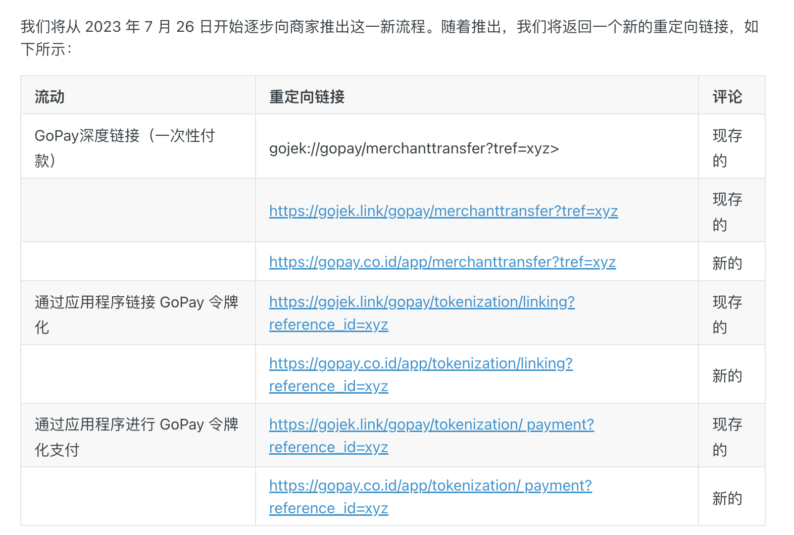

- [[Google支付]]
- [[Meta分享]]
- [[Firebase推送]]Firebase埋点
- goPay支付常见问题文档
	- https://docs.midtrans.com/docs/technical-faq#android
	- 
	- 官方推荐做法：
		- ```kotlin
		  @TargetApi(Build.VERSION_CODES.N)
		  @Override
		  public boolean shouldOverrideUrlLoading(WebView view, WebResourceRequest request) {
		      final Uri uri = request.getUrl();
		      return handleWebviewCustomUri(uri);
		  }
		  
		  private boolean handleWebviewCustomUri(final Uri uri) {
		      final String url = uri.toString();
		      
		      // detect these specified universal-urls/deeplinks to be handled by OS
		      if (url.contains("gojek://") 
		        || url.contains("gopay://") 
		        || url.contains("//gojek.link") 
		        || url.contains("//gopay.co.id") 
		        || url.contains("shopeeid://") 
		        || url.contains("//wsa.wallet.airpay.co.id")
		        || url.contains("//tmrwbyuobid.page.link")
		      ) 
		      {
		          final Intent intent = new Intent(Intent.ACTION_VIEW, uri);
		          startActivity(intent);
		          // `true` means for the specified url, will be handled by OS by starting Intent
		          return true;
		      } else {
		          // `false` means any other url will be loaded normally by the WebView
		          return false;
		      }
		  }
		  ```