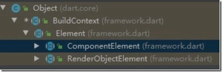
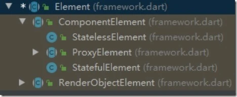

- ## 前言
  collapsed:: true
	- 在flutter中，我们要开发一个UI界面，需要通过组合其它Widget 来实现，Flutter中，一切都是widget，当UI发生变化时，我们不去直接修改DOM，通过更新状态，
	- 让Flutter UI框架来根据新的状态来构建UI。
	- StatelessWidget（无状态的组件） 和 StatefulWidget（有状态的组件） 的build方法都会传一个BuildContext 对象
	  collapsed:: true
		- ```
		  @override
		    Widget build(BuildContext context) {
		  }
		  ```
	- 大多数时候，我们也需要使用context 做一些事，比如：
	  collapsed:: true
		- ```
		  Theme.of(context) //获取主题
		  Navigator.push(context, route) //入栈新路由
		  Navigator.pop(context); //导航到新页面，或者返回到上个页面
		  Scaffold.of(context)//提示信息组件
		  ```
	- BuildContext乱用引发的问题
	  collapsed:: true
		- ```
		  Scaffold.of() called with a context that does not contain a Scaffold.
		  
		  No Scaffold ancestor could be found starting from the context that was passed to Scaffold.of(). This usually happens when the context provided is from the same StatefulWidget as that whose build function actually creates the Scaffold widget being sought.
		  ```
	- 开发过程中很常见的写法，这是新建Flutter工程自带的代码：添加FloatingActionButton点击事件，发现报错信息
	  collapsed:: true
		- ```
		  import \'package:flutter/material.dart\';
		  
		  void main() => runApp(MyApp());
		  
		  class MyApp extends StatelessWidget {
		    @override
		    Widget build(BuildContext context) {
		      return MaterialApp( 
		        home: MyHomePage(),
		      );
		    }
		  }
		  
		  class MyHomePage extends StatefulWidget {
		    @override
		    _MyHomePageState createState() => _MyHomePageState();
		  }
		  
		  class _MyHomePageState extends State<MyHomePage> {
		    int _counter = 0;
		  
		    void _incrementCounter() {
		      setState(() {
		        _counter++;
		      });
		    }
		  
		    @override
		    Widget build(BuildContext context) { 
		      return Scaffold( 
		        body: Center( 
		          child: Text( 
		            \'$_counter\',
		            style: Theme.of(context).textTheme.display1,
		          ),
		        ),
		        floatingActionButton: FloatingActionButton(
		          onPressed: Scaffold.of(context).showSnackBar(SnackBar(content: Text(\'message\')));,
		          child: Icon(Icons.add),
		        ), // This trailing comma makes auto-formatting nicer for build methods.
		      );
		    }
		  }
		  ```
- ## BuildContext是什么
  collapsed:: true
	- 跟踪源码，发现BuildContext其是一个抽象接口类，但是每次build函数传进来的是什么呢。也就是说什么是一个context
		- ```
		  abstract class BuildContext {
		    /// The current configuration of the [Element] that is this [BuildContext].
		    Widget get widget;
		  
		    /// The [BuildOwner] for this context. The [BuildOwner] is in charge of
		    /// managing the rendering pipeline for this context.
		    BuildOwner get owner;
		    ...
		  ```
- ## Flutter视图构建
  collapsed:: true
	- 回到问题思考，Flutter在构建视图的时候究竟发生了什么。这里以Stateless Widget为例。
	  collapsed:: true
		- ```
		  abstract class StatelessWidget extends Widget {
		    const StatelessWidget({ Key key }) : super(key: key);
		    @override
		    StatelessElement createElement() => StatelessElement(this);
		    ...
		  ```
	- 当要把这个widget装进视图树的时候，首先会去createElement，并将当前widget传给Element的构造函数，那么StatelessElement就持有的Widget的引用。
	- 继续跟踪源码，看下StatelessElement又做了什么呢。
	  collapsed:: true
		- ```
		  class StatelessElement extends ComponentElement {
		    /// Creates an element that uses the given widget as its configuration.
		    StatelessElement(StatelessWidget widget) : super(widget);
		  
		    @override
		    StatelessWidget get widget => super.widget;
		  
		    @override
		    Widget build() => widget.build(this);
		  
		    @override
		    void update(StatelessWidget newWidget) {
		      super.update(newWidget);
		      assert(widget == newWidget);
		      _dirty = true;
		      rebuild();
		    }
		  }
		  
		  
		  ```
	- 将Widget传入StatelessElement的构造函数，StatelessElement持有widget的引用，并且调用了自身的build方法，而build方法真正调用了widget的build方法，并且传入了this，
	- 即将StatelessElement对象传入。这个BuildContext就是StatelessElement，跟踪代码，发现他们间接继承自Element类，查看Element定义，发现果然实现了BuildContext接口
	  collapsed:: true
		- ```
		  class Element extends DiagnosticableTree implements BuildContext {
		      ...
		  }
		  ```
	- 至此真相大白，BuildContext就是widget对应的Element，Flutter不鼓励直接操作Element，所以以BuildContext接口的形式对外暴露。所以我们可以通过context在StatelessWidget和StatefulWidget的build方法中访问Element对象。
	- BuildContext与Element继承关系
	  collapsed:: true
		- 
	- 再来看下Element的继承关系
	  collapsed:: true
		- 
	- ComponentElement，负责组装element，包含Widget的配置信息。
	- RenderObjectElement  视图树的渲染
	- 调用 Element 的 createRenderObject() 方法（当然不是每个widget的element都有renderObject）创建每个渲染对象，形成一个 Render Tree。
- ## 视图树装载过程
	- StatelessWidget
	  collapsed:: true
		- 首先它会调用StatelessWidget的 createElement 方法，并根据这个widget生成StatelesseElement对象。
		- 将这个StatelesseElement对象挂载到element树上。
		- StatelesseElement对象调用widget的build方法，并将element自身作为BuildContext传入
	- of(context)方法
		-