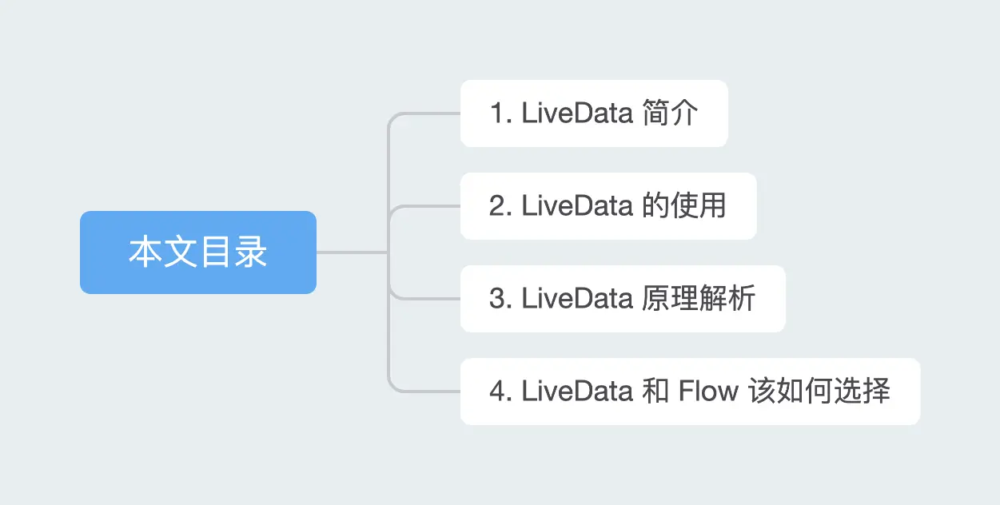
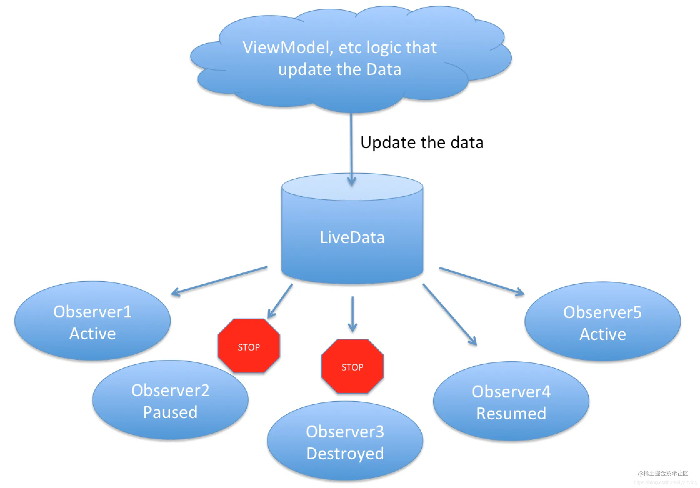
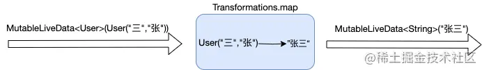

- 本文会由浅入深的为大家介绍 Jetpack 的成员之一：LiveData。内容包括 LiveData 的简介、基本使用，原理分析（如何感知宿主生命周期变化，消息分发流程等），在文章末尾会比较一下 LiveData 和 Flow 的一些区别。
- 
- # 1. LiveData 简介
  collapsed:: true
	- ## 1.1 LivaData 是什么？
	  collapsed:: true
		- LiveData 是一种具有生命周期（如 Activity、Fragment 或 Service）感知能力的、可观察的数据存储器类。LiveData 仅更新处于活跃生命周期状态的应用组件观察者。
		- 
	- ## 1.2 LivaData 的优势
	  collapsed:: true
		- LiveData 能确保 UI 和数据状态相符
		  LiveData 遵循观察者模式。当底层数据发生变化时，LiveData 会通知 Observer 对象来更新界面。
		- 不会发生内存泄漏
		  观察者和 Lifecycle 对象绑定，能在销毁时自动解除注册。
		- 不会给已经停止的 Activity 发送事件
		  如果观察者处于非活跃状态，LiveData 不会再发送任何事件给这些 Observer 对象。
		- 不再需要手动处理生命周期
		  UI 组件仅仅需要对相关数据进行观察，LiveData 自动处理生命周期状态改变后，需要处理的代码。
		- 数据始终保持最新状态
		  一个非活跃的组件进入到活跃状态后，会立即获取到最新的数据，不用担心数据问题。
		- LiveData 在横竖屏切换等 Configuration 改变时，也能保证获取到最新数据
		  例如 Acitivty、Fragment 因为屏幕选装导致重建, 能立即接收到最新的数据。
		- LiveData 能资源共享
		  如果将 LiveData 对象扩展，用单例模式将系统服务进行包裹。这些服务就可以在 APP 中共享。
- # 2 LiveData 的使用
	- ## 2.1 MutableLiveData 的使用
	  collapsed:: true
		- 在 ViewModel 中创建一个实例 LiveData 来保存某种类型的数据。
		  collapsed:: true
			- ```
			  class NameViewModel : ViewModel() {
			  
			           // 创建一个字符串类型的LiveData
			            val currentNameLiveData: MutableLiveData<String> by lazy {
			                   MutableLiveData<String>()
			            }
			  
			           // Rest of the ViewModel...
			  }
			  ```
		- 注册观察者 Observer 并实现 onChanged 方法，该方法在 LiveData 对象持有的数据变化的时候回调，来更新 UI
		  collapsed:: true
			- ```
			  class NameActivity : AppCompatActivity() {
			  
			      // Use the 'by viewModels()' Kotlin property delegate
			      // from the activity-ktx artifact
			      private val model: NameViewModel by viewModels()
			  
			      override fun onCreate(savedInstanceState: Bundle?) {
			          super.onCreate(savedInstanceState)
			  
			          // Other code to setup the activity...
			          
			          // 为LiveData注册Observer观察者
			          model.currentNameLiveData.observe(this, object : Observer<String>{
			              override fun onChanged(newName: String?) {
			                  // Update the UI,
			                  nameTextView.text = newName
			              }
			          })
			      }
			  }
			  ```
		- 更新 LiveData 对象
		  collapsed:: true
			- ```
			  button.setOnClickListener {
			      val anotherName = "Hello"
			      model.currentNameLiveData.setValue(anotherName)
			  }
			  ```
		- 注意点：LiveData建议封装在ViewModel内部使用
		- 避免造成 Activity 和 Fragment 的臃肿。现在这些 UI 控制器负责显示数据但不保存数据状态；
		  将 LiveData 实例与特定 Activity 和 Fragment 实例分离，从而确保 LiveData对象在横竖屏切换后继续存在。
	- ## 2.2 LiveData 的数据转换
		- ## 2.2.1 Transformations.map
		  collapsed:: true
			- map 函数：基于原 LiveData，对其值进行改变然后生成一个新的 LiveData 返回。
			- ## api:
			  collapsed:: true
				- ```
				  /**
				   * @param  source:用于转换的LiveData原始对象
				   * @param  mapFunction: 转换函数
				   */
				  public static LiveData<Y> map (LiveData<X> source, Function<X, Y> mapFunction)
				  ```
			- ## 示例：
			  collapsed:: true
				- ```
				  data class User(val firstName:String,val lastName:String){}
				  
				  val userLiveData: MutableLiveData<User> by lazy{
				      MutableLiveData<User>(User("三","张"))
				  }
				  
				  // 传入MutableLiveData<User>(User("三","张")) -> MutableLiveData<String>(”张三“)
				  val userName: MutableLiveData<String> = Transformations.map(userLiveData) {
				      user -> "${user.lastName} ${user.firstName}"
				  }
				  ```
			- 
		- ## 2.2.2 Transformations.switchMap()
			- switchMap() 函数： 传入LiveData对象，当此LivaData中值变化时，调用转换函数生成新的LiveData对象返回。
			- ## api:
				- ```
				  ```