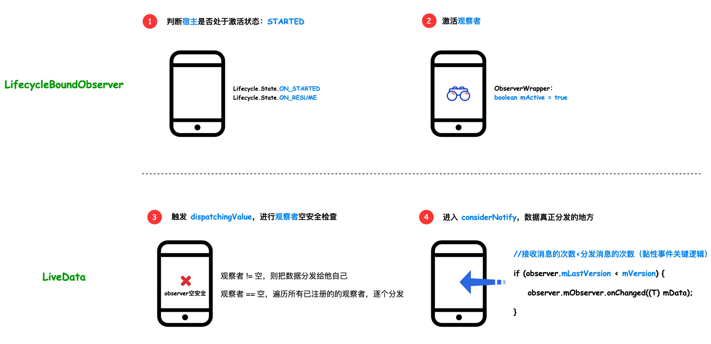

- 本文会由浅入深的为大家介绍 Jetpack 的成员之一：LiveData。内容包括 LiveData 的简介、基本使用，原理分析（如何感知宿主生命周期变化，消息分发流程等），在文章末尾会比较一下 LiveData 和 Flow 的一些区别。
- 
- # 1. LiveData 简介
  collapsed:: true
	- ## 1.1 LivaData 是什么？
	  collapsed:: true
		- LiveData 是一种具有生命周期（如 Activity、Fragment 或 Service）感知能力的、可观察的数据存储器类。LiveData 仅更新处于活跃生命周期状态的应用组件观察者。
		- 
	- ## 1.2 LivaData 的优势
	  collapsed:: true
		- LiveData 能确保 UI 和数据状态相符
		  LiveData 遵循观察者模式。当底层数据发生变化时，LiveData 会通知 Observer 对象来更新界面。
		- 不会发生内存泄漏
		  观察者和 Lifecycle 对象绑定，能在销毁时自动解除注册。
		- 不会给已经停止的 Activity 发送事件
		  如果观察者处于非活跃状态，LiveData 不会再发送任何事件给这些 Observer 对象。
		- 不再需要手动处理生命周期
		  UI 组件仅仅需要对相关数据进行观察，LiveData 自动处理生命周期状态改变后，需要处理的代码。
		- 数据始终保持最新状态
		  一个非活跃的组件进入到活跃状态后，会立即获取到最新的数据，不用担心数据问题。
		- LiveData 在横竖屏切换等 Configuration 改变时，也能保证获取到最新数据
		  例如 Acitivty、Fragment 因为屏幕选装导致重建, 能立即接收到最新的数据。
		- LiveData 能资源共享
		  如果将 LiveData 对象扩展，用单例模式将系统服务进行包裹。这些服务就可以在 APP 中共享。
- # 2 LiveData 的使用
  collapsed:: true
	- ## 2.1 MutableLiveData 的使用
	  collapsed:: true
		- 在 ViewModel 中创建一个实例 LiveData 来保存某种类型的数据。
		  collapsed:: true
			- ```
			  class NameViewModel : ViewModel() {
			  
			           // 创建一个字符串类型的LiveData
			            val currentNameLiveData: MutableLiveData<String> by lazy {
			                   MutableLiveData<String>()
			            }
			  
			           // Rest of the ViewModel...
			  }
			  ```
		- 注册观察者 Observer 并实现 onChanged 方法，该方法在 LiveData 对象持有的数据变化的时候回调，来更新 UI
		  collapsed:: true
			- ```
			  class NameActivity : AppCompatActivity() {
			  
			      // Use the 'by viewModels()' Kotlin property delegate
			      // from the activity-ktx artifact
			      private val model: NameViewModel by viewModels()
			  
			      override fun onCreate(savedInstanceState: Bundle?) {
			          super.onCreate(savedInstanceState)
			  
			          // Other code to setup the activity...
			          
			          // 为LiveData注册Observer观察者
			          model.currentNameLiveData.observe(this, object : Observer<String>{
			              override fun onChanged(newName: String?) {
			                  // Update the UI,
			                  nameTextView.text = newName
			              }
			          })
			      }
			  }
			  ```
		- 更新 LiveData 对象
		  collapsed:: true
			- ```
			  button.setOnClickListener {
			      val anotherName = "Hello"
			      model.currentNameLiveData.setValue(anotherName)
			  }
			  ```
		- 注意点：LiveData建议封装在ViewModel内部使用
		- 避免造成 Activity 和 Fragment 的臃肿。现在这些 UI 控制器负责显示数据但不保存数据状态；
		  将 LiveData 实例与特定 Activity 和 Fragment 实例分离，从而确保 LiveData对象在横竖屏切换后继续存在。
	- ## 2.2 LiveData 的数据转换
	  collapsed:: true
		- ## 2.2.1 Transformations.map
		  collapsed:: true
			- map 函数：基于原 LiveData，对其值进行改变然后生成一个新的 LiveData 返回。
			- ## api:
			  collapsed:: true
				- ```
				  /**
				   * @param  source:用于转换的LiveData原始对象
				   * @param  mapFunction: 转换函数
				   */
				  public static LiveData<Y> map (LiveData<X> source, Function<X, Y> mapFunction)
				  ```
			- ## 示例：
			  collapsed:: true
				- ```
				  data class User(val firstName:String,val lastName:String){}
				  
				  val userLiveData: MutableLiveData<User> by lazy{
				      MutableLiveData<User>(User("三","张"))
				  }
				  
				  // 传入MutableLiveData<User>(User("三","张")) -> MutableLiveData<String>(”张三“)
				  val userName: MutableLiveData<String> = Transformations.map(userLiveData) {
				      user -> "${user.lastName} ${user.firstName}"
				  }
				  ```
			- 
		- ## 2.2.2 Transformations.switchMap()
			- switchMap() 函数： 传入LiveData对象，当此LivaData中值变化时，调用转换函数生成新的LiveData对象返回。
			- ## api:
			  collapsed:: true
				- ```
				  /**
				   * @param  source:传入待观察的LiveData对象
				   * @param  switchMapFunction: 转换函数
				   */
				  public static LiveData<Y> switchMap (LiveData<X> source, Function<X,LiveData<Y>> switchMapFunction)
				  ```
			- ## 示例：
				- ```
				  // 条件结果liveDataA
				  val liveDataA = MutableLiveData<String>("1001")
				  // 条件结果liveDataB
				  val liveDataB = MutableLiveData<String>("2002")
				  // 条件LiveData
				  val liveDataSwitch = MutableLiveData<Boolean>(false)
				  
				  // Transformations.switchMap 监测liveDataSwitch值的变化，条件触发不同的liveData返回
				  val transformSwitchedLiveData =
				      Transformations.switchMap(liveDataSwitch) {
				      switchToB ->
				          if(switchToB) { liveDataB }
				          else{ liveDataA }
				      }
				  
				  // 注册监听
				  transformSwitchedLiveData.observe(this,Observer<String> { value ->
				      value?.let {
				          txt_fragment.text = it
				      }
				  })
				  
				  // SwitchCompat 开关手动控制liveDataSwitch值的变化
				  liveDataSwitch.value = switch_live_data.isChecked
				  switch_live_data.setOnCheckedChangeListener { buttonView, isChecked ->
				      liveDataSwitch.value = isChecked
				  }
				  ```
				- 
		-
	- ## 2.3MediatorLiveData 的使用
		- MediatorLiveData可以作为中介观察或调度多个 LiveData 数据源；
		  同时也可以做为一个liveData，被其他 Observer 观察。
		- ## 2.3.1 示例
		  collapsed:: true
			- 监听多个不同类型数据源，map() 和 switchMap() 也应用了 MediatorLiveData 中介功能
			  collapsed:: true
				- ```
				   // String 类型的liveData
				      private val liveData1 = MutableLiveData<String>()
				      // Int类型的liveData
				      private val liveData2 = MutableLiveData<Int>()
				      
				      fun setData1(name: String) {
				          liveData1.value = name
				      }
				      fun setData2(id: Int) {
				          liveData2.value = id
				      }
				    
				      val mediatorLiveData = MediatorLiveData<String>()
				      init {
				          mediatorLiveData.addSource(liveData1) {   
				             mediatorLiveData.value = "A:$it"
				          }
				          mediatorLiveData.addSource(liveData2) {
				             mediatorLiveData.value = "B:$it"
				          }
				      }
				      // 监听不同数据源更新UI
				      mediatorLiveData.observe(this, changeObserver)
				      private val changeObserver = Observer<String> { value ->
				          value?.let {
				              text = it
				          }
				      }
				  ```
			- 
		- 使用多个MutableLiveData 单独观察数据，更新UI也能实现以上功能，但MutableLiveData需要分别要设置 LifecycleOwner 而 MediatorLiveData 能统一管理添加到它内部所有 LiveData 的生命周期， MediatorLiveData 重写了 LiveData 的 onActive 和 onInactive 方法统一去添加和移除它内部 LiveData 的 Observer
		- ## 2.3.2 可用点
			- MediatorLiveData监听不同来源（缓存、内置、网络）LiveData，更新UI数据
- #  3LiveData 原理解析
	- 在分析 LiveData 的原理之前，我们先来回顾一下 Handler、EventBus、RxjavaBus 的消息分发机制，它们不会关心当前页面是否可见，只要有消息就会进行转发。
	- 这样做的后果就是，即便应用在后台，页面处于不可见的情况下，还在进行一些无用的工作抢占资源。甚至可能造成 NPE。
	- 而 LiveData 的出现，完美地解决了以往使用 callback 回调可能带来的 NPE，生命周期越界，后台任务抢占资源等问题。
	- 我们从代码的角度，来看一看 LiveData 与传统消息分发组件的不同：
	  collapsed:: true
		- {:height 530, :width 716}
	- ## 3.1 那么 LiveData 是如何解决这些问题的呢？下面我们从源码角度来分析一下。
	  collapsed:: true
		- 我们想要使用 LiveData 去观察数据，会用到 observe 方法，观察者可以在收到 onChanged 事件时更新界面：
		  collapsed:: true
			- {:height 335, :width 716}
		- 而与宿主生命周期的绑定，也是在 observe 里进行的：
		  collapsed:: true
			- 
		- 可将上面的源码总结为图：
		  collapsed:: true
			- 
		- 结论
		- 所以，LiveData 之所以能够感知到宿主的生命周期，是借助了 Lifecycle 的能力。
	- ## 3.2 LiveData 的反注册和消息分发
		- 在上一节中，我们分析了，LiveData 是借助 Lifecycle 的能力实现了对宿主生命周期的监听，每当宿主的生命周期变化的时候，都会回调 LifecycleBoundObserver 的 onStateChanged 方法，那么，可以在 onStateChanged 方法里判断宿主当前的生命周期，从而做一些操作。
		- ## 3.2.1 反注册
		  collapsed:: true
			- 在 onStateChanged 方法里，首先会判断宿主当前的状态是否为 DESTROYED，即销毁状态，如果条件成立，则会主动移除掉观察者，即反注册，从而避免了内存泄露。
			- 
		- ## 3.2.2 宿主生命周期变化的消息分发规则
		  collapsed:: true
			- 宿主生命周期变化的消息分发，起点依然是在onStateChanged里：
			  collapsed:: true
				- 
			- 下面通过一张图来给大家展示具体的消息分发流程：
			  collapsed:: true
				- 
			- 特别说明一下，第4 步中的关键逻辑：
			  collapsed:: true
				- 
			- 这就是为什么 LiveData 支持黏性事件的原因，即先发送一条数据，后注册一个观察者，也是能够收到之前发送的那条数据的。
		- ## 3.2.3 普通消息分发规则