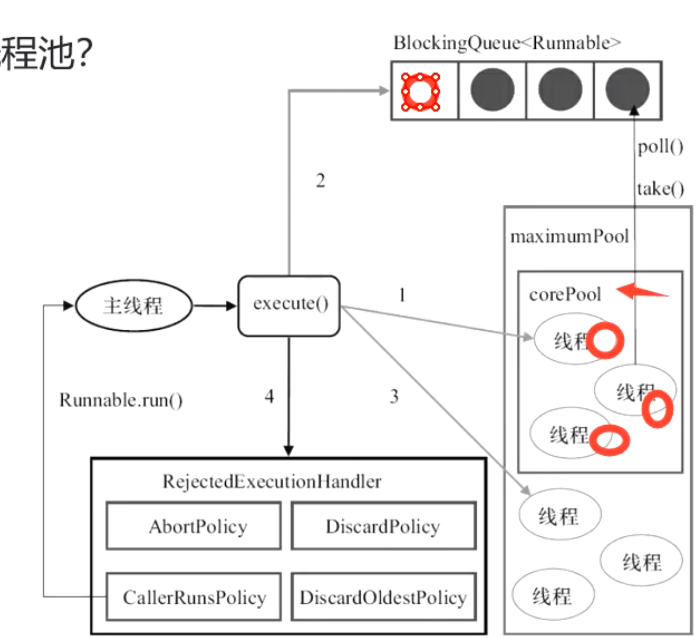

- 图解
	- 
	- # 线程池的判断规则
	  collapsed:: true
		- {:height 430, :width 749}
- 当一个任务通过Execute（Runnable）方法添加到线程池时
- 1、当前线程数 < corePoolSize，新建核心线程处理被添加的任务
- 2、当前线程数 >= corePoolSize,
	- 存在空闲线程，使用空闲线程
	- 不存在空闲线程，则尝试添加等待队列BlockingQueue,
		- 添加成功等待空闲线程，处理任务
		- 添加失败，判断是否小于最大线程数maximumPool
			- 小于最大线程数，新建线程处理新任务
			- 等于，执行拒绝策略