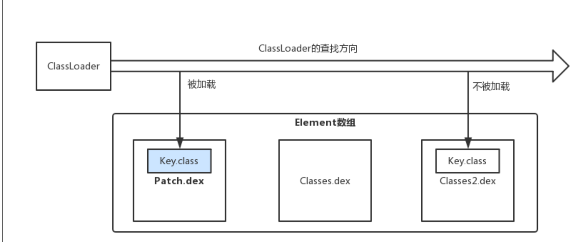
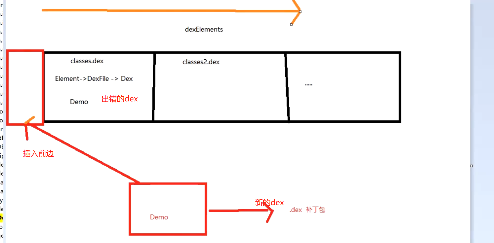

# 概念
collapsed:: true
	- PathClassLoader 中存在一个Element数组，Element类中存在一个dexFile成员表示dex文件，即：APK中有X个dex，则Element数组就有X个元素。
	- 
	- 在 PathClassLoader 中的Element数组为：[patch.dex , classes.dex , classes2.dex]。如果存在**Key.class**位于patch.dex与classes2.dex中都存在一份，当进行类查找时，循环获得 dexElements 中的DexFile，查找到了**Key.class**则立即返回，不会再管后续的element中的DexFile是否能加载到**Key.class**了。
	- 因此实际上，一种热修复实现可以将出现Bug的class单独的制作一份fifix.dex文件(补丁包)，然后在程序启动时，从服务器下载fifix.dex保存到某个路径，再通过fifix.dex的文件路径，用其创建 Element 对象，然后将这个 Element 对象插入到我们程序的类加载器 PathClassLoader 的 pathList 中的 dexElements 数组头部。这样在加载出现Bug的class时会优先加载fifix.dex中的修复类，从而解决Bug。
- # 一、结合类加载机制，大致原理
  collapsed:: true
	- 
	- 每次启动都要执行这个事情，为了要修复的类未被加载，则在Application  attachBaseContext中执行插入
	- ## 前提条件
		- 要修复的类没有被加载过，因为加载过会有缓存，插入也没意义了，看类加载的流程
- # 二、涉及技术
	- 类加载机制
	- 反射插入到Element数组里去
- # 三、实现流程-结合的是最基础的原理
	- 1、获取当前应用的PathClassLoader
	- 2、反射获取到DexPathList属性对象pathList
	- 3、反射修改pathList的dexElements
		- 1、把补丁包patch.dex 转换为 Element[]（patch）
		- 2、获取pathList的dexElements属性（old）
		- 3、patch+old合并 并反射赋值给 pathList 的dexElements
- # [[字节码怎么打包成dex]]