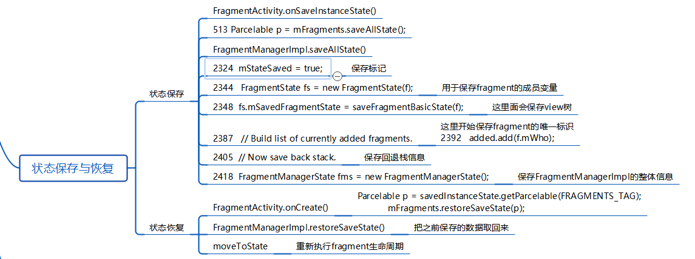

- # 背景
	- 当内存不足的时候，Fragment被回收，恢复状态
	- 
- # 一、状态保存（androidx已处理）
  collapsed:: true
	- ## 1、处理的代码FragmentActivity
		- ```java
		      protected void onSaveInstanceState(Bundle outState) {
		          super.onSaveInstanceState(outState);
		          markFragmentsCreated();
		          // 1、保存所有信息
		          Parcelable p = mFragments.saveAllState();
		          // 2、存在bundle里
		          if (p != null) {
		              outState.putParcelable(FRAGMENTS_TAG, p);
		          }
		          if (mPendingFragmentActivityResults.size() > 0) {
		              outState.putInt(NEXT_CANDIDATE_REQUEST_INDEX_TAG, mNextCandidateRequestIndex);
		  
		              int[] requestCodes = new int[mPendingFragmentActivityResults.size()];
		              String[] fragmentWhos = new String[mPendingFragmentActivityResults.size()];
		              for (int i = 0; i < mPendingFragmentActivityResults.size(); i++) {
		                  requestCodes[i] = mPendingFragmentActivityResults.keyAt(i);
		                  fragmentWhos[i] = mPendingFragmentActivityResults.valueAt(i);
		              }
		              outState.putIntArray(ALLOCATED_REQUEST_INDICIES_TAG, requestCodes);
		              outState.putStringArray(REQUEST_FRAGMENT_WHO_TAG, fragmentWhos);
		          }
		      }
		  ```
	- ## 2、Parcelable p = mFragments.saveAllState();控制器调用到FragmentManagerImpl 的相关方法
	  collapsed:: true
		- ```java
		   Parcelable saveAllState() {
		          // Make sure all pending operations have now been executed to get
		          // our state update-to-date.
		          forcePostponedTransactions();
		          endAnimatingAwayFragments();
		          execPendingActions();
		          // 1保存标记。。commit时状态判断用
		         // 状态保存为true
		          mStateSaved = true;
		          mSavedNonConfig = null;
		  
		          if (mActive == null || mActive.size() <= 0) {
		              return null;
		          }
		  
		          // First collect all active fragments.
		          int N = mActive.size();
		          FragmentState[] active = new FragmentState[N];
		          boolean haveFragments = false;
		          for (int i=0; i<N; i++) {
		              Fragment f = mActive.valueAt(i);
		              if (f != null) {
		                  if (f.mIndex < 0) {
		                      throwException(new IllegalStateException(
		                              "Failure saving state: active " + f
		                              + " has cleared index: " + f.mIndex));
		                  }
		  
		                  haveFragments = true;
		                  // 2、保存Fragment 所有成员变量，包括Fragment tag标记
		                  FragmentState fs = new FragmentState(f);
		                  active[i] = fs;
		  
		                  if (f.mState > Fragment.INITIALIZING && fs.mSavedFragmentState == null) {
		                      // 3、保存view树
		                      fs.mSavedFragmentState = saveFragmentBasicState(f);
		  
		                      if (f.mTarget != null) {
		                          if (f.mTarget.mIndex < 0) {
		                              throwException(new IllegalStateException(
		                                      "Failure saving state: " + f
		                                      + " has target not in fragment manager: " + f.mTarget));
		                          }
		                          if (fs.mSavedFragmentState == null) {
		                              fs.mSavedFragmentState = new Bundle();
		                          }
		                          putFragment(fs.mSavedFragmentState,
		                                  FragmentManagerImpl.TARGET_STATE_TAG, f.mTarget);
		                          if (f.mTargetRequestCode != 0) {
		                              fs.mSavedFragmentState.putInt(
		                                      FragmentManagerImpl.TARGET_REQUEST_CODE_STATE_TAG,
		                                      f.mTargetRequestCode);
		                          }
		                      }
		  
		                  } else {
		                      fs.mSavedFragmentState = f.mSavedFragmentState;
		                  }
		  
		                  if (DEBUG) Log.v(TAG, "Saved state of " + f + ": "
		                          + fs.mSavedFragmentState);
		              }
		          }
		  
		          if (!haveFragments) {
		              if (DEBUG) Log.v(TAG, "saveAllState: no fragments!");
		              return null;
		          }
		  
		          int[] added = null;
		          BackStackState[] backStack = null;
		  
		          // Build list of currently added fragments.
		          N = mAdded.size();
		          if (N > 0) {
		              added = new int[N];
		              for (int i = 0; i < N; i++) {
		                  added[i] = mAdded.get(i).mIndex;
		                  if (added[i] < 0) {
		                      throwException(new IllegalStateException(
		                              "Failure saving state: active " + mAdded.get(i)
		                              + " has cleared index: " + added[i]));
		                  }
		                  if (DEBUG) {
		                      Log.v(TAG, "saveAllState: adding fragment #" + i
		                              + ": " + mAdded.get(i));
		                  }
		              }
		          }
		  
		          // Now save back stack. 4、保存回退栈信息
		          if (mBackStack != null) {
		              N = mBackStack.size();
		              if (N > 0) {
		                  backStack = new BackStackState[N];
		                  for (int i=0; i<N; i++) {
		                      backStack[i] = new BackStackState(mBackStack.get(i));
		                      if (DEBUG) Log.v(TAG, "saveAllState: adding back stack #" + i
		                              + ": " + mBackStack.get(i));
		                  }
		              }
		          }
		  
		          // 5、保存FragmentManagerImpl的整体信息
		          FragmentManagerState fms = new FragmentManagerState();
		          fms.mActive = active;
		          fms.mAdded = added;
		          fms.mBackStack = backStack;
		          if (mPrimaryNav != null) {
		              fms.mPrimaryNavActiveIndex = mPrimaryNav.mIndex;
		          }
		          fms.mNextFragmentIndex = mNextFragmentIndex;
		          saveNonConfig();
		          return fms;
		      }
		  ```
		-
- # 二、状态恢复
	- ## 1、FragmentActivity.onCreate()
	  collapsed:: true
		- ```java
		      protected void onCreate(@Nullable Bundle savedInstanceState) {
		          mFragments.attachHost(null /*parent*/);
		  
		          super.onCreate(savedInstanceState);
		  
		          NonConfigurationInstances nc =
		                  (NonConfigurationInstances) getLastNonConfigurationInstance();
		          if (nc != null && nc.viewModelStore != null && mViewModelStore == null) {
		              mViewModelStore = nc.viewModelStore;
		          }
		          if (savedInstanceState != null) {
		              // 拿回缓存的信息
		              Parcelable p = savedInstanceState.getParcelable(FRAGMENTS_TAG);
		              mFragments.restoreAllState(p, nc != null ? nc.fragments : null);
		  
		              // Check if there are any pending onActivityResult calls to descendent Fragments.
		              if (savedInstanceState.containsKey(NEXT_CANDIDATE_REQUEST_INDEX_TAG)) {
		                  mNextCandidateRequestIndex =
		                          savedInstanceState.getInt(NEXT_CANDIDATE_REQUEST_INDEX_TAG);
		                  int[] requestCodes = savedInstanceState.getIntArray(ALLOCATED_REQUEST_INDICIES_TAG);
		                  String[] fragmentWhos = savedInstanceState.getStringArray(REQUEST_FRAGMENT_WHO_TAG);
		                  if (requestCodes == null || fragmentWhos == null ||
		                              requestCodes.length != fragmentWhos.length) {
		                      Log.w(TAG, "Invalid requestCode mapping in savedInstanceState.");
		                  } else {
		                      mPendingFragmentActivityResults = new SparseArrayCompat<>(requestCodes.length);
		                      for (int i = 0; i < requestCodes.length; i++) {
		                          mPendingFragmentActivityResults.put(requestCodes[i], fragmentWhos[i]);
		                      }
		                  }
		              }
		          }
		  
		          if (mPendingFragmentActivityResults == null) {
		              mPendingFragmentActivityResults = new SparseArrayCompat<>();
		              mNextCandidateRequestIndex = 0;
		          }
		  
		          mFragments.dispatchCreate();
		      }
		  ```
	- ## 2、FragmentManagerImpl.restoreSaveState()把之前保存的数据取回来
	- ## 3、moveToState 重新执行Fragment生命周期，将Fragment生产回来