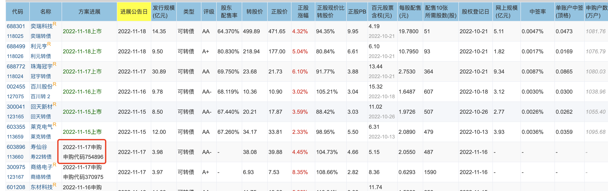

- # 一、申购可转债的三大群体
	- ## 1、原股东优先配债(优先中签 100%)
		- 需要买入一定量的原始股票
	- ## 2、广大网民打新债(随机中签)
	- ## 3、机构投资者参与的网下申购部分(逐渐取消)
	- ## 注、原股东即享受配债，也可以同时参与打新。
- # 二、配售操作
	- 1、集思录->待发转债
	  collapsed:: true
		- {:height 355, :width 716}
		- 
		- 申购日前1个交易日买股配债
	- 2、看中10张需要买多少股票
		- {:height 127, :width 716}
		- 配售10张所需股数*正股价 = 买股总钱数(中1手债)
		-
		- ## 看百元股票含权，约高，配售1手债花的钱更少
	- 3、比如配售10张所需股数 51，实际你买肯定是100股1手。整手买的，那么100股能中多少张债
		- 
		- ## 计算可配售金额与可配售数量
			- 沪市：可配售手数 = 持股数量(股) x 配售金额(元/股) / 1000
				-
			- 深市：可配售张数 = 持股数量(股) x 配售金额(元/股) / 100
			-