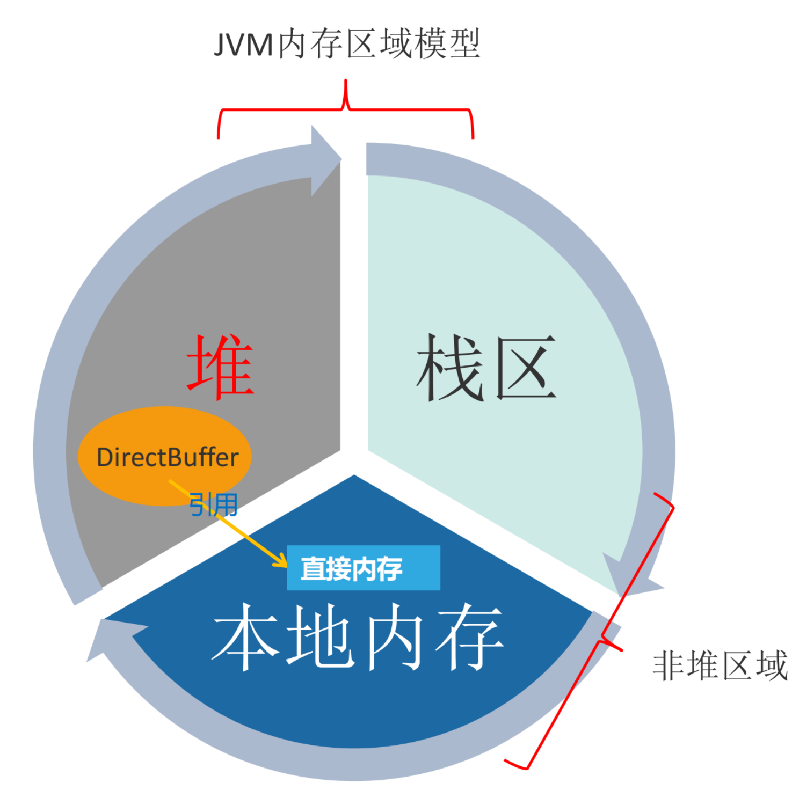

- # 一、直接内存模型
	- 
- # 二、简介
	- [[#red]]==**直接内存**==
		- 不是虚拟机运行时数据区的一部分，也不是java虚拟机规范中定义的内存区域
- # 三、使用场景
	- [[#red]]==**如果使用了NIO,这块区域会被频繁使用，在java堆内可以用directByteBuffer对象直接引用并操作**==
	- ## NIO
		- 在 JDK 1.4 中新加入 NIO (New Input/Output) 类，引入了一种基于通道(Channel)和缓存(Buffer)的 I/O 方式，它可以使用 Native 函数库直接分配堆外内存，然后通过一个存储在 Java 堆中的 DirectByteBuffer 对象作为这块内存的引用进行操作。可以避免在 Java 堆和 Native 堆中来回的数据耗时操作，这样在一些场景中能显著提高性能。
- # 四、特点
	- [[#red]]==**jdk1.8的元空间就在这块内存中，这块内存不受Java堆大小的限制，但受本机总内存的限制，可拓展，通过MaxDirectMemorySize来设置（默认与堆内存最大值一样）**==，如果内存区域总和大于物理内存限制从而导致动态扩展时出现异常就会报outOfMemoryError。
-