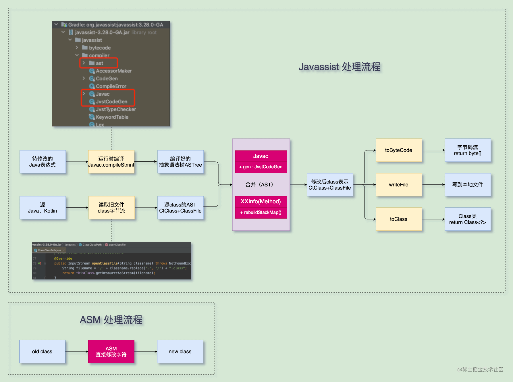

- ## 简单介绍
	- Javassist(java assist)也是一种修改字节码的工具，它不仅可以像ASM一样基于字节码修改，也可以在源代码级面进行修改，也就是说可以像平时写代码一样去修改原java类，而不需要熟悉字节码规范，这样就大大减少了我们的学习成本。
- ## 示例Demo
	- collapsed:: true
	  1. 注入ClassPath
		- Javassist允许我们绕开字节码直接修改源码，那它就必须读取原来的Class类文件，这样它才可以生成出最终的字节码。
		- ClassPool用于存储需要处理的类文件地址或ClassLoader，我们需要在transform处理每一个input时将路径注入到ClassPool中，否则修改时很可能会报错 NotFountException。
		- ```
		  abstract class BaseTransform(private val extension: BaseExtension) : Transform() {
		      protected val classPool: ClassPool = ClassPool.getDefault().apply {
		          // 重点！！ 注入android.jar
		          appendClassPath(extension.bootClasspath[0].absolutePath)
		      }
		      
		      @Throws(TransformException::class, InterruptedException::class, IOException::class)
		      final override fun transform(transformInvocation: TransformInvocation) {
		          ...
		          transformInvocation.inputs.forEach { input ->
		              input.jarInputs.forEach { jarInput ->
		                  // 注入jar地址
		                  classPool.appendClassPath(jarInput.file.absolutePath)
		                  ...
		              }
		              input.directoryInputs.forEach { directoryInput ->
		                  // 注入directory地址
		                  classPool.appendClassPath(directoryInput.file.absolutePath)
		                  ...
		              }
		          }
		      }
		  }   
		  ```
	- 2、处理单个类
	  collapsed:: true
		- Transform中找到单个需要处理的类，然后通过className找到对应类进行修改
		- ```
		   /**
		       * 处理完成后还是通过ByteArray写回transform的输出路径
		       */
		      override fun handleFileBytes(className: String): ByteArray {
		          val targetClass = classPool.get(className)
		          handleClass(targetClass)
		          
		          return targetClass.toBytecode()
		      }
		      
		      override fun handleClass(targetClass: CtClass) {
		          // 是否是Activity的子类
		          if (!targetClass.subclassOf(classPool["android.app.Activity"])) {
		              return
		          }
		          val onCreateMethods = targetClass.getDeclaredMethods("onCreate")
		          for (onCreateMethod in onCreateMethods) {
		              // 判断是否是onCreate生命周期方法
		              val params = onCreateMethod.parameterTypes
		              if (params.size != 1 || params[0] != classPool["android.os.Bundle"]) {
		                  continue
		              }
		              // 真正的处理
		              try {
		                  case2(targetClass, onCreateMethod)
		              } catch (e: CannotCompileException) {
		                  println("$name.handleClass CannotCompileException: $onCreateMethod")
		              }
		          }
		      }
		      
		      /**
		       * 插入到方法后面
		       * 注意
		       * 1. 不管当前类是否是kotlin，只能插入java代码
		       * 2. 必须是可用的表达式, 不能是编译不过的代码, 比如单个括号
		       */
		      private fun case1(onCreateMethod: CtMethod) {
		          classPool.importPackage("android.widget.Toast")
		          onCreateMethod.insertAfter(
		              """
		                  showJavassistToast();
		                  Toast.makeText(this, JAVASSIST_SINGE_MSG, Toast.LENGTH_LONG).show();
		              """
		          )
		      }
		      
		      /**
		       * 整体catch
		       * 注意：addCatch 必须在最后补充return, 否则注入报错 no basic block;
		       */
		      private fun case2(targetClass: CtClass, onCreateMethod: CtMethod) {
		          classPool.importPackage("android.util.Log")
		          onCreateMethod.addCatch(
		              """
		                  Log.e("${targetClass.name}", "空指针了我擦:\n" + Log.getStackTraceString(${'$'}e));
		                  return;
		              """, classPool.get("java.lang.NullPointerException")
		          )
		      }
		  ```
	- 以上代码实现了对所有Activity的onCreate方法添加try-catch。
- ## 可以用来做哪些处理
	- 按之前的了解，Javassist存在一定的能力限制，所以我们更偏向ASM。不过通过对Javassist-API的简单梳理，发现它基本上也可以实现所有的需求：
	- 修改语句：CtMethod.instrument(CodeConverter())，CtMethod.instrument(ExprEditor)
	  插入语句：CtMethod.insertBefore, CtMethod.insertAfter, CtMethod.insertAt
	  整体替换：CtMethod.setBody
	  整体catch：CtMethod.addCatch
	  修改修饰符：CtMethod/CtField/CtConstructor.setModifiers
	  …
	  更详细的API请见官方文档：https://github.com/jboss-javassist/javassist/wiki/Tutorial-2
- ## 还能运行时修改？
  collapsed:: true
	- 在看文档的时候发现了彩蛋，javassist竟然还可以实现运行时动态修改代码，而且有两种方式：
		- 1、CtClass同时提供了Class<?> toClass(ClassLoader loader)，这样我们可以直接写业务代码时修改任意代码，然后通过toClass构建出修改后对象。不过注意，这里不是AOP类型的对原类文件做修改，而是随用随构建，只对当前有效。
		- 2、动态代理 ProxyFactory，突破JDK提供的Proxy和InvocationHandler，可以处理动态代理类。但测试发现白高兴一场😂，对于android如果使用ProxyFactory的话会崩溃，原因在于Android修改了JDK代码，SecurityManager.getClassContext必定返回null导致空指针。
		- ```
		  val proxyFactory = ProxyFactory().apply {
		      superclass = ProxyTest::class.java
		      setFilter { it.name == "test" }
		  }
		  val proxyClass = proxyFactory.createClass() // 空指针崩溃
		  (proxyClass as Proxy).setHandler { self, thisMethod, _, args ->
		      val result = thisMethod.invoke(self, args) as String
		      return@setHandler result + result
		  }
		  val proxyTest = proxyClass.newInstance() as ProxyTest
		  ```
- ## Javassist处理原理
  collapsed:: true
	- 
- 总结一下
  Javassist与ASM相比学习成本比较低，而且基本可以满足所有的需求，后续有Transform可以考虑优先采用Javassist。
- 另外Javassist可以运行时动态修改类文件，修改三方库bug时也可以考虑使用Javassist处理。