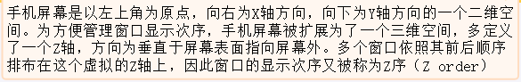
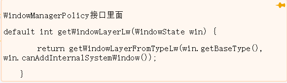

- 
- ## 1、WMS.addWindow 当app添加一个view的时候最终会调用到这里
- ## 2、执行win = new WindowState构造函数中
	- PhoneWindowManager.getWindowLayerLw  计算  mBaseLayer(在WindowManagerPolicy接口实现)
		- 
		- getWindowLayerFromTypeLw  把窗口根据类型分成不同的层
	- PhoneWindowManager.getSubWindowLayerFromTypeLw