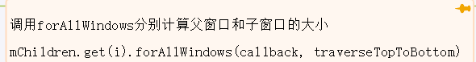

- performTraversals
	- relayoutWindow
		- IWindowSession.relayout
			- WMS.relayoutWindow
				- WindowSurfacePlacer.performSurfacePlacement（计算Window大小，执行动态更新Surface）
					- WindowSurfacePlacer.performSurfacePlacementLoop
						- RootWindowContainer.performSurfacePlacement
							- RootWindowContainer.applySurfaceChangesTransaction
								- DisplayContent.applySurfaceChangesTransaction
									- DisplayContent.performLayout
										- PhoneWindowManager.beginLayoutLw
										  collapsed:: true
											- 
										- DisplayContent.forAllWindows
											- 
											- ToBooleanFunction.apply
												- mPerformLayout 是一个Consumer<WindowState>
													- PhoneWindowManager.layoutWindowLw  计算窗口大小
														- WindowState.computeFrameLw
-