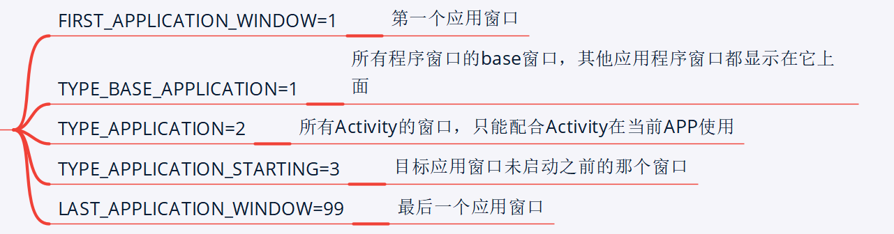
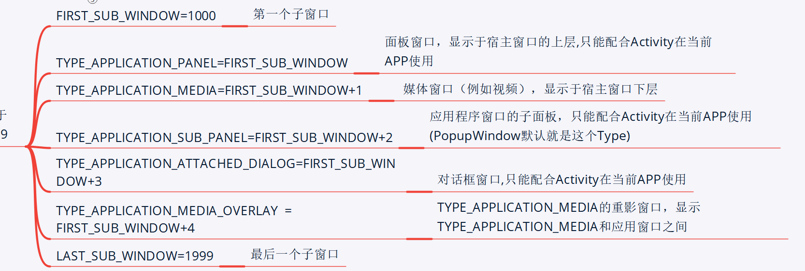
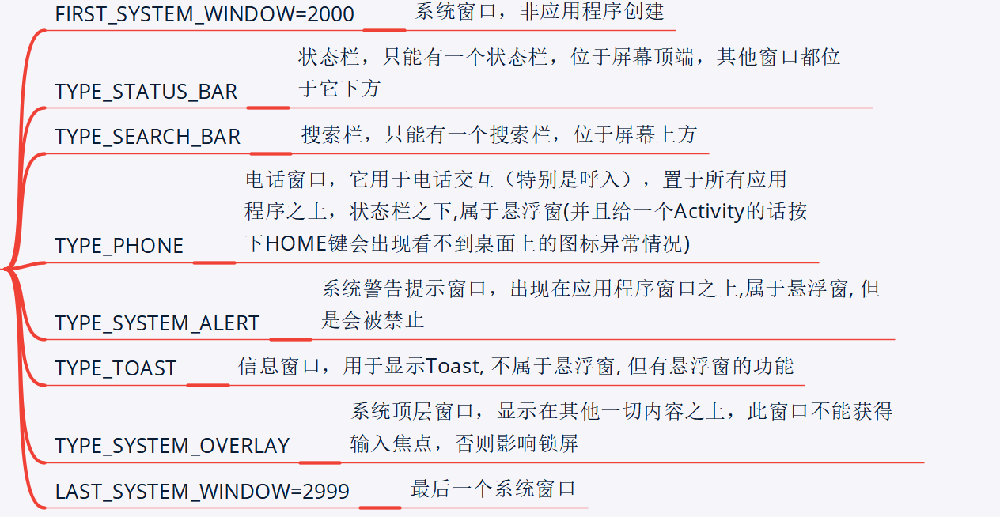

- 应用窗口：层级范围是1~99
- 子窗口：层级范围是1000~1999
- 系统窗口：层级范围是2000~2999
## 各级别type值在WindowManager中的定义分别为：
	- ## 应用窗口（1~99）系统窗口起来之后才可能创建应用窗口
		- 包括所有应用程序自己创建的窗口，以及在应用起来之前系统负责显示的窗口，层级范围是1~99
		- 
		- ```java
		  //第一个应用窗口
		  public static final int FIRST_APPLICATION_WINDOW = 1;
		  //所有程序窗口的base窗口，其他应用程序窗口都显示在它上面
		  public static final int TYPE_BASE_APPLICATION = 1;
		  //所有Activity的窗口，只能配合Activity在当前APP使用
		  public static final int TYPE_APPLICATION = 2; // 用的最多
		  //目标应用窗口未启动之前的那个窗口
		  public static final int TYPE_APPLICATION_STARTING = 3;
		  //最后一个应用窗口
		  public static final int LAST_APPLICATION_WINDOW = 99;
		  ```
	- ## 子窗口（1000~1999）
		- 应用自定义的对话框，或者输入法窗口，子窗口必须依附于某个应用窗口[[#red]]==**（设置相同的token)**==，层级范围是1000~1999
		- 
		- ```java
		  //第一个子窗口
		  public static final int FIRST_SUB_WINDOW = 1000;
		  // 面板窗口，显示于宿主窗口的上层,只能配合Activity在当前APP使用
		  public static final int TYPE_APPLICATION_PANEL =
		  FIRST_SUB_WINDOW;
		  // 媒体窗口（例如视频），显示于宿主窗口下层
		  public static final int TYPE_APPLICATION_MEDIA =
		  FIRST_SUB_WINDOW+1;
		  // 应用程序窗口的子面板，只能配合Activity在当前APP使用
		  (PopupWindow默认就是这个Type)
		  public static final int TYPE_APPLICATION_SUB_PANEL =
		  FIRST_SUB_WINDOW+2;
		  //对话框窗口,只能配合Activity在当前APP使用
		  public static final int TYPE_APPLICATION_ATTACHED_DIALOG
		  = FIRST_SUB_WINDOW+3;
		  //
		  public static final int TYPE_APPLICATION_MEDIA_OVERLAY
		  = FIRST_SUB_WINDOW+4;
		  //最后一个子窗口
		  public static final int LAST_SUB_WINDOW = 1999;
		  ```
	- ## 系统窗口：层级范围是2000~2999
		- 系统设计，不依附于任何应用窗口，比如：状态栏(Status Bar)、导航栏(Navigation Bar)、壁纸(Wallpaper)、来电显示窗口(Phone)、锁屏窗口(KeyGuard)、信息提示窗口(Toast)、音量调整窗口、鼠标光标等等，层级范围是2000~2999
		- 
		- ```java
		  //系统窗口，非应用程序创建
		  public static final int FIRST_SYSTEM_WINDOW =
		  2000;
		  //状态栏，只能有一个状态栏，位于屏幕顶端，其他窗口都位于它下
		  方
		  public static final int TYPE_STATUS_BAR =
		  FIRST_SYSTEM_WINDOW;
		  //搜索栏，只能有一个搜索栏，位于屏幕上方
		  public static final int TYPE_SEARCH_BAR =
		  FIRST_SYSTEM_WINDOW+1;
		  //
		  //电话窗口，它用于电话交互（特别是呼入），置于所有应用程序之
		  上，状态栏之下,属于悬浮窗(并且给一个Activity的话按下HOME键会出现看
		  不到桌面上的图标异常情况)
		  public static final int TYPE_PHONE =
		  FIRST_SYSTEM_WINDOW+2;
		  //
		  //系统警告提示窗口，出现在应用程序窗口之上,属于悬浮窗, 但是
		  会被禁止
		  public static final int TYPE_SYSTEM_ALERT =
		  FIRST_SYSTEM_WINDOW+3;
		  //
		  //信息窗口，用于显示Toast, 不属于悬浮窗, 但有悬浮窗的功能,
		  缺点是在Android2.3上无法接收点击事件
		  public static final int TYPE_TOAST =
		  FIRST_SYSTEM_WINDOW+5;
		  //
		  public static final int TYPE_KEYGUARD =
		  FIRST_SYSTEM_WINDOW+4;
		  //锁屏窗口
		  public static final int TYPE_KEYGUARD =
		  FIRST_SYSTEM_WINDOW+4;
		  //系统顶层窗口，显示在其他一切内容之上，此窗口不能获得输入焦
		  点，否则影响锁屏
		  public static final int TYPE_SYSTEM_OVERLAY =
		  FIRST_SYSTEM_WINDOW+6;
		  //电话优先，当锁屏时显示，此窗口不能获得输入焦点，否则影响锁
		  屏
		  public static final int TYPE_PRIORITY_PHONE =
		  FIRST_SYSTEM_WINDOW+7;
		  //系统对话框窗口
		  public static final int TYPE_SYSTEM_DIALOG =
		  FIRST_SYSTEM_WINDOW+8;
		  //锁屏时显示的对话框
		  public static final int TYPE_KEYGUARD_DIALOG =
		  FIRST_SYSTEM_WINDOW+9;
		  //系统内部错误提示，显示在任何窗口之上
		  public static final int TYPE_SYSTEM_ERROR =
		  FIRST_SYSTEM_WINDOW+10;
		  //内部输入法窗口，显示于普通UI之上，应用程序可重新布局以免
		  被此窗口覆盖
		  public static final int TYPE_INPUT_METHOD =
		  FIRST_SYSTEM_WINDOW+11;
		  //内部输入法对话框，显示于当前输入法窗口之上
		  public static final int TYPE_INPUT_METHOD_DIALOG=
		  FIRST_SYSTEM_WINDOW+12;
		  //墙纸窗口
		  public static final int TYPE_WALLPAPER =
		  FIRST_SYSTEM_WINDOW+13;
		  //状态栏的滑动面板
		  public static final int TYPE_STATUS_BAR_PANEL =
		  FIRST_SYSTEM_WINDOW+14;
		  //安全系统覆盖窗口，这些窗户必须不带输入焦点，否则会干扰键盘
		  public static final int TYPE_SECURE_SYSTEM_OVERLAY
		  = FIRST_SYSTEM_WINDOW+15;
		  //最后一个系统窗口
		  public static final int LAST_SYSTEM_WINDOW =
		  2999;
		  2.窗口flags显示属性在WindowManager中也有定义：
		  //窗口特征标记
		  public int flags;
		  //当该window对用户可见的时候，允许锁屏
		  public static final int
		  FLAG_ALLOW_LOCK_WHILE_SCREEN_ON = 0x00000001;
		  //窗口后面的所有内容都变暗
		  public static final int FLAG_DIM_BEHIND =
		  0x00000002;
		  //Flag：窗口后面的所有内容都变模糊
		  public static final int FLAG_BLUR_BEHIND =
		  0x00000004;
		  //窗口不能获得焦点
		  public static final int FLAG_NOT_FOCUSABLE =
		  0x00000008;
		  //窗口不接受触摸屏事件
		  public static final int FLAG_NOT_TOUCHABLE =
		  0x00000010;
		  //即使在该window在可获得焦点情况下，允许该窗口之外的点击事
		  件传递到当前窗口后面的的窗口去
		  public static final int FLAG_NOT_TOUCH_MODAL =
		  0x00000020;
		  //当手机处于睡眠状态时，如果屏幕被按下，那么该window将第一
		  个收到触摸事件
		  public static final int FLAG_TOUCHABLE_WHEN_WAKING
		  = 0x00000040;
		  //当该window对用户可见时，屏幕出于常亮状态
		  public static final int FLAG_KEEP_SCREEN_ON =
		  0x00000080;
		  //：让window占满整个手机屏幕，不留任何边界
		  public static final int FLAG_LAYOUT_IN_SCREEN =
		  0x00000100;
		  //允许窗口超出整个手机屏幕
		  public static final int FLAG_LAYOUT_NO_LIMITS =
		  0x00000200;
		  //window全屏显示
		  public static final int FLAG_FULLSCREEN =
		  0x00000400;
		  //恢复window非全屏显示
		  public static final int FLAG_FORCE_NOT_FULLSCREEN
		  = 0x00000800;
		  //开启窗口抖动
		  public static final int FLAG_DITHER =
		  0x00001000;
		  //安全内容窗口，该窗口显示时不允许截屏
		  public static final int FLAG_SECURE =
		  0x00002000;
		  //锁屏时显示该窗口
		  public static final int FLAG_SHOW_WHEN_LOCKED =
		  0x00080000;
		  //系统的墙纸显示在该窗口之后
		  public static final int FLAG_SHOW_WALLPAPER =
		  0x00100000;
		  //当window被显示的时候，系统将把它当做一个用户活动事件，以
		  点亮手机屏幕
		  public static final int FLAG_TURN_SCREEN_ON =
		  0x00200000;
		  //该窗口显示，消失键盘
		  public static final int FLAG_DISMISS_KEYGUARD =
		  0x00400000;
		  //当该window在可以接受触摸屏情况下，让因在该window之外，
		  而发送到后面的window的触摸屏可以支持split touch
		  public static final int FLAG_SPLIT_TOUCH =
		  0x00800000;
		  //对该window进行硬件加速，该flag必须在Activity或Dialog
		  的Content View之前进行设置
		  public static final int FLAG_HARDWARE_ACCELERATED
		  = 0x01000000;
		  //让window占满整个手机屏幕，不留任何边界
		  public static final int FLAG_LAYOUT_IN_OVERSCAN =
		  0x02000000;
		  //透明状态栏
		  public static final int FLAG_TRANSLUCENT_STATUS =
		  0x04000000;
		  //透明导航栏
		  public static final int
		  FLAG_TRANSLUCENT_NAVIGATION = 0x08000000;
		  ```