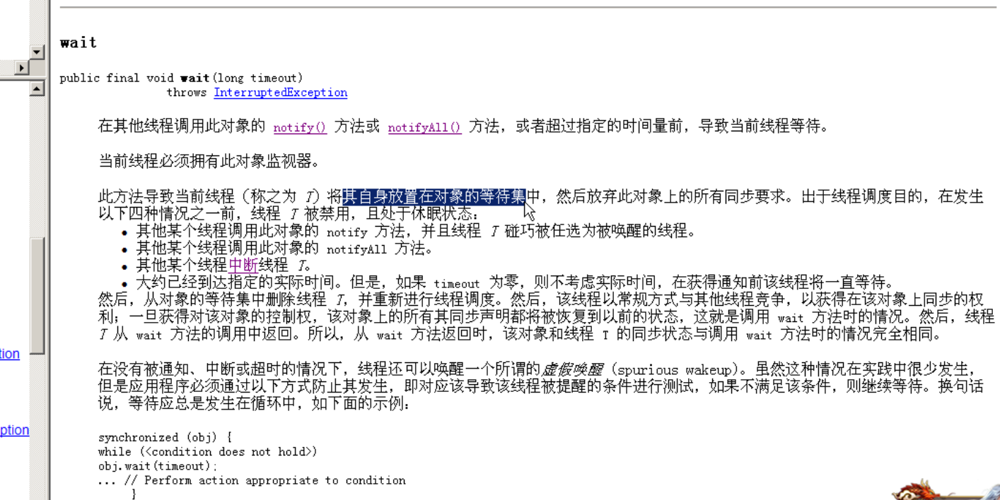

# api
	- 
- ## [[#red]]==**涉及的方法（由object锁调用）**==
	- 1，wait(): 让线程处于冻结状态，被wait的线程会被存储到线程池中。
		- 释放cpu的执行权和执行资格
		- 一个锁一个线程池，哪个锁调用的wait()会存在哪个锁的线程池中。
		-
	- 2，notify():唤醒同一个锁的对应线程池中一个线程([[#red]]==**任意**==).
	- 3，notifyAll():唤醒同一个锁的对应线程池中的所有线程。
		- 适用于多生产多消费模式，同一个锁多个wait线程，需要用这个
- ## 前提
	- 这些方法都必须定义在同步中。
	  因为这些方法是用于操作线程状态的方法。
	  必须要明确到底操作的是哪个锁上的线程。
- ## 为什么操作线程的方法wait notify notifyAll定义在了Object类中？
	- 因为[[#red]]==**这些方法是监视器的方法。监视器其实就是锁**==。
	- 锁可以是任意的对象，任意的对象调用的方式一定定义在Object类中。