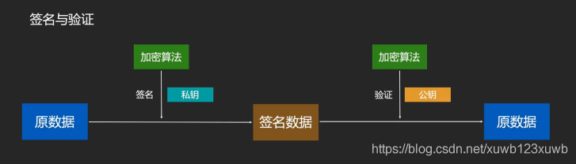

## 签名：
	- 我手里有个私钥，我拿这个私钥 对某个数据 进行一次非对称加密计算； 这个加密之后的数据就可以认为被我签过名了；
- ## 验证：
	- 别人拿着我的公钥 对这个数据再进行一次非对称加密，就可以把数据还原了，从而验证了签名的真实性
- 
- ## 对原理的解释说明：
	- 1、私钥和公钥互相可解
	- 2、私钥只有我有，他具有不可伪造性，因为别人 签名的不能被我的签名解开
-