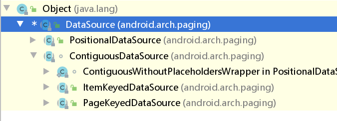
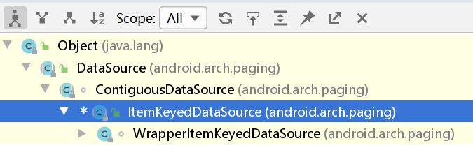
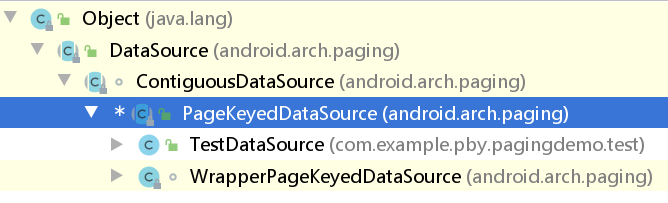
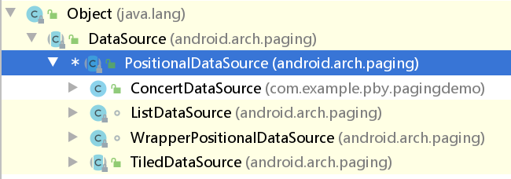

## abstract class DataSource<Key, Value>：
collapsed:: true
	- 
- ## abstract class ItemKeyedDataSource<Key, Value>：
  collapsed:: true
	- 
- ## abstract class PageKeyedDataSource<Key, Value>：
  collapsed:: true
	- 
- ## abstract class PositionalDataSource<T>： 我们刚刚使用的是这个 数据源子类
  collapsed:: true
	- 
- ## DataSource的三个子类:
	- PageKeyedDataSource：如果页面需要实现上一页、下一页，需要将请求的Token传递到下一步时使用
	- ItemKeyedDataSource：程序需要根据上一条数据信息（ID）获取下一条数据时使用
	- PositionalDataSource：需要从数据存储中选择的任何位置获取数据页；例如，请求可能返回以位置1200开头的20个数据项
	- 当然是在拿取数据的地方开始分析，Paging组件的开始执行都是从创建 LiveData<PagedList>开始的，我们源码的分析也从LiveData<PagedList>的创建开始一探Paging背后的逻辑，同学们我们开始分析吧：