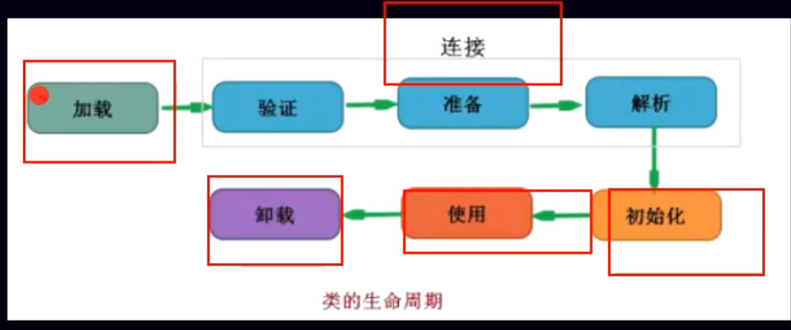
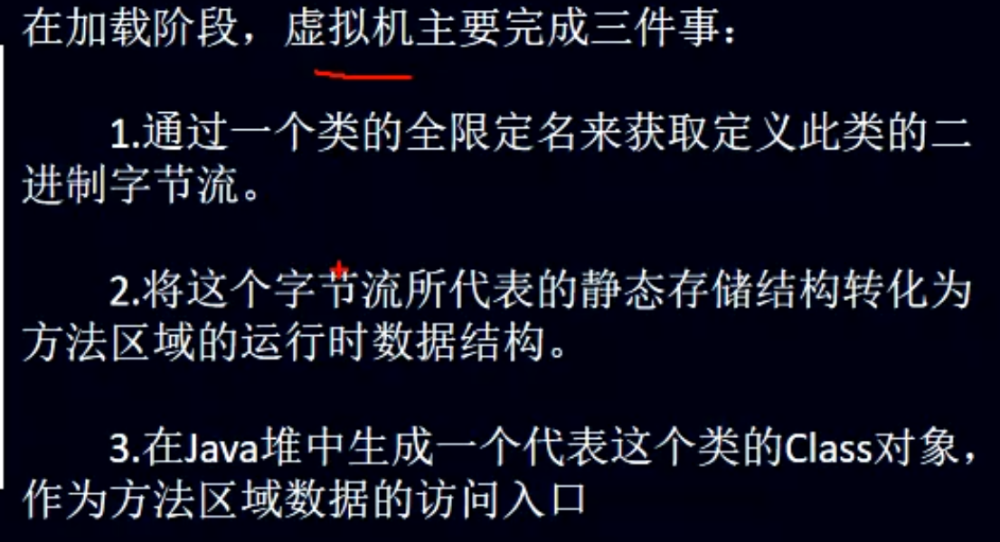

- 
- # 加载 连接 初始化 使用 卸载
- # 1、加载阶段
  collapsed:: true
	- 
- # 2、链接
  collapsed:: true
	- 验证->准备->解析
	- ## 验证：确保被加载的[[#red]]==**类的正确性**==
	  collapsed:: true
		- 验证是连接阶段的第一步，这一阶段的目的是为了确保class文件的字节流中包含的信息是否符合当前虚拟机的要求，并且不会危害虚拟机自身的安全。
		- 验证阶段大致会完成4个阶段的验证动作：
		  collapsed:: true
			- 文件格式验证：验证字节流是否符合class文件格式的规范。判断字节楼的开头是否是0xcafebabe等。
			- 元数据验证：对字节码描述的信息进行语义分析(注意：对比javac变异阶段的语义分析)，以保证其描述的信息符合java语言规范的要求；例如：这个类是否有父类，除了java.lang.object之外。
			- 字节码验证：通过数据流和控制流的分析，确定程序语义是合法的、符合逻辑的。
			- 符号引用验证：确保解析动作能正确执行。
			  验证阶段是非常重要的，但不是必须的，他对程序运行期没有影响，如果所引用的类经过反复验证，那么可以考虑采用-Xverifynone参数来关闭大部分的类验证措施，以缩短虚拟机类加载的时间。
	- ## 准备：为[[#red]]==**类的静态变量分配内存**==，并将其初始化为默认值。
	  collapsed:: true
		- 准备阶段是正式为类的标量分配内存并设置类变量初始值的阶段，这些内存都将在方法区中分配。
		  对于该阶段有以下几点需要注意：
		- 1、这时候进行内存分配的仅包括类变量(static),而不包括实例变量，实例变量会在对象实例化时，随着对象一块分配在java堆中。
		  2、这里所设置的初始值通常情况下是数据类型默认的零值(如0、0L、null、fales等)，而不是在被java代码中被显式地赋予的值。
		  假设一个类变量定义为public static int vla = 4;
		  那么变量val在准备阶段过后的初始值为0，而不是4，因为这个时候尚未开始执行任何java方法，而把val赋值为4的 public static指令实在程序编译之后，存放在类构造器()方法之中的，所以把val赋值为4的动作将在初始化阶段才会执行。
	- ## 解析：把[[#red]]==**类中的符号引用转换为直接引用**==
	  collapsed:: true
		- 解析阶段是虚拟机将常量池内的符号引用替换为直接引用的过程，解析动作主要针对类或接口、字段、类方法、接口方法、方法类型、方法句柄和调用点限定符7类符号引用进行。符号引用就是一组符号来描述目标，可以是任何字面量。
		- 直接引用就是直接指向目标的指针、相对偏移量或一个间接定位到目标的句柄。
- # 3、初始化
	- 为类的静态标量赋予正确的初始值，jvm负责对类进行初始化，主要[[#red]]==**对类变量进行初始化**==
- # 4、使用
  collapsed:: true
	- 创建类的实例，也就是new的方式
	- 访问某个类或接口的静态变量，或者对该静态变量赋值
	- 调用类的静态方法
	- 反射（如Class.forName(“com.shengsiyuan.Test”)）
	- 初始化某个类的子类，则其父类也会被初始化
	- Java虚拟机启动时被标明为启动类的类（Java Test），直接使用java.exe命令来运行某个主类
- # 5、卸载
  collapsed:: true
	- - 执行了System.exit()方法。
	- - 程序正常执行结束
	- - 程序在执行过程中遇到了异常或错误而异常终止
	- - 由于操作系统出现错误而导致java虚拟机进程终止