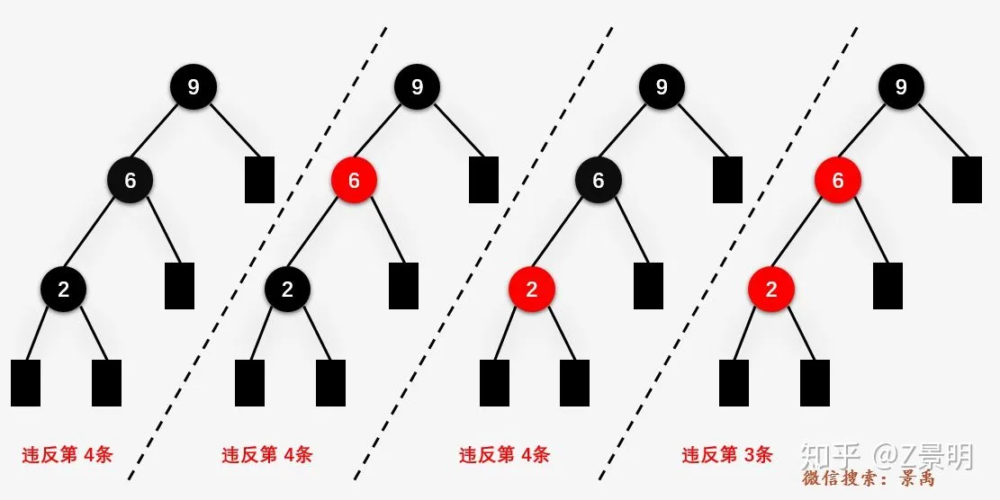

- # 前言
  collapsed:: true
	- 自从JDK1.8HashMap底层实现引入红黑树后，红黑树已经成了越来越多面试话题，有些变态面试官甚至会让你当场手撕红黑树（惨无人道！）。我们今天就来彻底分析了解一波红黑树，解开它神秘面纱。
- # 你将学到
  collapsed:: true
	- 什么是红黑树
	  红黑树的使用场景和解决问题
	  红黑树的常见操作
- # 什么是红黑树
	- ## 定义:
	  collapsed:: true
		- R-B Tree，全称是Red-Black Tree，又称为“红黑树”，它一种特殊的二叉查找树。红黑树的每个节点上都有存储位表示节点的颜色，可以是红(Red)或黑(Black)。
	- ## 红黑树的特性:
	  collapsed:: true
		- 每个节点或者是黑色，或者是红色。
		- 根节点是黑色。
		- 每个叶子节点（NIL）是黑色。 [注意：这里叶子节点，是指为空(NIL或NULL)的叶子节点！]
		- 如果一个节点是红色的，则它的子节点必须是黑色的。
		- 从一个节点到该节点的子孙节点的所有路径上包含相同数目的黑节点。
		-
		- 注意：
		  collapsed:: true
			- 1. 特性3中的叶子节点，是只为空(NIL或null)的节点。
			  2. 特性5，确保没有一条路径会比其他路径长出俩倍。因而，红黑树是相对是接近平衡的二叉树。
			  
			- 
	- ## 红黑树操作
		- 数据结构的操作无非增删改查。我们先来了解下这几种操作对红黑树的影响
		- 改：修改节点的内容值，而非键值，所以不可能会改变原有红黑树的结构。
		  查：遍历树，有先序中序后序三种方式。也不可能会改变原有红黑树的结构。
		  增：增加节点，会改变原有树结构
		  删：删除节点，会改变原有树结构
		- 原有红黑树结构被改变后就会变成一个普通的树，所以必须进行一系列操作使其重新恢复红黑树的特性。
		- 操作方式有两方面，一是旋转重新变回二叉树，二是重新着色重新满足特性4和5。
		- 红黑树的旋转与平衡二叉树旋转一样分为左旋右旋，接下来我们先详细介绍下左右旋转。
		- ## 左旋
		  左旋示例图(以X为节点进行左旋)：
			- ```
			       X                       Z
			      / \     --左旋-->        /
			     Y   Z                   X
			                            /
			                           Y
			  ```
			- 对X节点进行左旋，其实就是将X的右子节点作为X的父节点（X变为Z的左子节点）。
			- 因此，左旋中的“左”，意味着“被旋转的节点将变成一个左节点”。
			- 以上是一个很简单的示例图，在实际情况下会更复杂些，需要考虑以下场景：
			- X节点有没有父节点
			  1.1 如果X是没有父节点，那么直接将X变为Z的左子节点，Z作为根节点
			  2.2. 如果X有父节点，那么X变为Z的左子节点后，Z要变为原X父节点的子节点
			  Z节点有没有左节点
			  2.1 如果Z没有左子节点，将Z直接变成X的父节点
			  2.2 如果Z有左子节点，那么Z的左子节点就要变为X节点的右子节点
			  我们用张动图来更深刻的理解下
			-