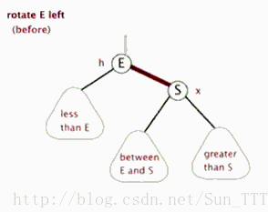
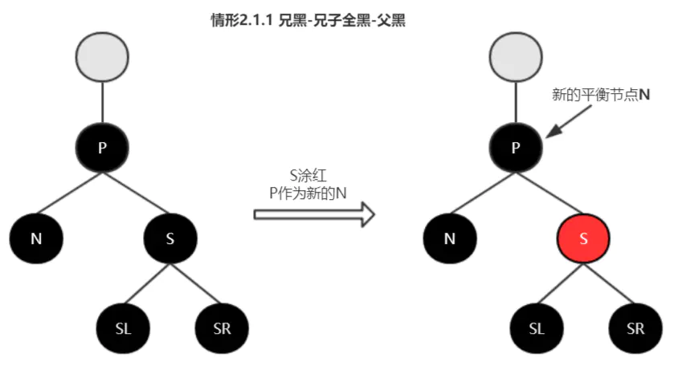
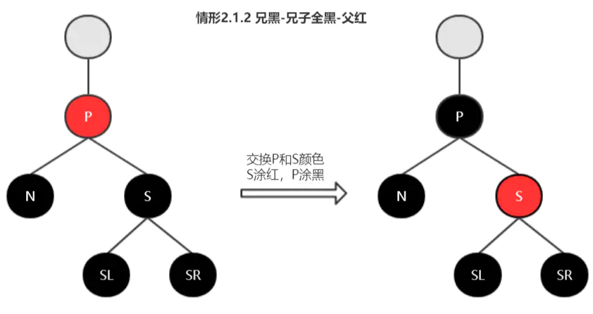
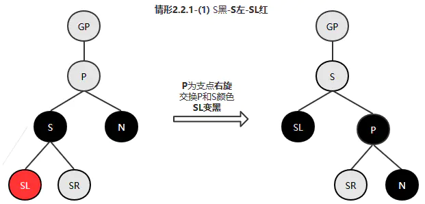
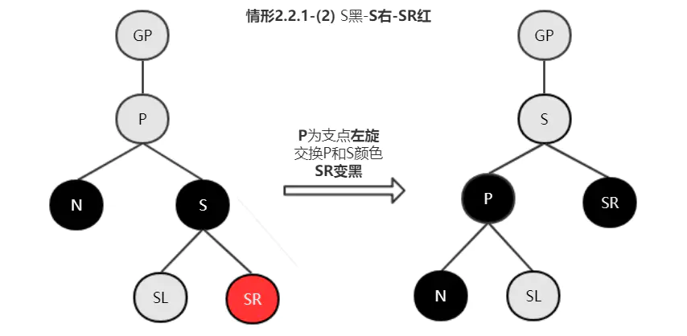
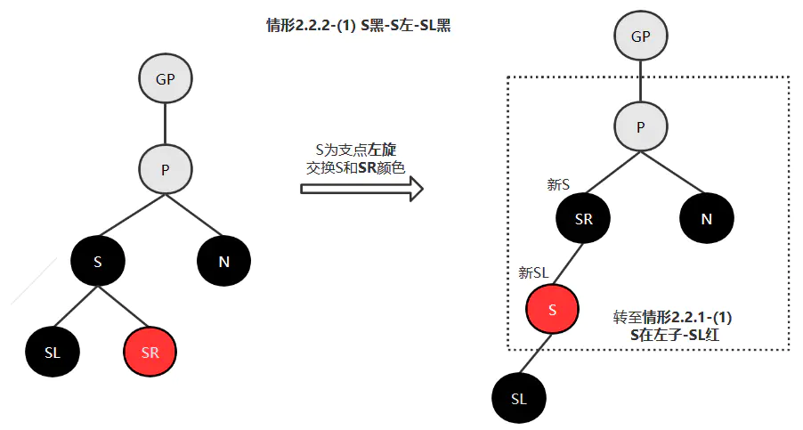
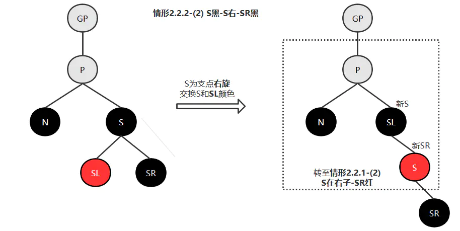
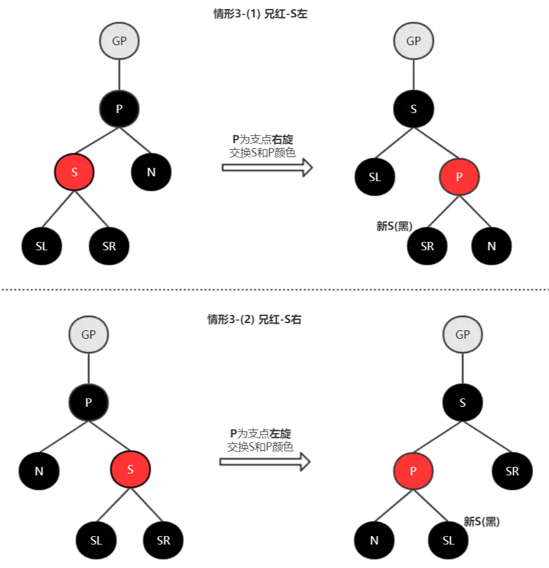

- # 前言
  collapsed:: true
	- 自从JDK1.8HashMap底层实现引入红黑树后，红黑树已经成了越来越多面试话题，有些变态面试官甚至会让你当场手撕红黑树（惨无人道！）。我们今天就来彻底分析了解一波红黑树，解开它神秘面纱。
- # 你将学到
  collapsed:: true
	- 什么是红黑树
	  红黑树的使用场景和解决问题
	  红黑树的常见操作
- # 什么是红黑树
	- ## 定义:
	  collapsed:: true
		- R-B Tree，全称是Red-Black Tree，又称为“红黑树”，它一种特殊的二叉查找树。红黑树的每个节点上都有存储位表示节点的颜色，可以是红(Red)或黑(Black)。
	- ## 红黑树的特性:
	  collapsed:: true
		- 每个节点或者是黑色，或者是红色。
		- 根节点是黑色。
		- 每个叶子节点（NIL）是黑色。 [注意：这里叶子节点，是指为空(NIL或NULL)的叶子节点！]
		- 如果一个节点是红色的，则它的子节点必须是黑色的。
		- 从一个节点到该节点的子孙节点的所有路径上包含相同数目的黑节点。
		-
		- 注意：
		  collapsed:: true
			- 1. 特性3中的叶子节点，是只为空(NIL或null)的节点。
			  2. 特性5，确保没有一条路径会比其他路径长出俩倍。因而，红黑树是相对是接近平衡的二叉树。
			  
			- 
	- ## 红黑树操作
		- 数据结构的操作无非增删改查。我们先来了解下这几种操作对红黑树的影响
		- 改：修改节点的内容值，而非键值，所以不可能会改变原有红黑树的结构。
		  查：遍历树，有先序中序后序三种方式。也不可能会改变原有红黑树的结构。
		  增：增加节点，会改变原有树结构
		  删：删除节点，会改变原有树结构
		- 原有红黑树结构被改变后就会变成一个普通的树，所以必须进行一系列操作使其重新恢复红黑树的特性。
		- 操作方式有两方面，一是旋转重新变回二叉树，二是重新着色重新满足特性4和5。
		- 红黑树的旋转与平衡二叉树旋转一样分为左旋右旋，接下来我们先详细介绍下左右旋转。
		- ## 左旋
		  collapsed:: true
		  左旋示例图(以X为节点进行左旋)：
			- ```
			       X                       Z
			      / \     --左旋-->        /
			     Y   Z                   X
			                            /
			                           Y
			  ```
			- 对X节点进行左旋，其实就是将X的右子节点作为X的父节点（X变为Z的左子节点）。
			- 因此，左旋中的“左”，意味着“被旋转的节点将变成一个左节点”。
			- 以上是一个很简单的示例图，在实际情况下会更复杂些，需要考虑以下场景：
			- X节点有没有父节点
			  collapsed:: true
				- 
			- 1.1 如果X是没有父节点，那么直接将X变为Z的左子节点，Z作为根节点
			- 2.2. 如果X有父节点，那么X变为Z的左子节点后，Z要变为原X父节点的子节点
			  Z节点有没有左节点
			- 2.1 如果Z没有左子节点，将Z直接变成X的父节点
			- 2.2 如果Z有左子节点，那么Z的左子节点就要变为X节点的右子节点
			  我们用张动图来更深刻的理解下
			- 我们再来以下图为例用伪代码实现下左旋，考虑左右场景。
			  collapsed:: true
				- 
				-
			- ## 总结下分为三个步骤：
				- 1、目标节点的右子节点关系处理
					- 1.1 解除目标节点与其右子节点的关系
					- 1.2 如果右子节点有左子节点，则将其变为目标节点的右子节点
				- 2、目标节点的父节点关系处理，总结一句话就是由目标节点的右子节点集成目标节点的父节点关系
					- 2.1 如果目标节点是根节点，则将目标节点的原右子节点变为根节点。
					- 2.2 如果目标节点是左子节点，则将目标节点的原右子节点变为左子节点。
					- 2.3 如果目标节点是右子节点，则将目标节点的原右子节点变为右子节点。
				- 3 目标节点的父节点改为其原右节点
				- 
				- ```
				  LEFT-ROTATE(T, X) 
				  
				  right[X] ← left[Z]  //  将 “Z的左孩子” 设为“X的右孩子”，即 将W设为X的右孩子
				  p[left[Z]] ← X  // 将 “X” 设为 “Z的左孩子的父亲”，即将W的父亲设为X
				  //此时情况如图2所述
				  p[Z] ← p[X] // 将 “X的父亲” 设为 “Z的父亲”
				  if p[X] = nil[T]       
				      then root[T] ← Z    //情况1：如果 “X的父亲”是空节点，则将Z设为根节点
				  else if X = left[p[X]]  
				      then left[p[X]] ← Z //情况2：如果X是它父节点的左孩子，则将Z设为“X的父节点的左孩子”
				  else right[p[X]] ← Z    //情况3：(X是它父节点的右孩子)将y设为“x的父节点的右孩子”
				  //此时情况如图3所述
				  left[Z] ← X // 将 “X” 设为 “Z的左孩子”
				  p[X] ← Z    // 将 “X的父节点” 设为 “Z”
				  //此时情况如图4所述
				  ```
		- # 右旋
		  collapsed:: true
			- 右旋示例图(以X为节点进行右旋)：
			  collapsed:: true
				- ```
				       X                   Z
				      / \     --右旋-->      \
				     Y   Z                    X
				                               \                
				                                Z
				  ```
			- 对X节点进行右旋，其实就是将X的左子节点作为X的父节点（X变为Z的右子节点）。
			- 因此，右旋中的“右”，意味着“被旋转的节点将变成一个右节点”。
			- 因为右旋与左旋对应，所以我们关于右旋的处理过程和伪代码就不在赘述了，大家自行理解吧。
			- 这里我们只用一张动图来理解下
			  collapsed:: true
				- 
		- # 着色
		  collapsed:: true
			- 最开始提到红黑树是有颜色，所以任意的删除添加操作都是有可能使其违反特性4，所以我们需要进行重新着色使其恢复原特性。
			- 关于重新着色部分我们以插入操作为例进行详细说明。
		- # 插入
		  collapsed:: true
			- 讲具体的插入操作之前我们先普及下通用规则和术语
			- ## 通用规则：
			  collapsed:: true
				- ### 规则一：红黑树默认插入的节点总是红色的
				  collapsed:: true
					- 你肯定要问为啥是红色而不是黑色的？
					- 根据红黑树特性5“从一个节点到该节点的子孙节点的所有路径上包含相同数目的黑节点。”
					- 如果我们插入节点是黑色，那么必然会违背该定理。那我们就需要调整多次。相反如果我们插入的是红色，就能以最小的代价进行变换？
				- ### 规则二：红色节点尽可能的向根节点置换
				  collapsed:: true
					- 想象下我们插入的几种可能场景
					- 原来是个空树我们差进去一个红点，那么把这个红节点变黑就完事了
					  我们插入的父节点是黑色的，那我们直接插入啥也不用管。
					  我们插入的父节点是红色的，那么本来原树是红黑颜色平衡的，我们又现在多加了一个红色节点进来，那是不是得想办法再给他减回去？而怎么减是影响最小的？对，把他换到根节点上，然后图黑。
				- ### 规则三：插入节点只能从叶子节点开始插，不能在两个节点中间插
			- ## 术语：
			  collapsed:: true
				- 当前节点：我们要插入的节点，也是我们要处理的节点。我们记作N节点。
				- 父节点：N节点的直接父级节点，记作F节点。
				- 祖父节点：N节点的父级节点的父级节点，记作GP节点。
				- 叔叔节点：GP节点的非P子节点的另一个子节点，记作U节点。
				- 父节点和当前在同一边：N节点相对于P节点是左（右）节点，同时P节点相对于GP节点是左（右）节点。
				- 父节点和当前不在同一边：N节点相对于P节点是左（右）节点，但F节点相对于GP节点是右（左）节点。
			- ## 具体平衡规则
				- 接下来开始我们的正式环节，我们先上流程图
				  collapsed:: true
					- 
				-
				- ## 情况1、2我们不用说明，直接分析流程3。流程3其实可以归结为三类
					- 第一类：父叔节点为同为红色。这种情况要将父叔节点变成黑色，祖父节点变为红色。为什么这么做？再想想上边提到的规则二。
					- 第二类：父红叔黑，子父在同一边的。这种祖父节点涂红，父节点涂黑。然后以祖父节点进行旋转，如果父子同在左那就右旋，如果同在右那就左旋。为什么这么做？
					  collapsed:: true
						- 1原树父红叔黑，那么叔叔节点就不是干扰项了。因为叔叔节点原来就是平衡的，他是黑色的无论怎么旋转。
						  2那么我们就需要在子，父，祖父，这条链路三个节点上做文章实现新的平衡。
						  3原树父节点是红的，那么祖父节点肯定就是黑的。而新树上，子节点是红的，那如果我们把父节点改成黑的，祖父节点改成红的，然后以父节点代替祖父节点的位置那是不是就完成了平衡？
						- 
					- 第三类：父红叔黑，子父不在同一边的。这种情况我们就要考虑把它转换成情况二，对父节点进行旋转，如果父节点在做那么就对父节点左旋，如果父节点再右，那就右旋。为什么这么做？看下图一目了然
					  collapsed:: true
						- 
						- 
		- # 实践一下了。我们以下图为例，在K点插入一个左节点N，看看变换规则。
		  collapsed:: true
			- 原红黑树结构：
			  collapsed:: true
				- 
			- 向K节点插入一个新节点N：
			  collapsed:: true
				- 
			- 父（K）红叔（J）红，父（K）叔（J）节点变黑，祖父节点（I）变红，并以祖父节点（I）进行下一步处理：
			  collapsed:: true
				- 
			- 父（G）红叔（H）黑，且父（G）为左子节点与当前节点（I）右子节点不在同一边，以父（G）进行左旋，并以父（G）进行下一步操作。
			  collapsed:: true
				- 
				-
			- 父（I）红叔（H）黑，且父（I）为左子节点与当前（G）左子节点在同一边，所以当前（G）节点的祖父节点（E）进行右旋。
			  collapsed:: true
				- 
			- 上述祖父节点（E）右旋后将祖父节点（E）改为红色，父节点（I）改为黑色
				- 
			- 最终变换完的效果如上图
				- 由于上图图片大小限制，暂时没有绘制完全部节点。大家可以只看A-B-I-E分支的黑高，不用关心其他分支的。
		- # 删除
			- 讲完了插入我们讲讲删除规则，同样的我们先讲下通用规则
			- ## 通用规则：
			  collapsed:: true
				- ### 规则一：删除不是上来直接把节点干掉，而是要转换成后继节点为叶子节点的情况
					- 可以参看[红黑树(一)之 原理和算法详细介绍](https://www.cnblogs.com/skywang12345/p/3245399.html)这篇文章删除部分。总之就是先找到找要删除节点的中序遍历的后继节点，将该后继节点的值所有内容都复制给要被删除的节点。然后以后继节点继续递归，直到该后继节点是叶子节点。
					  collapsed:: true
						- 
					- 按照上图举例，删除节点80，不是直接把节点80干掉，而是找到80的左子树最大值60来替换原节点80，然后删除60节点。
			- ## 术语：
			  collapsed:: true
				- 
				- 当前节点：我们要插入的节点，也是我们要处理的节点。我们记作N节点。
				  父节点：N节点的直接父级节点，记作P节点。
				  兄弟节点：N节点的父级节点的另一个子节点，记作S节点。
				  兄弟节点的左子节点：S的左孩子，记作SL节点。
				  兄弟节点的右子节点：S的右孩子，记作SR节点。
			- ## 具体平衡规则
			  collapsed:: true
				- 删除操作主要分为两个步骤：
				  collapsed:: true
					- 1、执行标准的 BST 的删除操作具体参考图解：什么是二叉排序树？。总结下就是分为以下三种情况：
						- 被删除节点没有子节点，那么它就是叶子节点直接删除。
						  被删除的节点有一个子节点，那么用其子节点代替它，然后删除子节点。
						  被删除的节点有两个子节点，那么将后继节点内容全部复制给该节点，然后以后继节点继续处理，直到出现上述两种情况的时候。
					- 2 旋转着色重新恢复平衡，平衡手段主要以下两种方式
				- 两种方式：
				  collapsed:: true
					- 把这个分枝的黑高减一转换成整个树黑高减一。
					- 向兄弟借，然后由兄弟自己恢复平衡。
				- 
				- 1.N为根节点
					- 网上写的是“直接删除达到平衡”，但是我个人分析这个平衡其实就是变成了一个空树。
					  如果最开始删除的就是根节点，并且它有叶子节点。那么就需要用叶子节点来替换它删除。那么N就是叶子节点而不是根节点。
					  如果最开始它没有叶子节点，那么此时就只能删除根节点。根节点删除后是不是这棵树都没了？
				- 2.兄弟节点为黑
				  collapsed:: true
					- 2.1 兄弟子节点全黑
					  collapsed:: true
						- 2.1.1 父节点为黑
						  collapsed:: true
							- 
							- 分析这种情况的时候可以先分析下2.1.2。可以看出这种情况跟2.1.2的区别就是在父节点的颜色上。
							- 因为原来父节点就是黑色平衡状态，所以如果我们想在父节点以下来解决这平衡问题了，那就只能在N节点的子节点找出一个红子节点把他变成黑节点。但是如果N节点删除之前有个红子节点，那我们直接删除红子节点就可以直接完成平衡。而我们现在删除的N是个黑节点，所以想通过红变黑增加黑高的路子是行不通的
							- 第二种方案就是从兄弟节点“去借去骗去偷袭”，但是这种情况下兄弟节点也是没有红子节点的，而且他也不可能红色孙子节点。如果他有红色孙子节点，那么这个红色孙子节点必然还有黑色子节点，那么这个树之前就不是红黑树。
							- 既然上述情况都无法行的通那就只能问题转换，让兄弟节点黑高也减一，变成父节点以下黑高都减一，问题就转换成了如何父节点的黑高减一。
						- 2.1.2 父节点为红
						  collapsed:: true
							- 
							- 这种情况只需要交换父兄的颜色即可平衡。删除前：GP-P-N高度减一。变换后GP-P-N的黑高又被增加了一，而GP-P-S链路的黑高没变。同时因为S的子节点全都是黑色，那么S节点变为红色后也不会出现两个红情况违反红黑树特性4的情况。父节点原来是红色，所以祖父节点一定不是红色（那就是黑色）否则也是违反红黑树特性4，祖父节点是黑色，那么父节点转换为黑色并不违反红黑树特性。
						-
					- 2.2 兄弟子节点不全黑
					  collapsed:: true
						- 既然兄弟节点不全黑，说明兄弟节点存在红节点的。那么我们就可以这样处理，兄弟节点借给删除节点一个黑节点，这样删除节点的黑高就恢复平衡，兄弟节点的黑高就减一了。
						- 那么问题就转换成了这样，兄弟节点在“无中生有”一个黑色节点，这样兄弟节点黑高就恢复了。怎么“无中生有”呢？就是把一个红色节点改为一个黑色节点。接下来根据不同情况我们在具体分析下场景。
						- 2.2.1 兄在左(右)，兄左(右)子红
						  collapsed:: true
							- 
							- N分支去S分支借个黑节点过来，所以右旋。右旋完毕后P节点要变黑。如果不变黑怎么算借呢？
							- 然后S节点要变为原来P节点的颜色，因为现在S节点做到了原来P节点的位置，所以他的颜色值必须要与原来的P节点一致才能保证不对GP节点产生影响。
							- 最后原S节点借出去了一个黑节点，此时这一侧就少个黑色节点，那么怎么处理呢？左子SL红节点改为黑色。
							- 同样问题，左子SL节点变黑后会破坏红黑叔稳定性么？答案不会。如果SL原来是红色，那么SL的子节点就不可能是红色的（那也就是黑色），所以必然不会破坏红黑树特性4。
							- {:height 373, :width 746}
							- 兄右，兄右子红与刚才情况对称，大家自行推导。
						- 2.2.2 兄在左(右)，兄右(左)子红
						  collapsed:: true
							- 这种情况我们要做的就是转换成2.2.1的情形，然后再以2.2.1的情况进行二次处理。
							- 
					- 好了，现在我们的目标明确了，将兄左，兄右子红情况转换成兄左兄左子红的情况，然后还不能破坏原S分支的红黑树性质。怎么搞？怎么搞？
					- 以S节点进行左旋，左旋后S分支的黑高没变（都还是2个黑色节点）。但是有另个问题，原来S节点的颜色被改变了。所以我们需要将SR节点的颜色改为原来S节点的颜色。这样加完有多了一个黑节点，怎么办？把原来S节点颜色改为红色。
					- 这样我们就转换成了2.2.1兄左，兄左子红的情况。
					- 接下来肯定又有同学要问了，你咋确定SL节点一定是黑的不是红的？万一SL是红的你这么一处理岂不是出现S，SL同为红色的情况？静下心思考下，如果SL是红色，岂不是直接可以用2.2.1情况处理了？
					- 
					- 兄右兄左子红情况与上述情况对称大家自行推导。
				- 3.兄弟节点为红
					- 图
					  collapsed:: true
						- 
					- 我们以兄弟节点在左为例进行分析。N分支少了一个黑节点怎么办？找兄弟！兄弟借出来少了个黑节点怎么办？无中生有！
					  
					  讲讲这种情况怎么无中生有，原S分支只有S是红的，那只能把S节点搞成黑色。但这样处理后左边黑高确实没变，但右边右缺出现三个连续黑节点S-P-N。这时候大家会说没问题啊，黑高已经平衡了。但是想想，如果这么搞下去会不会红黑树最终变成黑树了？
					  所以我们需要将原来P节点颜色改为红色，此时情况就转换成情况2兄黑情况，所以我们也没必要留着三连黑节点。
					  
					  兄弟为右红节点情况与左红对称，大家自行推导。
			- 删除流程总结
			- 红黑树删除逻辑比添加逻辑复杂许多，我们这里小小的总结下。
			  
			  一. 节点删除需要转换到叶子节删除，不是直接把节点删除。
			  二. 删除节点后的平衡逻辑操作主要思想是黑高的再平衡，黑高在平衡的手段有两种：
			  * 分支的黑高减少向上转换为主枝的黑高减少。
			  * 找兄弟节点去借，然后兄弟再无中生有。
			  三. 最基本的情形就是2.2.1情况，其他情况都是通过各种变换后转换到2.2.1情形处理