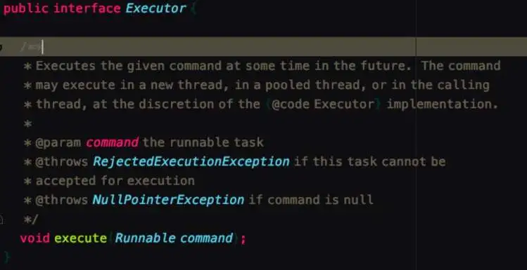

- # 深入理解线程池
	- ## 1. 项目中代码实例
	  collapsed:: true
		- 我们在源码的时候通常会到如下代码使用方式：
		  collapsed:: true
			- 
		- private final ExecutorService socketDataProcessor;
		- this.socketDataProcessor.submit(new SocketDataProcessorRunnable(var1, var3, var4));
		- socketDataProcessor 类型为ExecutorService,调用了submit方法，传递了一个runable。
		- 更直观的例子如下:
		  collapsed:: true
			- 
		- 所以引出我们今天要讲的主人公-线程池，我们不禁会产生下面的疑问：
		- 什么是线程池？
		  解决什么问题？
		  线程池的设计与实现？
		  线程池的种类及其使用？
		  下面我们就围绕这几个问题咋展开讨论。
	- ## 2、什么是线程池
		- 线程过多会带来额外的开销，其中包括创建销毁线程的开销、调度线程的开销等等，同时也降低了计算机的整体性能。
		- 线程池用来维护多个线程，等待分配可并发执行的任务。一方面避免了处理任务时创建销毁线程开销的代价，另一方面避免了线程数量膨胀导致的过分调度问题，保证了对内核的充分利用。
	- ## 3、线程池解决的问题
		- 线程池解决的问题就是对资源的管理问题。
		- 在并发环境下，操作系统不能够确定在任意时刻中，有多少任务需要执行，有多少资源需要投入。这种不确定性将产生许多问题：
		- 频繁申请/销毁资源和调度资源，将带来额外的消耗，可能会非常巨大。
		- 对资源无限申请缺少抑制手段，易引发系统资源耗尽的风险。引发OOM。
		- 不对资源管理，会降低系统的稳定性。
		- 所以线程池采用了池化的思想，将线程池进行统一管理。
		- 采用池化的思想有：
		- 内存池(Memory Pooling)：预先申请内存，提升申请内存速度，减少内存碎片。
		  连接池(Connection Pooling)：预先申请数据库连接，提升申请连接的速度，降低系统的开销。
		  实例池(Object Pooling)：循环使用对象，减少资源在初始化和释放时的昂贵损耗。
	- ## 4. 线程池的设计与实现
		- 线程池的具体实现是ThreadPoolExecutor,先看下这个类的总体设计。
		- ### 4.1 总体设计
			- ThreadPoolExecutor继承关系如下：
			  collapsed:: true
				- 
			- 我们从上到下看下这几个类到底定义和做了些什么。
			- Excutor
			  collapsed:: true
				- 
				- 定义了一个 excute()方法，将任务提交和执行解耦。
				- 用户无需关注如何创建线程，如何调度线程来执行任务，用户只需提供Runnable对象，将任务的运行逻辑提交到执行器(Executor)中，由Executor框架完成线程的调配和任务的执行部分。
			- ExcutorService
			  collapsed:: true
				- 
				- ExecutorService接口增加了一些能力：
				  （1）扩充执行任务的能力，补充可以为一个或一批异步任务生成Future的方法,eg：submit()方法；
				  （2）提供了管控线程池的方法，比如停止线程池的运行。eg： shutdown();
			- AbstractExecuteService
				-
- 参考
	- https://tech.meituan.com/2020/04/02/java-pooling-pratice-in-meituan.html