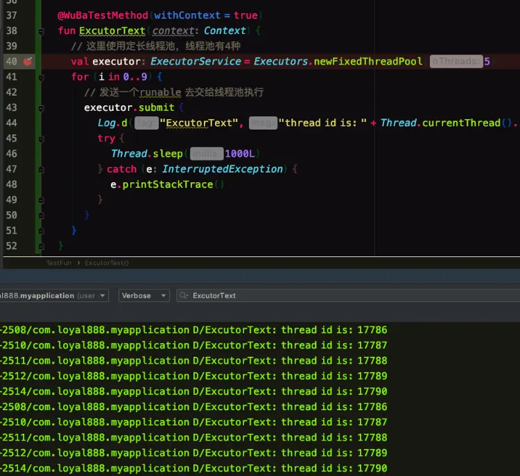

- # 深入理解线程池
	- ## 1. 项目中代码实例
	  collapsed:: true
		- 我们在源码的时候通常会到如下代码使用方式：
		  collapsed:: true
			- 
		- private final ExecutorService socketDataProcessor;
		- this.socketDataProcessor.submit(new SocketDataProcessorRunnable(var1, var3, var4));
		- socketDataProcessor 类型为ExecutorService,调用了submit方法，传递了一个runable。
		- 更直观的例子如下:
		  collapsed:: true
			- 
		- 所以引出我们今天要讲的主人公-线程池，我们不禁会产生下面的疑问：
		- 什么是线程池？
		  解决什么问题？
		  线程池的设计与实现？
		  线程池的种类及其使用？
		  下面我们就围绕这几个问题咋展开讨论。
	- ## 2、什么是线程池
		- 线程过多会带来额外的开销，其中包括创建销毁线程的开销、调度线程的开销等等，同时也降低了计算机的整体性能。
		- 线程池用来维护多个线程，等待分配可并发执行的任务。一方面避免了处理任务时创建销毁线程开销的代价，另一方面避免了线程数量膨胀导致的过分调度问题，保证了对内核的充分利用。
	- ## 3、线程池解决的问题
		- 线程池解决的问题就是对资源的管理问题。
		- 在并发环境下，操作系统不能够确定在任意时刻中，有多少任务需要执行，有多少资源需要投入。这种不确定性将产生许多问题：
		- 频繁申请/销毁资源和调度资源，将带来额外的消耗，可能会非常巨大。
		- 对资源无限申请缺少抑制手段，易引发系统资源耗尽的风险。引发OOM。
		- 不对资源管理，会降低系统的稳定性。
		- 所以线程池采用了池化的思想，将线程池进行统一管理。
		- 采用池化的思想有：
		- 内存池(Memory Pooling)：预先申请内存，提升申请内存速度，减少内存碎片。
		  连接池(Connection Pooling)：预先申请数据库连接，提升申请连接的速度，降低系统的开销。
		  实例池(Object Pooling)：循环使用对象，减少资源在初始化和释放时的昂贵损耗。
	- ## 4. 线程池的设计与实现
		- 线程池的具体实现是ThreadPoolExecutor,先看下这个类的总体设计。
		- ### 4.1 总体设计
		  collapsed:: true
			- ThreadPoolExecutor继承关系如下：
			  collapsed:: true
				- 
			- 我们从上到下看下这几个类到底定义和做了些什么。
			- Excutor
			  collapsed:: true
				- 
				- 定义了一个 excute()方法，将任务提交和执行解耦。
				- 用户无需关注如何创建线程，如何调度线程来执行任务，用户只需提供Runnable对象，将任务的运行逻辑提交到执行器(Executor)中，由Executor框架完成线程的调配和任务的执行部分。
			- ExcutorService
			  collapsed:: true
				- 
				- ExecutorService接口增加了一些能力：
				  （1）扩充执行任务的能力，补充可以为一个或一批异步任务生成Future的方法,eg：submit()方法；
				  （2）提供了管控线程池的方法，比如停止线程池的运行。eg： shutdown();
			- AbstractExecuteService
			  collapsed:: true
				- 
				- AbstractExecutorService则是上层的抽象类，将执行任务的流程串联了起来（submit 里面调用了 excute），保证下层的实现只需关注一个执行任务的方法即可。看下submit的具体实现：
				- 
				- 可以看到这个submit方法，主要做的事情就是将传进来的task包装，交给execute方法去执行。后面会具体分析这个excute方法
			- ThreadPoolExcutor
				- 
				- 可以看到方法可以分为几类：线程管理策略、构造函数、执行关闭、参数的get/set。
				- 我们先看一下构造函数，及其参数的含义：
				- 
				- corePoolSize : 核心线程数，这些线程创建后并不会消除，而是一种常驻线程。
				- maxinumPoolSize:表示最大允许被创建的线程数，比如当前任务较多，将核心线程数都用完了，还无法满足需求时，此时就会创建新的线程，但是线程池内线程总数不会超过最大线程数。
				- keepAliveTime,unit: 非核心线程数的存活时间。
				- ThreadFactory： 用来创建线程，用默认的就行，自定义的可以设置线程的优先级。
				- Handler: 任务拒绝策略，有两种情况，第一种是当我们调用shutdown 等方法关闭线程池后，这时候即使线程池内部还有没执行完的任务正在执行，但是由于线程池已经关闭，我们再继续想线程池提交任务就会遭到拒绝。另一种情况就是当达到最大线程数，线程池已经没有能力继续处理新提交的任务时，这是也就拒绝。
				- 对类结构了解了之后，再来了解下线程生命周期是如何管理的。
			-
		- ## 4.2 线程生命周期
		  collapsed:: true
			- 线程的状态
				- 线程在线程池中有5种状态，分别是
					- 
				- 那么这个状态是怎么区分的呢？用了一个字段（ctl）来标识：
				- private final AtomicInteger ctl = new AtomicInteger(ctlOf(RUNNING, 0));
				- 对线程池的运行状态和线程池中有效线程的数量进行控制的一个字段， 它同时包含两部分的信息：线程池的运行状态 (runState) 和线程池内有效线程的数量 workerCount)，高3位保存runState，低29位保存workerCount，两个变量之间互不干扰。
				- 用一个变量去存储两个值，可避免在做相关决策时，出现不一致的情况，不必为了维护两者的一致，而占用锁资源。这里都使用的是位运算的方式，相比于基本运算，速度也会快很多。
			- 线程的生命周期
				- 
		- ## 4.3任务执行机制
		  collapsed:: true
			- 任务执行就是调用submit() -> excute(),excute里面的具体流程。先看代码：
			  collapsed:: true
				- 
			- 1 首先检测线程池运行状态，如果不是RUNNING，则直接拒绝，线程池要保证在RUNNING的状态下执行任务。
			- 2 如果workerCount < corePoolSize，则创建并启动一个线程来执行新提交的任务。
			- 3 如果workerCount >= corePoolSize，且线程池内的阻塞队列未满，则将任务添加到该阻塞队列中。
			- 4 如果workerCount >= corePoolSize && workerCount < maximumPoolSize，且线程池内的阻塞队列已满，则创建并启动一个线程来执行新提交的任务。
			- 5 如果workerCount >= maximumPoolSize，并且线程池内的阻塞队列已满, 则根据拒绝策略来处理该任务, 默认的处理方式是直接抛异常。
			- 流程图如下：
			  collapsed:: true
				- 
			- 那么我们先看我们给定的例子，第一次进来，workerCount < corePoolSize，会执行addWork()函数，且为核心线程。
			- 看一下addWork干了啥：
		-
- 参考
	- https://tech.meituan.com/2020/04/02/java-pooling-pratice-in-meituan.html