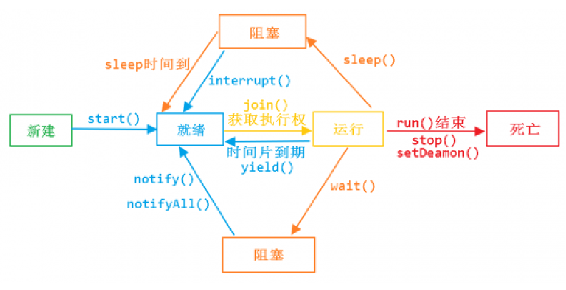

- 
- ## 1、新建装态
	- new Thread()
- ## 2、准备就绪，可运行态（具备执行资格）
  collapsed:: true
	- 新建到就绪：thread.start
	- 阻塞到就绪：
		- 1、sleep()睡时间到，睡被打断
		- 2、notify notifyAll
	- 运行到就绪：
		- 运行时间片到期
		- yield() 暂停[[#red]]==**（让出执行权）**==
- ## 3、运行状态（具备执行权）
	- 轮到执行
	- join 获取执行权
- ## 4、阻塞状态（释放执行权）
	- 运行的线程
	- 1、调用sleep（不释放锁）
	- 2、wait()（释放锁）
- ## 5、死亡
	- run结束
	- stop()
- # [[六种状态的线程生命周期]]
-