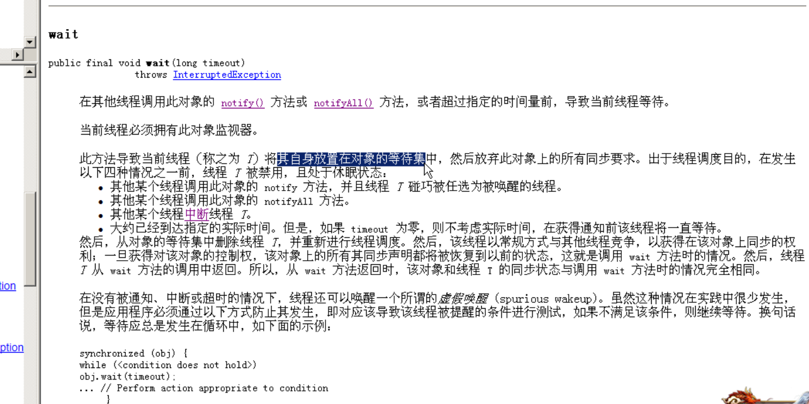
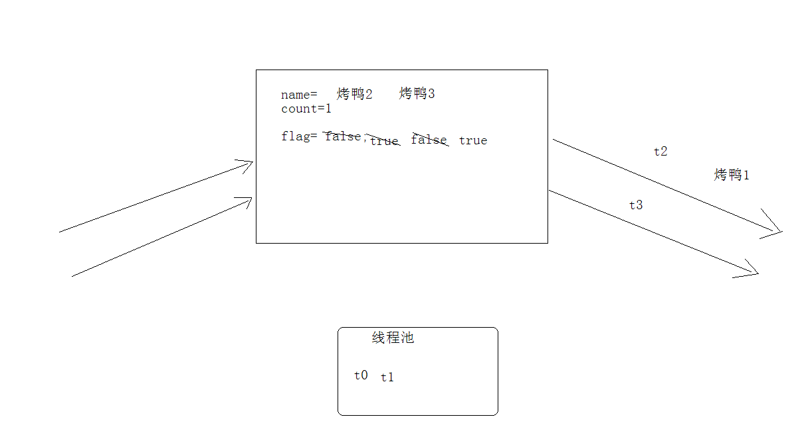
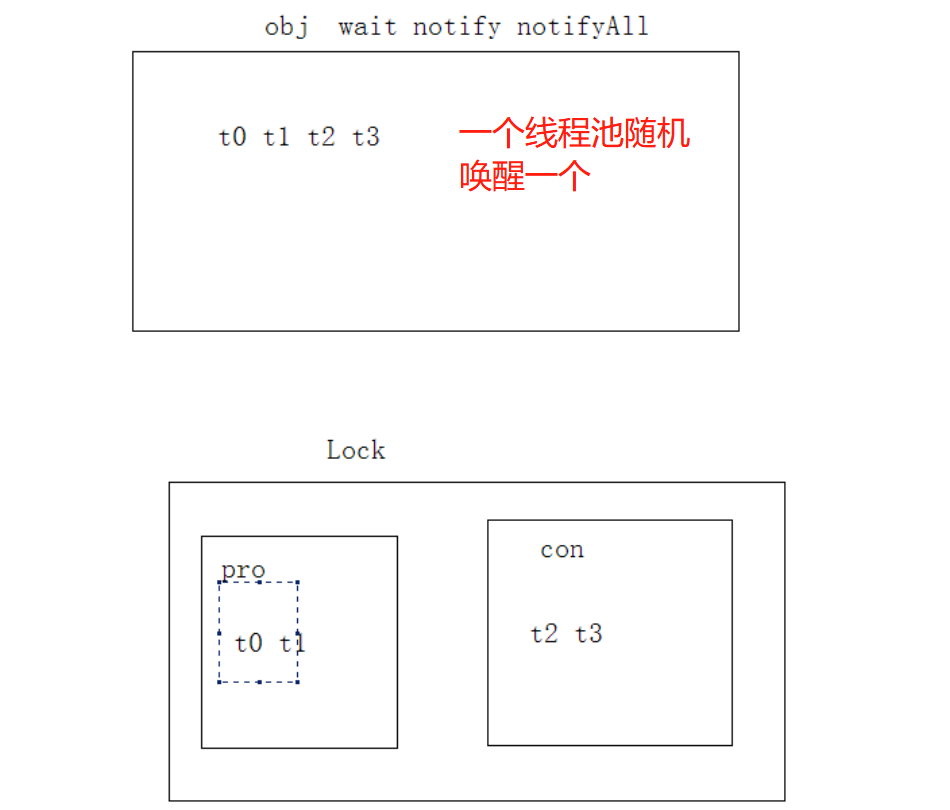
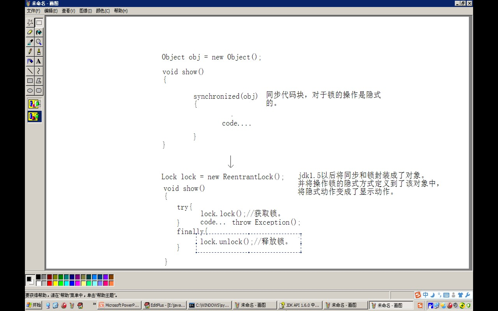

- # 一、概述
	- 多个线程在处理同一资源，但是任务却不同
- # 二、示例1：输入资源，输出资源
  collapsed:: true
	- 这个效果是，输出mike一片丽丽一片的出现，而不是单个切换
	- 因为输入线程获取cpu执行权会来回切换赋值，
	- 输出线程获取执行权，只会对着最后赋值的那个进行输出
	- ```java
	  
	  //操作的资源
	  class Resource
	  {
	  	String name;
	  	String sex;
	  }
	  
	  
	  //线程1：输入
	  class Input implements Runnable
	  {
	  	Resource r ;
	  //	Object obj = new Object();
	  	Input(Resource r)
	  	{
	  		this.r = r;
	  	}
	  	public void run()
	  	{
	  		int x = 0;
	  		while(true)
	  		{   // 保证锁的唯一
	  			synchronized(r)
	  			{
	  				if(x==0)
	  				{
	  					r.name = "mike";
	  					r.sex = "nan";
	  				}
	  				else
	  				{
	  					r.name = "丽丽";
	  					r.sex = "女女女女女女";
	  				}
	  			}
	  			x = (x+1)%2;
	  
	  		}
	  	}
	  }
	  // 线程2：输出
	  class Output implements Runnable
	  {
	  
	  	Resource r;
	  //	Object obj = new Object();
	  	Output(Resource r)
	  	{
	  		this.r = r;
	  	}
	  
	  	public void run()
	  	{
	  		while(true)
	  		{
	              // 2个线程锁的唯一
	  			synchronized(r)
	  			{
	  				System.out.println(r.name+"....."+r.sex);
	  			}
	  		}
	  	}
	  }
	  
	  
	  
	  class  ResourceDemo
	  {
	  	public static void main(String[] args) 
	  	{
	  		//创建资源。
	  		Resource r = new Resource();
	  		//创建任务。
	  		Input in = new Input(r);
	  		Output out = new Output(r);
	  		//创建线程，执行路径。
	  		Thread t1 = new Thread(in);
	  		Thread t2 = new Thread(out);
	  		//开启线程
	  		t1.start();
	  		t2.start();
	  	}
	  }
	  
	  ```
- # 三、示例2：单个输入输出切换，线程间通信
  collapsed:: true
	- ```java
	  //资源
	  class Resource
	  {
	  	String name;
	  	String sex;
	  	boolean flag = false;
	  }
	  
	  
	  //输入
	  class Input implements Runnable
	  {
	  	Resource r ;
	  //	Object obj = new Object();
	  	Input(Resource r)
	  	{
	  		this.r = r;
	  	}
	  	public void run()
	  	{
	  		int x = 0;
	  		while(true)
	  		{
	  			synchronized(r)
	  			{
	  				if(r.flag)
	  					try{r.wait();}catch(InterruptedException e){}
	  				if(x==0)
	  				{
	  					r.name = "mike";
	  					r.sex = "nan";
	  				}
	  				else
	  				{
	  					r.name = "丽丽";
	  					r.sex = "女女女女女女";
	  				}
	  				r.flag = true;
	  				r.notify();
	  			}
	  			x = (x+1)%2;
	  
	  		}
	  	}
	  }
	  //输出
	  class Output implements Runnable
	  {
	  
	  	Resource r;
	  //	Object obj = new Object();
	  	Output(Resource r)
	  	{
	  		this.r = r;
	  	}
	  
	  	public void run()
	  	{
	  		while(true)
	  		{
	  			synchronized(r)
	  			{
	  				if(!r.flag)
	  					try{r.wait();}catch(InterruptedException e){}
	  				System.out.println(r.name+"....."+r.sex);
	  				r.flag = false;
	  				r.notify();
	  			}
	  		}
	  	}
	  }
	  
	  
	  
	  class  ResourceDemo2
	  {
	  	public static void main(String[] args) 
	  	{
	  		//创建资源。
	  		Resource r = new Resource();
	  		//创建任务。
	  		Input in = new Input(r);
	  		Output out = new Output(r);
	  		//创建线程，执行路径。
	  		Thread t1 = new Thread(in);
	  		Thread t2 = new Thread(out);
	  		//开启线程
	  		t1.start();
	  		t2.start();
	  	}
	  }
	  
	  ```
- # 四、等待/唤醒机制（wait()，notify()）
  collapsed:: true
	- 
	- ## [[#red]]==**涉及的方法（由object锁调用）**==
		- 1，wait(): 让线程处于冻结状态，被wait的线程会被存储到线程池中。
			- 释放cpu的执行权和执行资格
			- 一个锁一个线程池，哪个锁调用的wait()会存在哪个锁的线程池中。
			-
		- 2，notify():唤醒同一个锁的对应线程池中一个线程([[#red]]==**任意**==).
		- 3，notifyAll():唤醒同一个锁的对应线程池中的所有线程。
			- 适用于多生产多消费模式，同一个锁多个wait线程，需要用这个
	- ## 前提
		- 这些方法都必须定义在同步中。
		  因为这些方法是用于操作线程状态的方法。
		  必须要明确到底操作的是哪个锁上的线程。
	- ## 为什么操作线程的方法wait notify notifyAll定义在了Object类中？
		- 因为[[#red]]==**这些方法是监视器的方法。监视器其实就是锁**==。
		- 锁可以是任意的对象，任意的对象调用的方式一定定义在Object类中。
- # 五、示例3：代码优化:实际开发用这个（单生产消费用if+notify就行）
  collapsed:: true
	- 1、共享操作的资源里封装属性
	- 2、属性操作添加同步方法
	- ```java
	  class Resource
	  {
	  	private String name;
	  	private String sex;
	  	private boolean flag = false;
	  
	  	public synchronized void set(String name,String sex)
	  	{
	  		if(flag)
	  			try{this.wait();}catch(InterruptedException e){}
	  		this.name = name;
	  		this.sex = sex;
	  		flag = true;
	  		this.notify();
	  	}
	  
	  	public synchronized void out()
	  	{
	  		if(!flag)
	  			try{this.wait();}catch(InterruptedException e){}
	  		System.out.println(name+"...+...."+sex);
	  		flag = false;
	  		notify();
	  	}
	  }
	  
	  
	  //输入
	  class Input implements Runnable
	  {
	  	Resource r ;
	  //	Object obj = new Object();
	  	Input(Resource r)
	  	{
	  		this.r = r;
	  	}
	  	public void run()
	  	{
	  		int x = 0;
	  		while(true)
	  		{
	  			if(x==0)
	  			{
	  				r.set("mike","nan");
	  			}
	  			else
	  			{
	  				r.set("丽丽","女女女女女女");
	  			}
	  			x = (x+1)%2;
	  		}
	  	}
	  }
	  //输出
	  class Output implements Runnable
	  {
	  
	  	Resource r;
	  //	Object obj = new Object();
	  	Output(Resource r)
	  	{
	  		this.r = r;
	  	}
	  
	  	public void run()
	  	{
	  		while(true)
	  		{
	  			r.out();
	  		}
	  	}
	  }
	  
	  
	  
	  class  ResourceDemo3
	  {
	  	public static void main(String[] args) 
	  	{
	  		//创建资源。
	  		Resource r = new Resource();
	  		//创建任务。
	  		Input in = new Input(r);
	  		Output out = new Output(r);
	  		//创建线程，执行路径。
	  		Thread t1 = new Thread(in);
	  		Thread t2 = new Thread(out);
	  		//开启线程
	  		t1.start();
	  		t2.start();
	  	}
	  }
	  
	  ```
- # 六、多生产多消费示例
	- 
	- ## 多生产者，多消费者的问题。
		- 问题1：if判断标记，只有一次，会导致不该运行的线程运行了。出现了数据错误的情况。
			- while判断标记，解决了线程获取执行权后，是否要运行！
		- 问题2：notify:只能唤醒一个线程，如果本方唤醒了本方，没有意义。而且while判断标记+notify会导致死锁。
			- notifyAll解决了本方线程一定会唤醒对方线程的问题。
	- ## 情况1 用示例3的if+notify会出现，生产1个 消费2个的情况，因为多生产多消费的问题
	- ## 改进1：（while+notifyAll）
		- ## 完整代码
		  collapsed:: true
			- ```java
			  class Resource
			  {
			  	private String name;
			  	private int count = 1;
			  	private boolean flag = false;
			  	public synchronized void set(String name)//  
			  	{
			  		while(flag)
			  			try{this.wait();}catch(InterruptedException e){}//   t1    t0  wait
			  		
			  		this.name = name + count;//烤鸭1  烤鸭2  烤鸭3
			  		count++;//2 3 4
			  		System.out.println(Thread.currentThread().getName()+"...生产者..."+this.name);//生产烤鸭1 生产烤鸭2 生产烤鸭3
			  		flag = true;
			  		notifyAll();
			  	}
			  
			  	public synchronized void out()//  t3
			  	{
			  		while(!flag)
			  			try{this.wait();}catch(InterruptedException e){}	//t2  t3
			  		System.out.println(Thread.currentThread().getName()+"...消费者........"+this.name);//消费烤鸭1
			  		flag = false;
			  		notifyAll();
			  	}
			  }
			  
			  class Producer implements Runnable
			  {
			  	private Resource r;
			  	Producer(Resource r)
			  	{
			  		this.r = r;
			  	}
			  	public void run()
			  	{
			  		while(true)
			  		{
			  			r.set("烤鸭");
			  		}
			  	}
			  }
			  
			  class Consumer implements Runnable
			  {
			  	private Resource r;
			  	Consumer(Resource r)
			  	{
			  		this.r = r;
			  	}
			  	public void run()
			  	{
			  		while(true)
			  		{
			  			r.out();
			  		}
			  	}
			  }
			  
			  
			  
			  class  ProducerConsumerDemo
			  {
			  	public static void main(String[] args) 
			  	{
			  		Resource r = new Resource();
			  		Producer pro = new Producer(r);
			  		Consumer con = new Consumer(r);
			  
			  		Thread t0 = new Thread(pro);
			  		Thread t1 = new Thread(pro);
			  		Thread t2 = new Thread(con);
			  		Thread t3 = new Thread(con);
			  		t0.start();
			  		t1.start();
			  		t2.start();
			  		t3.start();
			  
			  	}
			  }
			  
			  ```
		- ## 弊端：
			- notifyAll会唤醒 该锁下，所有wait的线程，不管是该唤醒本方消费者（或生产者）还得对方生产者（或消费者）
			- 我们需要单独唤醒指定对方的wait的，通过同一个[[lock锁]]的多个condition监视器来分别控制
	- ## 改进2：lock多个监视器，精确唤醒
		- 代码
		  collapsed:: true
			- ```java
			  import java.util.concurrent.locks.*;
			  
			  class Resource
			  {
			  	private String name;
			  	private int count = 1;
			  	private boolean flag = false;
			  
			  //	创建一个锁对象。
			  	Lock lock = new ReentrantLock();
			  
			  	//通过已有的锁获取该锁上的监视器对象。
			  //	Condition con = lock.newCondition();
			  
			  	//通过已有的锁获取两组监视器，一组监视生产者，一组监视消费者。
			  	Condition producer_con = lock.newCondition();
			  	Condition consumer_con = lock.newCondition();
			  
			  	
			  	public  void set(String name)//  t0 t1
			  	{
			  		lock.lock();
			  		try
			  		{
			  			while(flag)
			  //			try{lock.wait();}catch(InterruptedException e){}//   t1    t0
			  			try{producer_con.await();}catch(InterruptedException e){}//   t1    t0
			  		
			  			this.name = name + count;//烤鸭1  烤鸭2  烤鸭3
			  			count++;//2 3 4
			  			System.out.println(Thread.currentThread().getName()+"...生产者5.0..."+this.name);//生产烤鸭1 生产烤鸭2 生产烤鸭3
			  			flag = true;
			  //			notifyAll();
			  //			con.signalAll();
			  			consumer_con.signal(); // 随便唤醒一个消费者
			  		}
			  		finally
			  		{
			  			lock.unlock();
			  		}
			  		
			  	}
			  
			  	public  void out()// t2 t3
			  	{
			  		lock.lock();
			  		try
			  		{
			  			while(!flag)
			  //			try{this.wait();}catch(InterruptedException e){}	//t2  t3
			  			try{cousumer_con.await();}catch(InterruptedException e){}	//t2  t3
			  			System.out.println(Thread.currentThread().getName()+"...消费者.5.0......."+this.name);//消费烤鸭1
			  			flag = false;
			  //			notifyAll();
			  //			con.signalAll();
			  			producer_con.signal();
			  		}
			  		finally
			  		{
			  			lock.unlock();
			  		}
			  		
			  	}
			  }
			  
			  class Producer implements Runnable
			  {
			  	private Resource r;
			  	Producer(Resource r)
			  	{
			  		this.r = r;
			  	}
			  	public void run()
			  	{
			  		while(true)
			  		{
			  			r.set("烤鸭");
			  		}
			  	}
			  }
			  
			  class Consumer implements Runnable
			  {
			  	private Resource r;
			  	Consumer(Resource r)
			  	{
			  		this.r = r;
			  	}
			  	public void run()
			  	{
			  		while(true)
			  		{
			  			r.out();
			  		}
			  	}
			  }
			  
			  
			  
			  class  ProducerConsumerDemo2
			  {
			  	public static void main(String[] args) 
			  	{
			  		Resource r = new Resource();
			  		Producer pro = new Producer(r);
			  		Consumer con = new Consumer(r);
			  
			  		Thread t0 = new Thread(pro);
			  		Thread t1 = new Thread(pro);
			  		Thread t2 = new Thread(con);
			  		Thread t3 = new Thread(con);
			  		t0.start();
			  		t1.start();
			  		t2.start();
			  		t3.start();
			  
			  	}
			  }
			  
			  ```
		- 原理
			- 
-
- #
- # 七、synchnized和lock区别
	- 1、synchnized对锁的操作是隐式的
	  collapsed:: true
		- lock将同步和锁封装成对象，将操作锁变成了显示的
		- 
	- 2、synchnized，锁上只能有一组wait notify
		- condition能有多组