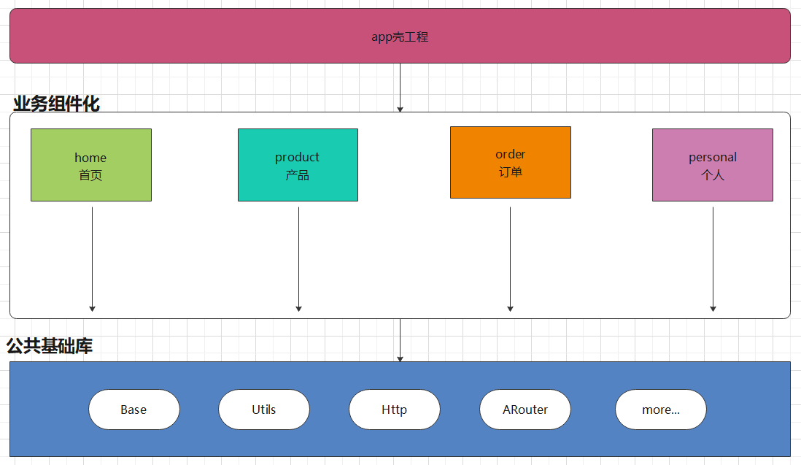
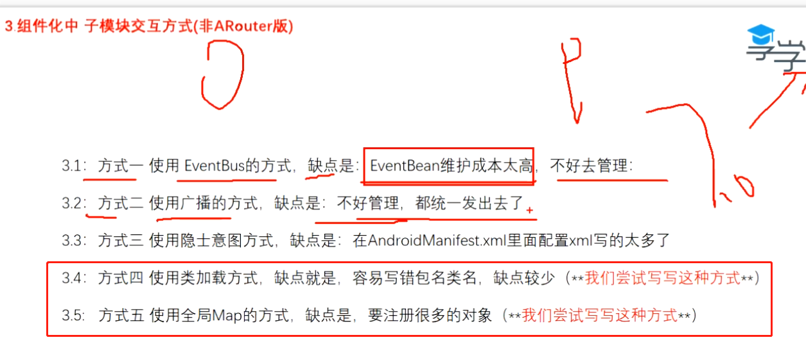
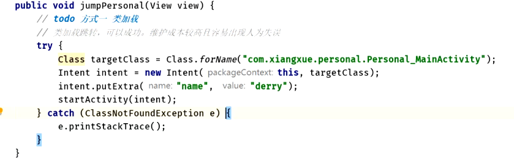

# 组件化分层图
collapsed:: true
	- 
- # [[什么是组件化？为什么需要组件化？]]
- # [[集成环境/组件环境自动部署配置-gradle]]
- # 组件化子模块交互方式（非ARouter版本）
  collapsed:: true
	- 
	- ## 类加载方式
		- 
	- 全局Map
		- 就是类似Arouter模式注册 路由表信息
- # 实战
	- # [[Metax组件化]]
	- # 实现上的技巧
	  collapsed:: true
		- ## 架构图
		  collapsed:: true
			- 
		- ## 1、组件互相独立，组件之间的能力怎么调用->[[组件接口下沉]]
		- ## 2、[[组件化中Application的分层使用]]
			-