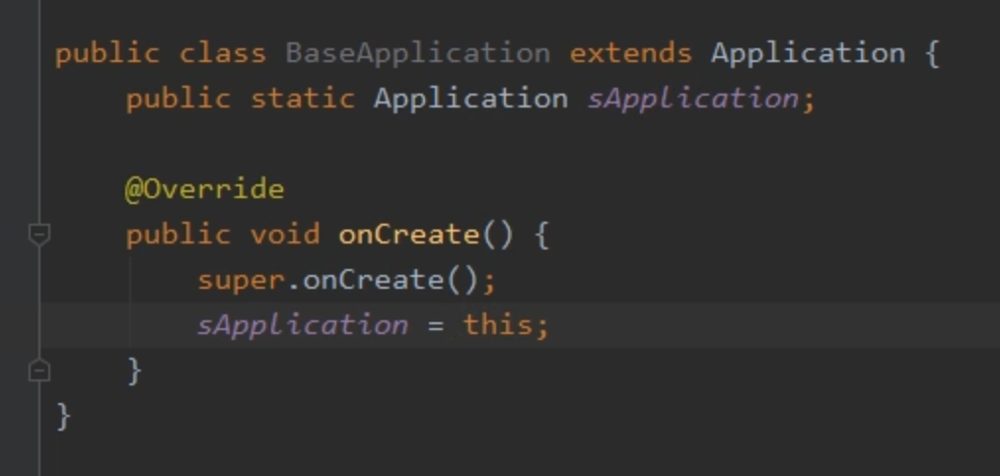
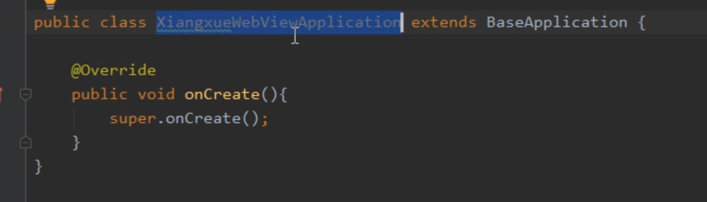
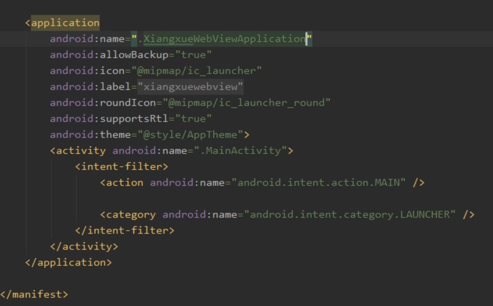
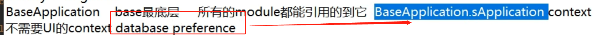

- 1、需要提供BaseApplication，放入 最底层 base层，提供获取Context 等通用能力
  collapsed:: true
	- 
- 2、在app层（最上层），新建子类去继承，提供实现，[[#red]]==**清单文件注册**==
  collapsed:: true
	- 
	- 注册
		- 
-
- # 好处
	- 
	- Application Context 不会有内存泄漏