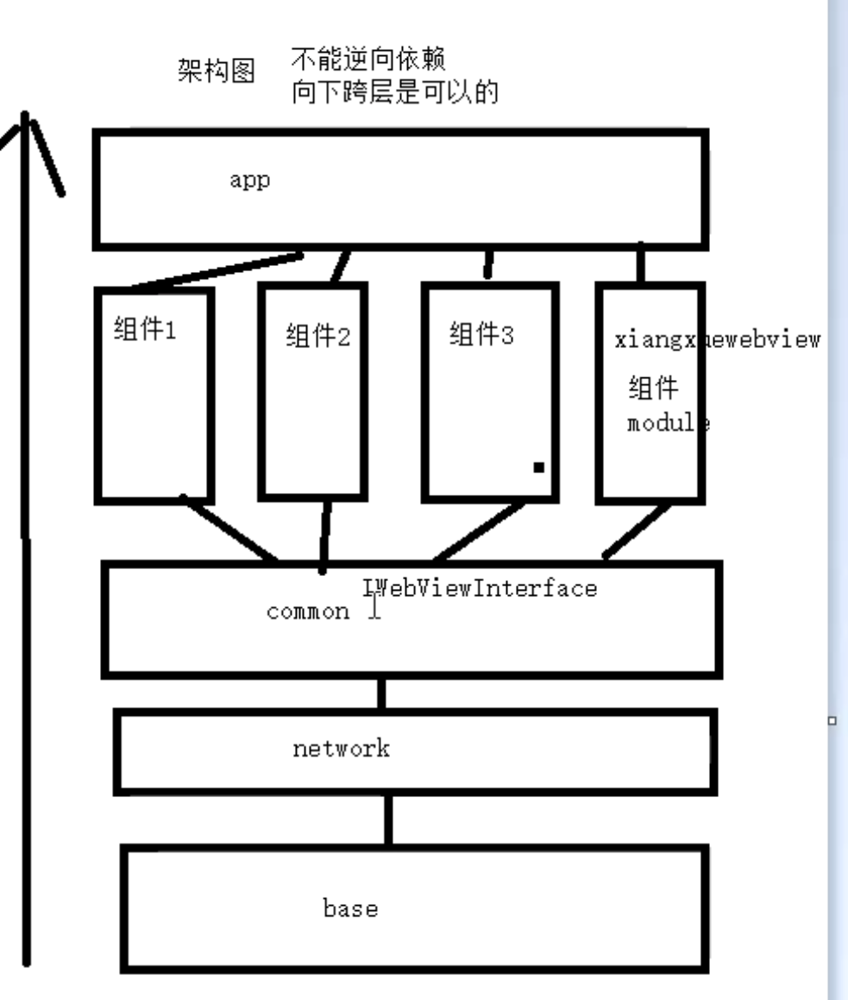
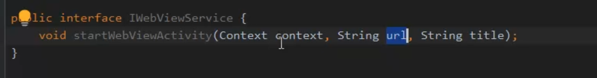
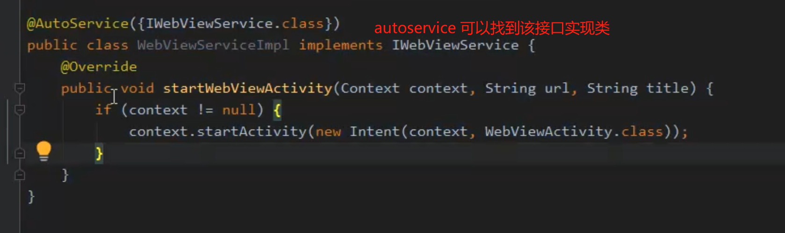
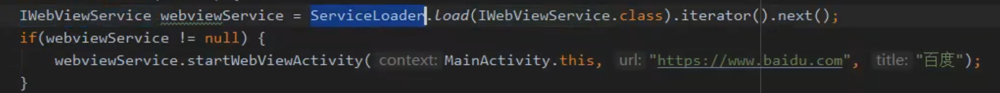

- 组件间通信：Arounder,或者[[googleAutoService]]
- 将webView组件提供的能力，下沉到Common 库中，提供获取实例服务。其他组件依赖Common，就能获取webView提供的服务
	- 
- ## 1、Common底层库
	- 提供webView 服务接口
		- 
		- ```kotlin
		  ```
- ## 2、webView组件提供实现
	- 依赖Common库
	- 提供实现
	- 
- ## 3、app上层或者其他组件，通过服务获取webView能力
	- 使用方都依赖Common
	- 