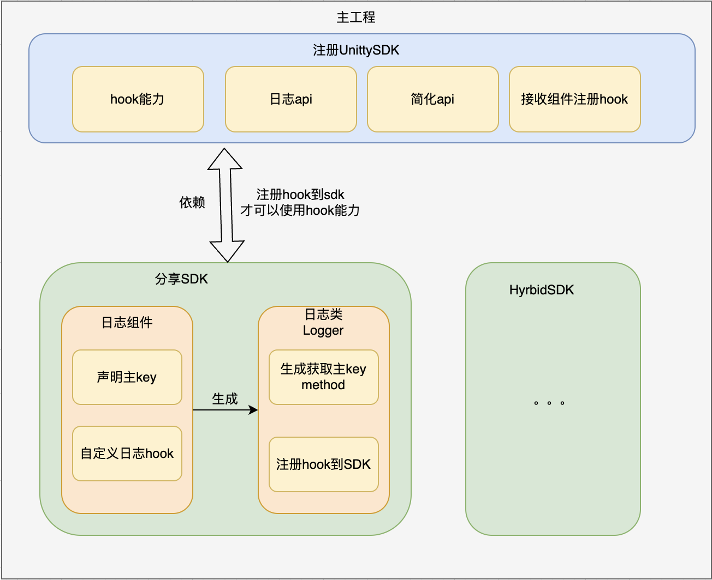

- ## 框架草图
	- 
- # 一、提供的能力：
	- ## (1) 一条日志控制多端输出：
		- 如之前 RN 中某场景输出 logcat、日志回捞需要写2条日志代码，使用统一日志库一条即可控制输出到 logcat、flipper、日志回捞、release
		-
		- ## 解析：
			- 1、debug环境：最终log.i输出
			- 2、release环境：println输出
			- 3、Wlog: 非发布包通过Log.i输出+上传到wlog
	- ## (2) 统一与聚合：
		- 埋点、RN、分享等 SDK 各自维护了一套日志实现，并侵入 SDK 接入了日志回捞和 flipper 定制，同时同一 SDK 内部存在多个不同的 Tag，查看时难以按模块聚合，统一日志库可以很好地解决这些问题
		-
		- ## 解析：
			- 日志库debug模式打印日志，Log.i(tag,msg)
			- tag填的是PrimaryTag，一个模块一个是唯一的，而api输入的tag是拼接在输出信息里的
			- 可以按照模块化过滤日志
			-
	- ## (3) 高性能：
		- 现有的日志实现大量使用了字符串拼接，如埋点 logcat 日志需要拼接十几个字段 (线上包也会触发)，而使用统一日志库的输出场景选项+闭包可实现分场景按需执行拼接
	-
		- ## 解析：
			- 闭包是一个方法，字符串拼接在方法里，release环境下 不会执行闭包的invoke，字符串也不会拼接
	- ## (4) 更安全：
		- 现有的日志调用处大量引用了上下文对象，如输出 RN bundle id、params，在线上容易产生空指针异常，而统一日志库使用字符串自动校验、闭包和异常捕捉很好的解决了这个痛点
		- 1、ASM字符串校验 不允许拼接参数，只能在debug 和 wlog 的参数上拼接
		- 2、闭包在线上环境是不执行的，所以大量减少线上环境因参数出错导致异常，因为线上环境只能输出message
		- 3、内部获取参数添加了异常捕获
	- ## (5) 自动化丰富的上下文：
		- 现有日志回捞需要在调用时手动传递当前的类和方法，而统一日志库会自动携带这些数据，无需手动添加
		- 1、链式调用是有入口函数，ASM可以扫描到的，可以采用ASM处理，编译期添加上下文调用位置
		- 2、包装api是没有入口函数可以扫描 -> 采用运行时获取堆栈信息
		  collapsed:: true
			- ```kotlin
			  class LogOwner(val className: String? , val methodName: String?) {
			      override fun toString(): String {
			          return "(invoke class=$className, method=$methodName)"
			      }
			  }
			  
			   /**
			       *  从堆栈信息获取调用位置
			       */
			     private fun getLogOwner(): LogOwner? {
			          // 非发布包开启
			          if(UnityLogSDK.isPublishPackage){
			              return null
			          }
			          val stringTag = Log.getStackTraceString(Throwable())
			          val list = stringTag.split("\n")
			          list.forEachIndexed { index, line ->
			              if (line.contains(UnityLogComponent::class.java.name) && (index + 1) < list.size
			                  && !list[index+1].contains(UnityLogComponent::class.java.name)) {
			                  // 取下一行
			                  val classLine = list[index + 1].replace(" ", "").replace("\tat", "")
			                  val finalLine = classLine.substring(0,classLine.indexOf("("))
			                  val className = finalLine.substring(0, finalLine.lastIndexOf("."))
			                  val methodName =
			                      finalLine.substring(finalLine.lastIndexOf(".") + 1)
			                  return LogOwner(className, methodName)
			              }
			          }
			          return null
			      }
			  ```
	- ## (6) 接入改造成本低：
		- 统一日志库包装了类似旧 api 的调用方法，接入改造成本低，同时由于其使用场景和安全性，改造后几乎不需要 QA 介入，预计 Q2 初可完成埋点、分享、RN 等 SDK 的接入
	-
	- ## (7) 对外提供hook log的能力，可统一对某tag加参数，扩展性强
- # 二、使用上
	- 每个SDK、APP(公共库中)、垂直库，都用一套日志库，demo用的话只在demo初始化，主工程接入，只在主工程application 初始化
	- 工程只初始化一次，生成一个统一日志库实例，维护一套log对象池(避免频繁创建对象)。
	- 各个SDK等使用hook能力 需要将组件注册到SDK
	- [[日志库接入流程]]
- # 三、技术点
	- ## 1、[[hooks能力]]
	- ## 2、[[对象池(避免频繁创建对象)]]
	- ## 3、[[获取堆栈信息的手段]]
-