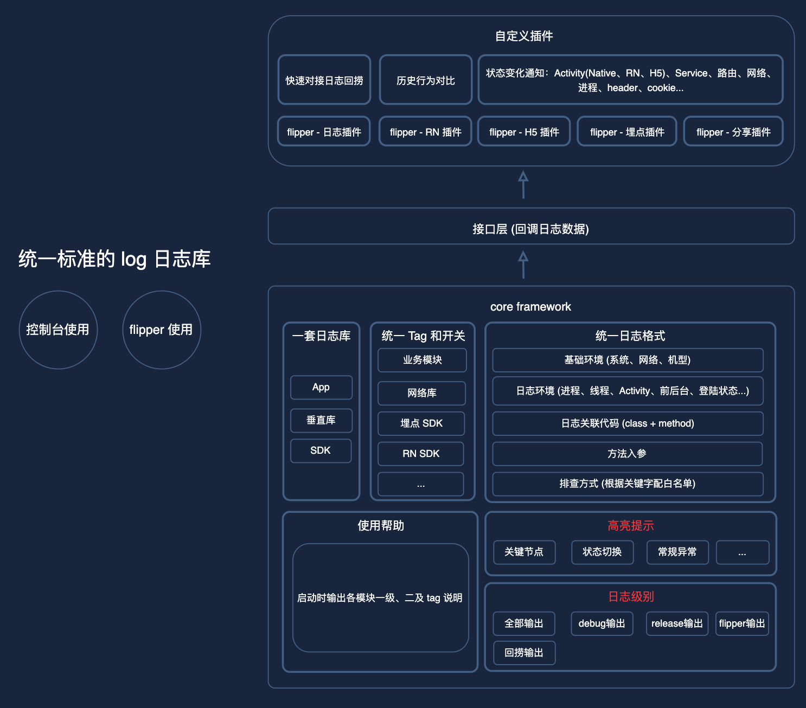

- # 一、简介：[问题排查，日志难](https://docs.58corp.com/#/space/1619941563754934272)
	- 开发一套统一规范的日志库：
	- ### 1、各模块日志 tag 不统一
	  collapsed:: true
		- 如埋点内部，埋点策略、埋点写入、上报分成多个一级 tag；RN Native、JS、Error 等同样也是多个一级 tag，无法根据 tag 快速查看单个模块的日志。需要区分出一级 tag 和二级 tag。
		- 解决：配置定义主TAG和二级TAG(按功能模块区分)。log输出时 主TAG-二级TAG
			- @UnityLogConfig(
			      className = "DemoUnityLogger",
			      primaryKey = TagAnnotation(
			          key = "UnityLogSDK",
			          des = "统一标准日志SDK"
			      ),
			      tags = arrayOf(
			          TagAnnotation(
			              key = "testModule",
			              des = "测试"
			          ),
			          TagAnnotation(
			              key = "runModules",
			              des = "执行组件"
			          )
			      )
			  )
			  class DemoUnityLogConfig {
			  
			  }
	- ### 2、关键模块日志缺失 (需要补全)
	  collapsed:: true
		- 如核心业务的执行流程、跨端/跨应用/跨模块等的通信过程、长时间运行组件的行为/状态切换、多个分支逻辑的判断等。
		- 解决：日志补全
	- ### 3、日志缺失很多关键信息
	  collapsed:: true
		- 环境信息：
			- 基础环境：系统、网络、机型
			- 日志环境：进程、线程、Activity、前后台、登陆状态、crash 时需要数据(如内存、gc...) 等
			- 关联代码：根据日志快速定位 class:method()
			- 方法入参数据
			- 排查方法：针对日志关键信息，可定制输出对应的排查方法解决方案
			- header、cookie 信息
		- 解决：
			- Log输出时，携带环境信息
	- ### 4、存在多套日志库
	  collapsed:: true
		- App、SDK、垂直业务库的 log 日志，58Flipper，线上的日志回捞各存在对应的 log 输出工具
		  线上、线下日志开关控制不统一
		- 解决：统一一套日志库，开关控制统一
	- ### 5、日志格式不统一
	  collapsed:: true
		- 日志的格式不统一
		  无法对关键核心的日志进行高亮显示 (如关键节点、空 url 等常规性异常进行提示)
		- 解决：日志SDK,统一拼装信息，和格式
	- ### 6、使用方不知道各模块日志的关键 tag
	  collapsed:: true
		- 由于未聚合日志库，无法在日志模块启动时输出所有已注册的日志业务的关键 tag 和说明
		- 解决：下边的功能一
	- ### 7、无法快速与 flipper 对接
	  collapsed:: true
		- 不规范的日志，flipper 开发各插件，如 RN、Hybrid、埋点、分享、log 等，需要各自定制去做开发，对 SDK 进行回调梳理。而规范日志后，可以通过日志格式，快速开发各种 flipper 应用插件。
	- ### 8、无法对状态变化进行主动输出
	  collapsed:: true
		- 四大组件的切换，包括 Activity(又可以区分成 Native、RN、H5)，Service...
		  Activity 的生命周期
		  路由信息
		  网络变化
		  进程变化
		- 解决：对各个信息，直接监听，统一TAG="UnityLogSmart"输出
		-
	- ### 9、无法与历史行为数据进行对比，发现异常
		- 如埋点、网络、分享的行为对比
		- 解决：
- # 优点：
	- 1、message 输入参数字符串校验，避免线上log崩溃
	- 2、
- # 二、设计
  collapsed:: true
	- 
- # 功能一、编译期收集注解信息，获取所有的组件模块，在 UnifyLogSDK 初始化时，输出 help
  collapsed:: true
	- help:
	  collapsed:: true
		- ```
		  UnifyLog 注册的组件信息如下：
		  (你可以使用 adb logcat | grep $primaryKey 过滤出组件的所有日志，
		  使用 adb logcat | grep $primaryKey-$tag 过来出组件子模块的日志，如 xxx,
		  使用 adb logcat | grep UnifyLogSmart 过来出日志库智能提示，包括 xxx 状态变化通知)
		  
		  --------------------------------------------------------------
		  primaryKey: WubaRNSDK
		  
		  描述：RN SDK
		  
		  tag：
		    1. hotUpdate：热更新
		    2. runModules：执行组件
		    ...
		  --------------------------------------------------------------
		  primaryKey: WubaHybridSDK
		  
		  描述：Hybrid SDK
		  
		  tag：
		    1. web init：web 初始化
		    2. web preload：预加载
		    ...
		  --------------------------------------------------------------
		  ```
	- 原理见常见问题中
- # 功能二、API与输出环境设计
  collapsed:: true
	- 该功能库只为了好排查问题，外层对外API只根据输出环境区分。
	  collapsed:: true
		- ```kotlin
		  package com.wuba.unitylog
		  
		  interface IUnityLog {
		      fun debug(
		          tag: String , messageGenerator: IMessageGenerator? ,
		          owner: LogOwner? = null
		      )
		  
		      fun debug(
		          tag: String , error: Throwable? ,
		          owner: LogOwner? = null
		      )
		  
		      fun debug(
		          tag: String , messageGenerator: IMessageGenerator? , error: Throwable? ,
		          owner: LogOwner? = null
		      )
		  
		      fun release(
		          tag: String , messageGenerator: IMessageGenerator? ,
		          owner: LogOwner? = null
		      )
		  
		      fun release(
		          tag: String , error: Throwable? ,
		          owner: LogOwner? = null
		      )
		  
		      fun release(
		          tag: String , messageGenerator: IMessageGenerator? , error: Throwable? ,
		          owner: LogOwner? = null
		      )
		  
		      fun wlog(
		          tag: String , messageGenerator: IMessageGenerator? ,
		          owner: LogOwner? = null
		      )
		  
		      fun wlog(
		          tag: String , error: Throwable? ,
		          owner: LogOwner? = null
		      )
		  
		      fun wlog(
		          tag: String , messageGenerator: IMessageGenerator? , error: Throwable? ,
		          owner: LogOwner? = null
		      )
		  }
		  ```
	- 同城可用于展示 || 可上传的平台：AS控制台、Flipper(桌面插件)、WLog(上传服务器日志回捞)
	- ## Debug API(开发环境)
		- 1、该API release 包下不会输出log
		  collapsed:: true
			- ```kotlin
			      override fun debug(
			          tag: String ,
			          messageGenerator: IMessageGenerator? ,
			          error: Throwable? ,
			          owner: LogOwner?
			      ) {
			          if (UnityLogSDK.isPublishPackage) {
			              return
			          }
			          val messageBody = makeMessage(
			              tag , messageGenerator , LogLevel.DEBUG , owner
			          )
			          // to logcat
			          Log.i(getPrimaryKey() , messageBody , error)
			          // to flipper
			          UnityLogSDK.unityFlipper?.toFlipper(getPrimaryKey() , messageBody , error)
			      }
			  ```
		- 2、Log.i 将组装信息通过输出到AS控制台
		- 3、将信息对接回调Flipper插件
	- ## Release API(线上环境)
		- 正式包也会携带的Log日志，通常只是些标记性的内容。需要CR代码
		- 1、Log.e 将信息输出到控制台
		- 2、非发布包也对接Flipper插件
			- 根据发布标识判断，是否是发布包调用的API.
	- ## WLog(日志回捞环境)
		- 用于上传日志到服务器，日志回捞环境
		- 1、输出到日志回捞环境
		- 2、非发布包：
			- Log.i 输出到AS控制台
			- 对接Flipper插件
- # 功能三、日志携带的信息的编写
  collapsed:: true
	- 日志输出时，携带基础环境、调用Log所在的类和方法
	- ## code:
	  collapsed:: true
		- 1、IUnityLog (api接口)
		  collapsed:: true
			- ```kotlin
			  package com.wuba.unitylog
			  
			  interface IUnityLog {
			      fun debug(
			          tag: String , messageGenerator: IMessageGenerator? ,
			          owner: LogOwner? = null
			      )
			  
			      fun debug(
			          tag: String , error: Throwable? ,
			          owner: LogOwner? = null
			      )
			  
			      fun debug(
			          tag: String , messageGenerator: IMessageGenerator? , error: Throwable? ,
			          owner: LogOwner? = null
			      )
			  
			      fun release(
			          tag: String , messageGenerator: IMessageGenerator? ,
			          owner: LogOwner? = null
			      )
			  
			      fun release(
			          tag: String , error: Throwable? ,
			          owner: LogOwner? = null
			      )
			  
			      fun release(
			          tag: String , messageGenerator: IMessageGenerator? , error: Throwable? ,
			          owner: LogOwner? = null
			      )
			  
			      fun wlog(
			          tag: String , messageGenerator: IMessageGenerator? ,
			          owner: LogOwner? = null
			      )
			  
			      fun wlog(
			          tag: String , error: Throwable? ,
			          owner: LogOwner? = null
			      )
			  
			      fun wlog(
			          tag: String , messageGenerator: IMessageGenerator? , error: Throwable? ,
			          owner: LogOwner? = null
			      )
			  }
			  ```
		- 2、BaseUnityLog (log基类)
		  collapsed:: true
			- 定义具体实现：如输出环境逻辑、字符串拼接、环境日志拼接
			- ```kotlin
			  package com.wuba.unitylog
			  
			  import android.util.Log
			  import com.wuba.unitylog.utils.LooperUtils
			  import com.wuba.unitylog.utils.ProcessUtils.getProcessName
			  
			  abstract class BaseUnityLog : IUnityLog {
			  
			      abstract fun getPrimaryKey(): String
			  
			      private fun makeMessage(
			          tag: String? ,
			          messageGenerator: IMessageGenerator? ,
			          logLevel: LogLevel ,
			          owner: LogOwner?
			      ): String {
			          val basicEnv = LogBasicEnv()
			          basicEnv.process = getProcessName(UnityLogSDK.applicationContext)
			          val isMainThread = "isMainThread=${LooperUtils.isMainThread}"
			          val threadId = "(id:${Thread.currentThread().id})"
			          basicEnv.threadInfo = "$isMainThread $threadId"
			          basicEnv.isForeground = UnityLogSDK.isForeground ?: true
			  
			          val builder = StringBuilder("[").append(tag ?: "").append("] ")
			              .append(messageGenerator?.getMessage() ?: "")
			              .append(" (level=").append(logLevel.value)
			              .append(", process=").append(basicEnv.process)
			              .append(", ").append(basicEnv.threadInfo)
			              .append(", isForeground=").append(basicEnv.isForeground)
			              .append(", method=").append(owner.toString())
			              .append(")")
			          return builder.toString()
			      }
			  
			      override fun debug(
			          tag: String ,
			          messageGenerator: IMessageGenerator? ,
			          owner: LogOwner?
			      ) {
			          debug(tag , messageGenerator , null , owner)
			      }
			  
			      override fun debug(
			          tag: String ,
			          error: Throwable? ,
			          owner: LogOwner?
			      ) {
			          debug(tag , null , error , owner)
			      }
			  
			      override fun debug(
			          tag: String ,
			          messageGenerator: IMessageGenerator? ,
			          error: Throwable? ,
			          owner: LogOwner?
			      ) {
			          if (UnityLogSDK.isPublishPackage) {
			              return
			          }
			          val messageBody = makeMessage(
			              tag , messageGenerator , LogLevel.DEBUG , owner
			          )
			          // to logcat
			          Log.i(getPrimaryKey() , messageBody , error)
			          // to flipper
			          UnityLogSDK.unityFlipper?.toFlipper(getPrimaryKey() , messageBody , error)
			      }
			  
			      override fun release(
			          tag: String ,
			          messageGenerator: IMessageGenerator? ,
			          owner: LogOwner?
			      ) {
			          release(tag , messageGenerator , null , owner)
			      }
			  
			      override fun release(
			          tag: String ,
			          error: Throwable? ,
			          owner: LogOwner?
			      ) {
			          release(tag , null , error , owner)
			      }
			  
			      override fun release(
			          tag: String ,
			          messageGenerator: IMessageGenerator? ,
			          error: Throwable? ,
			          owner: LogOwner?
			      ) {
			          val messageBody = makeMessage(
			              tag , messageGenerator , LogLevel.RELEASE , owner
			          )
			          // to logcat
			          Log.e(getPrimaryKey() , messageBody , error)
			          // to flipper if not publish package
			          if (!UnityLogSDK.isPublishPackage) {
			              UnityLogSDK.unityFlipper?.toFlipper(getPrimaryKey() , messageBody , error)
			          }
			      }
			  
			      override fun wlog(
			          tag: String ,
			          messageGenerator: IMessageGenerator? ,
			          owner: LogOwner?
			      ) {
			          wlog(tag , messageGenerator , null , owner)
			      }
			  
			      override fun wlog(
			          tag: String ,
			          error: Throwable? ,
			          owner: LogOwner?
			      ) {
			          wlog(tag , null , error , owner)
			      }
			  
			      override fun wlog(
			          tag: String ,
			          messageGenerator: IMessageGenerator? ,
			          error: Throwable? ,
			          owner: LogOwner?
			      ) {
			          val messageBody = makeMessage(
			              tag , messageGenerator , LogLevel.WLOG , owner
			          )
			  
			          // to wlog
			          UnityLogSDK.unityWLog?.toWLog(getPrimaryKey() , messageBody , error , owner)
			          // to logcat、flipper if not publish package
			          if (!UnityLogSDK.isPublishPackage) {
			              Log.i(getPrimaryKey() , messageBody , error)
			              UnityLogSDK.unityFlipper?.toFlipper(getPrimaryKey() , messageBody , error)
			          }
			      }
			  }
			  ```
			-
		- 3、IMessageGenerator (通过接口的方式获取RD输入的 message，避免字符串预创建)
		  collapsed:: true
			- ```kotlin
			  interface IMessageGenerator {
			      fun getMessage(): String
			  }
			  
			  ```
		- 4、LogLevel (定义日志级别：分别在对应api调用，做log提示，通过哪个级别api打印的)
		  collapsed:: true
			- ```kotlin
			  package com.wuba.unitylog
			  
			  internal enum class LogLevel(val value: String) {
			      DEBUG("debug") ,
			      RELEASE("release") ,
			      WLOG("wlog")
			  }
			  ```
			-
		- 5、LogOwner：(通过transform，扫码所有字节码，找到该类的调用位置，通过ASM插入对应的类名方法名。拼装信息的时候直接调用)
		  collapsed:: true
			- ```kotlin
			  class LogOwner(val className: String? , val methodName: String?) {
			      override fun toString(): String {
			          return "(invoke class=$className, method=$methodName)"
			      }
			  }
			  ```
		- 6、UnityLogSDK (SDK 初始化 和配置类)
		  collapsed:: true
			- ```kotlin
			  package com.wuba.unitylog
			  
			  import android.app.Activity
			  import android.app.Application
			  import android.content.Context
			  import android.os.Bundle
			  import android.util.Log
			  import com.wuba.unitylog.utils.ForegroundHelper
			  import com.wuba.unitylog.utils.ForegroundHelper.AppStatusListener
			  import com.wuba.unitylog.utils.NetWorkChangeUtils
			  import com.wuba.unitylog.utils.UnityLogHelpUtils
			  
			  object UnityLogSDK {
			      /**
			       * 是否已初始化
			       */
			      @Volatile
			      private var isInit: Boolean = false
			  
			      /**
			       * Application context
			       */
			      internal lateinit var applicationContext: Context
			          private set
			  
			      /**
			       * 是否为发布包
			       */
			      internal var isPublishPackage: Boolean = false
			          private set
			  
			      /**
			       * flipper 输出接口
			       */
			      internal var unityFlipper: IUnityFlipper? = null
			  
			      /**
			       * wlog 输出接口
			       */
			      internal var unityWLog: IUnityWLog? = null
			  
			      internal var isForeground: Boolean? = true
			          private set
			  
			      private const val SmartLogTag = "UnityLogSmart"
			  
			      @JvmStatic
			      fun init(application: Application , config: Config,registerKeyList:List<String>): UnityLogSDK {
			          if (isInit) {
			              return this
			          }
			          applicationContext = application.applicationContext
			  
			          isPublishPackage = config.isPublishPackage
			          unityFlipper = config.unityFlipper
			          unityWLog = config.unityWLog
			  
			          registerLifecycle(application)
			          registerNetWorkListener(applicationContext)
			          isInit = true
			          UnityLogHelpUtils.dynamicRegister(registerKeyList)
			          return this
			      }
			  
			      @JvmStatic
			      fun smartNotify(key: String , messageGenerator: IMessageGenerator) {
			          if (isPublishPackage) {
			              return
			          }
			          val observerMessage = messageGenerator.getMessage()
			          val msg = "$key: $observerMessage"
			  
			          Log.e(SmartLogTag , msg)
			  
			          // 回传给 flipper
			          unityFlipper?.toFlipper(SmartLogTag , msg , null)
			      }
			  
			      class Config {
			          internal var isPublishPackage: Boolean = false
			              private set
			  
			          internal var unityFlipper: IUnityFlipper? = null
			  
			          internal var unityWLog: IUnityWLog? = null
			  
			          fun isPublishPackage(isPublishPackage: Boolean): Config {
			              this.isPublishPackage = isPublishPackage
			              return this
			          }
			  
			          fun setUnityFlipper(unifyFlipper: IUnityFlipper): Config {
			              this.unityFlipper = unifyFlipper
			              return this
			          }
			  
			          fun setUnityWLog(unifyWLog: IUnityWLog): Config {
			              this.unityWLog = unifyWLog
			              return this
			          }
			      }
			  
			      private fun registerLifecycle(application: Application) {
			          application.registerActivityLifecycleCallbacks(ForegroundHelper)
			          ForegroundHelper.addAppStatusListener(object : AppStatusListener {
			              override fun onForeground(activity: Activity?) {
			                  isForeground = true
			                  smartNotify(SmartLogs.Activity , object : IMessageGenerator {
			                      override fun getMessage(): String {
			                          return "进入前台"
			                      }
			                  })
			              }
			  
			              override fun onBackground() {
			                  isForeground = false
			                  smartNotify(SmartLogs.Activity , object : IMessageGenerator {
			                      override fun getMessage(): String {
			                          return "回到后台"
			                      }
			                  })
			              }
			          })
			          application.registerActivityLifecycleCallbacks(object : Application.ActivityLifecycleCallbacks {
			              override fun onActivityCreated(activity: Activity , savedInstanceState: Bundle?) {
			                  smartNotify(SmartLogs.Activity , object : IMessageGenerator {
			                      override fun getMessage(): String {
			                          return "${activity.javaClass.simpleName} onCreate()"
			                      }
			                  })
			              }
			  
			              override fun onActivityStarted(activity: Activity) {
			                  smartNotify(SmartLogs.Activity , object : IMessageGenerator {
			                      override fun getMessage(): String {
			                          return "${activity.javaClass.simpleName} onStart()"
			                      }
			                  })
			              }
			  
			              override fun onActivityResumed(activity: Activity) {
			                  smartNotify(SmartLogs.Activity , object : IMessageGenerator {
			                      override fun getMessage(): String {
			                          return "${activity.javaClass.simpleName} onResume()"
			                      }
			                  })
			              }
			  
			              override fun onActivityPaused(activity: Activity) {
			                  smartNotify(SmartLogs.Activity , object : IMessageGenerator {
			                      override fun getMessage(): String {
			                          return "${activity.javaClass.simpleName} onPause()"
			                      }
			                  })
			              }
			  
			              override fun onActivityStopped(activity: Activity) {
			                  smartNotify(SmartLogs.Activity , object : IMessageGenerator {
			                      override fun getMessage(): String {
			                          return "${activity.javaClass.simpleName} onStop()"
			                      }
			                  })
			              }
			  
			              override fun onActivitySaveInstanceState(activity: Activity , outState: Bundle) {
			              }
			  
			              override fun onActivityDestroyed(activity: Activity) {
			                  smartNotify(SmartLogs.Activity , object : IMessageGenerator {
			                      override fun getMessage(): String {
			                          return "${activity.javaClass.simpleName} onDestroy()"
			                      }
			                  })
			              }
			          })
			      }
			  
			      private fun registerNetWorkListener(context: Context) {
			          // TODO 权限申请
			          NetWorkChangeUtils.registerNetWorkChangeListener(context , object : NetWorkChangeUtils.NetWorkListener {
			              override fun onAvailable(netType: String) {
			                  smartNotify(SmartLogs.NetWork , object : IMessageGenerator {
			                      override fun getMessage(): String {
			                          return "当前网络为：$netType"
			                      }
			                  })
			              }
			  
			              override fun onUnavailable() {
			                  smartNotify(SmartLogs.NetWork , object : IMessageGenerator {
			                      override fun getMessage(): String {
			                          return "网络不可用"
			                      }
			                  })
			              }
			          })
			      }
			  }
			  ```
	- ## 使用：
		- ```kotlin
		  package com.wuba.unitylog.app
		  
		  import androidx.appcompat.app.AppCompatActivity
		  import android.os.Bundle
		  import android.view.View
		  import android.widget.TextView
		  import com.wuba.unitylog.IMessageGenerator
		  
		  class MainActivity : AppCompatActivity() {
		  
		      override fun onCreate(savedInstanceState: Bundle?) {
		          super.onCreate(savedInstanceState)
		          setContentView(R.layout.activity_main)
		  
		          (findViewById<View>(R.id.title_text) as TextView).setText(R.string.app_name)
		  
		          RNLogger.debug(RNLogger.Tag_DynamicModule, object : IMessageGenerator {
		              override fun getMessage(): String {
		                  return "热更新模块日志"
		              }
		          })
		      }
		  }
		  
		  // 输出：
		  I/RNLogSDK: [DynamicModule] 热更新模块日志 (level=debug, process=com.wuba.unitylog.app, isMainThread=true (id:1), isForeground=true, method=(invoke class=com/wuba/unitylog/app/MainActivity, method=onCreate))
		  ```
- # 功能四、智能状态输出UnityLogSmart
  collapsed:: true
	- 智能日志内置在SDK中，如需借助Application，则在SDK初始化的时候，注册监听
	- ### 输出环境：
	  collapsed:: true
		- log.e 打印控制台
		- 通过IUnityFlipper接口 回传给Flipper插件
	- ## Android环境切换智能输出，与log基础环境赋值
		- ### 四大组件的切换，包括 Activity(又可以区分成 Native、RN、H5)，Service...
		- ### Activity 切换、Activity 的生命周期:ActivityLifecycleCallbacks
		  collapsed:: true
			- ```kotlin
			  private fun regist(application:Application){
			            application.registerActivityLifecycleCallbacks(object : Application.ActivityLifecycleCallbacks {
			              override fun onActivityCreated(activity: Activity , savedInstanceState: Bundle?) {
			                  smartNotify(SmartLogs.Activity , object : IMessageGenerator {
			                      override fun getMessage(): String {
			                          return "${activity.javaClass.simpleName} onCreate()"
			                      }
			                  })
			              }
			  
			              override fun onActivityStarted(activity: Activity) {
			                  smartNotify(SmartLogs.Activity , object : IMessageGenerator {
			                      override fun getMessage(): String {
			                          return "${activity.javaClass.simpleName} onStart()"
			                      }
			                  })
			              }
			  
			              override fun onActivityResumed(activity: Activity) {
			                  smartNotify(SmartLogs.Activity , object : IMessageGenerator {
			                      override fun getMessage(): String {
			                          return "${activity.javaClass.simpleName} onResume()"
			                      }
			                  })
			              }
			  
			              override fun onActivityPaused(activity: Activity) {
			                  smartNotify(SmartLogs.Activity , object : IMessageGenerator {
			                      override fun getMessage(): String {
			                          return "${activity.javaClass.simpleName} onPause()"
			                      }
			                  })
			              }
			  
			              override fun onActivityStopped(activity: Activity) {
			                  smartNotify(SmartLogs.Activity , object : IMessageGenerator {
			                      override fun getMessage(): String {
			                          return "${activity.javaClass.simpleName} onStop()"
			                      }
			                  })
			              }
			  
			              override fun onActivitySaveInstanceState(activity: Activity , outState: Bundle) {
			              }
			  
			              override fun onActivityDestroyed(activity: Activity) {
			                  smartNotify(SmartLogs.Activity , object : IMessageGenerator {
			                      override fun getMessage(): String {
			                          return "${activity.javaClass.simpleName} onDestroy()"
			                      }
			                  })
			              }
			          })
			  }
			  ```
		- ### 网络变化
		  collapsed:: true
			- 工具：
			  collapsed:: true
				- ```kotlin
				  package com.wuba.unitylog.utils
				  
				  import android.annotation.SuppressLint
				  import android.content.Context
				  import android.net.ConnectivityManager
				  import android.net.Network
				  import android.net.NetworkCapabilities
				  import android.os.Build
				  import android.telephony.TelephonyManager
				  
				  /**
				   * @author:xuwenbin
				   * @time:2023/3/3 2:46 PM
				   * @description: 网络状态监听
				   */
				  object NetWorkChangeUtils {
				  
				      fun registerNetWorkChangeListener(context:Context?,netWorkListener:NetWorkListener?){
				          if (Build.VERSION.SDK_INT < Build.VERSION_CODES.N) {
				              return
				          }
				          val connectivityManager = context?.getSystemService(Context.CONNECTIVITY_SERVICE) as ConnectivityManager
				          val telephonyManager = context.getSystemService(Context.TELEPHONY_SERVICE) as TelephonyManager
				          val networkCallback = object : ConnectivityManager.NetworkCallback() {
				              override fun onAvailable(network: Network) {
				                  // 当网络变为可用时调用
				                  netWorkListener?.onAvailable(getNetWorkType(connectivityManager,telephonyManager,network))
				              }
				  
				              override fun onLost(network: Network) {
				                  // 当网络不可用时调用
				                  netWorkListener?.onUnavailable()
				              }
				          }
				  
				          connectivityManager.registerDefaultNetworkCallback(networkCallback)
				      }
				  
				  
				      @SuppressLint("MissingPermission")
				      fun getNetWorkType(connectivityManager:ConnectivityManager, telephonyManager:TelephonyManager, activeNetwork: Network):String{
				          val networkCapabilities = connectivityManager.getNetworkCapabilities(activeNetwork)
				          if (networkCapabilities != null) {
				              if (networkCapabilities.hasTransport(NetworkCapabilities.TRANSPORT_CELLULAR)) {
				                  // 手机网络
				                  return getNetType(telephonyManager.networkType)
				              } else if (networkCapabilities.hasTransport(NetworkCapabilities.TRANSPORT_WIFI)) {
				                  // 当前网络为 Wi-Fi
				                  return "Wi-Fi"
				              }
				          }
				          return "未知网络"
				      }
				  
				      private fun getNetType(netWorkType: Int): String {
				          return when (netWorkType) {
				              TelephonyManager.NETWORK_TYPE_GPRS,
				              TelephonyManager.NETWORK_TYPE_EDGE,
				              TelephonyManager.NETWORK_TYPE_CDMA,
				              TelephonyManager.NETWORK_TYPE_1xRTT,
				              TelephonyManager.NETWORK_TYPE_IDEN ->
				                  "2G"
				              TelephonyManager.NETWORK_TYPE_UMTS,
				              TelephonyManager.NETWORK_TYPE_EVDO_0,
				              TelephonyManager.NETWORK_TYPE_EVDO_A,
				              TelephonyManager.NETWORK_TYPE_EVDO_B,
				              TelephonyManager.NETWORK_TYPE_HSPA,
				              TelephonyManager.NETWORK_TYPE_HSPAP,
				              TelephonyManager.NETWORK_TYPE_HSDPA,
				              TelephonyManager.NETWORK_TYPE_HSUPA,
				              TelephonyManager.NETWORK_TYPE_EHRPD ->
				                  "3G"
				              // 19 对应的是 NETWORK_TYPE_LTE_CA，被标记为 hide 了，所以直接使用 19 判断
				              TelephonyManager.NETWORK_TYPE_LTE, 19 ->
				                  "4G"
				              TelephonyManager.NETWORK_TYPE_NR ->
				                  "5G"
				              TelephonyManager.NETWORK_TYPE_UNKNOWN ->
				                  "未知网络"
				              else -> "未知网络"
				          }
				      }
				  
				  
				      interface NetWorkListener {
				          /**
				           *  网络可用
				           */
				          fun onAvailable(netType:String)
				  
				          /**
				           * 网络不可用
				           */
				          fun onUnavailable()
				      }
				  }
				  ```
			- 使用：
			  collapsed:: true
				- ```kotlin
				      private fun registerNetWorkListener(context: Context) {
				          // TODO 权限申请
				          NetWorkChangeUtils.registerNetWorkChangeListener(context , object : NetWorkChangeUtils.NetWorkListener {
				              override fun onAvailable(netType: String) {
				                  smartNotify(SmartLogs.NetWork , object : IMessageGenerator {
				                      override fun getMessage(): String {
				                          return "当前网络为：$netType"
				                      }
				                  })
				              }
				  
				              override fun onUnavailable() {
				                  smartNotify(SmartLogs.NetWork , object : IMessageGenerator {
				                      override fun getMessage(): String {
				                          return "网络不可用"
				                      }
				                  })
				              }
				          })
				      }
				  ```
		- ### 进程变化
		- ### 线程变化
		- ### 前后台切换监听
		  collapsed:: true
			- 工具类：
			  collapsed:: true
				- ```kotlin
				  package com.wuba.unitylog.utils
				  
				  import android.app.Activity
				  import android.app.Application
				  import android.os.Bundle
				  import java.util.concurrent.CopyOnWriteArrayList
				  
				  object ForegroundHelper: Application.ActivityLifecycleCallbacks {
				      private var finalCount = 0
				      private val mListeners: CopyOnWriteArrayList<AppStatusListener>?
				  
				      init {
				          mListeners = CopyOnWriteArrayList()
				      }
				  
				      /**
				       * 添加监听
				       *
				       * @param appStatusListener
				       */
				      fun addAppStatusListener(appStatusListener: AppStatusListener) {
				          mListeners!!.add(appStatusListener)
				      }
				  
				      /**
				       * 移除监听
				       *
				       * @param appStatusListener
				       */
				      fun removeAppStatusListener(appStatusListener: AppStatusListener) {
				          mListeners!!.remove(appStatusListener)
				      }
				  
				      override fun onActivityCreated(activity: Activity , savedInstanceState: Bundle?) {}
				  
				      override fun onActivityStarted(activity: Activity) {
				          finalCount++
				          //如果mFinalCount ==1，说明是从后台到前台
				          if (finalCount == 1) {
				              notifyForeground(activity)
				          }
				      }
				  
				      override fun onActivityResumed(activity: Activity) {}
				  
				      override fun onActivityPaused(activity: Activity) {}
				  
				      override fun onActivityStopped(activity: Activity) {
				          finalCount--
				          //NOTE: V10.3.0 fix by cuiqianbo 这里隐私弹窗页面要单独处理
				          //因为无法拦截到隐私弹窗页面的onStart()方法所以onStop()不能减1
				          if (activity != null && "PrivacyActivity" == activity.javaClass.name) {
				              finalCount++
				          }
				          //如果mFinalCount ==0，说明是前台到后台
				          if (finalCount <= 0) {
				              finalCount = 0
				              //说明从前台回到了后台
				              notifyBackground()
				          }
				      }
				  
				      override fun onActivitySaveInstanceState(activity: Activity , outState: Bundle) {}
				      override fun onActivityDestroyed(activity: Activity) {}
				      private fun notifyForeground(activity: Activity) {
				          if (mListeners != null) {
				              for (listener in mListeners) {
				                  listener?.onForeground(activity)
				              }
				          }
				      }
				  
				      private fun notifyBackground() {
				          if (mListeners != null) {
				              for (listener in mListeners) {
				                  listener?.onBackground()
				              }
				          }
				      }
				  
				      /**
				       * App前后台切换监听
				       */
				      interface AppStatusListener {
				          /**
				           * app 到前台
				           *
				           * @param activity 当前栈顶activity(app内页面)
				           */
				          fun onForeground(activity: Activity?)
				  
				          /**
				           * App切换到后台
				           */
				          fun onBackground()
				      }
				  }
				  ```
			- 使用：
			  collapsed:: true
				- ```kotlin
				      private fun registerLifecycle(application: Application) {
				          application.registerActivityLifecycleCallbacks(ForegroundHelper)
				          ForegroundHelper.addAppStatusListener(object : AppStatusListener {
				              override fun onForeground(activity: Activity?) {
				                  isForeground = true
				                  smartNotify(SmartLogs.Activity , object : IMessageGenerator {
				                      override fun getMessage(): String {
				                          return "进入前台"
				                      }
				                  })
				              }
				  
				              override fun onBackground() {
				                  isForeground = false
				                  smartNotify(SmartLogs.Activity , object : IMessageGenerator {
				                      override fun getMessage(): String {
				                          return "回到后台"
				                      }
				                  })
				              }
				          })
				      }
				  ```
	- ## 接入 App 可自定义：
	  collapsed:: true
		- ### 路由变化
		- ### cookie 变化
		- ### header 变化
		- ### 登陆状态变化
- # [[日志库常见问题]]