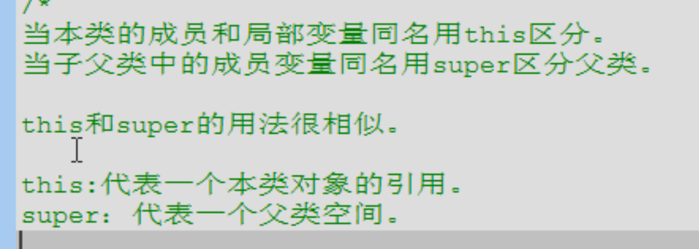
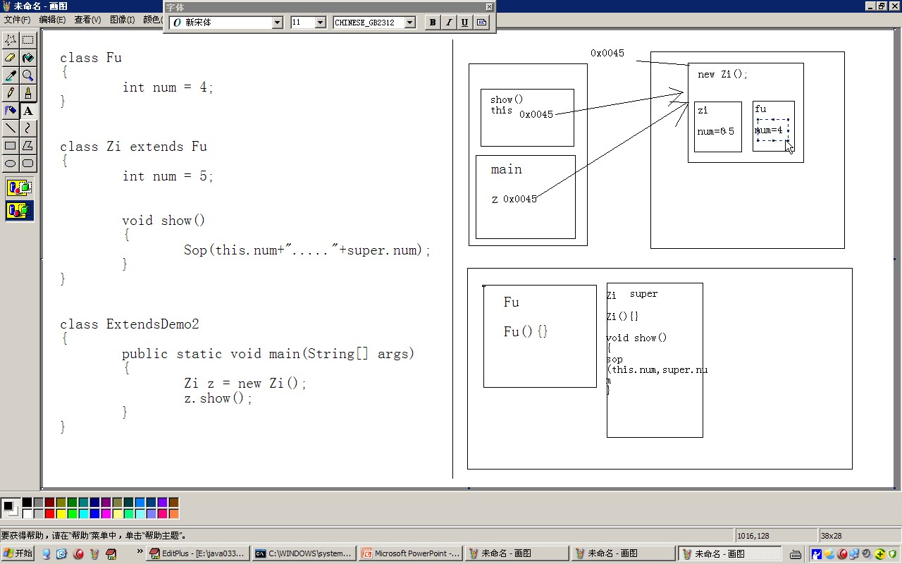
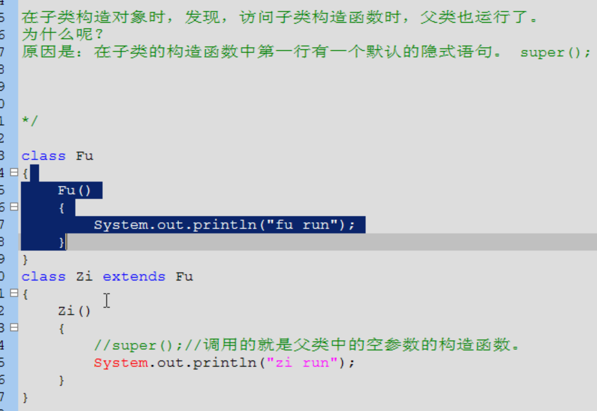
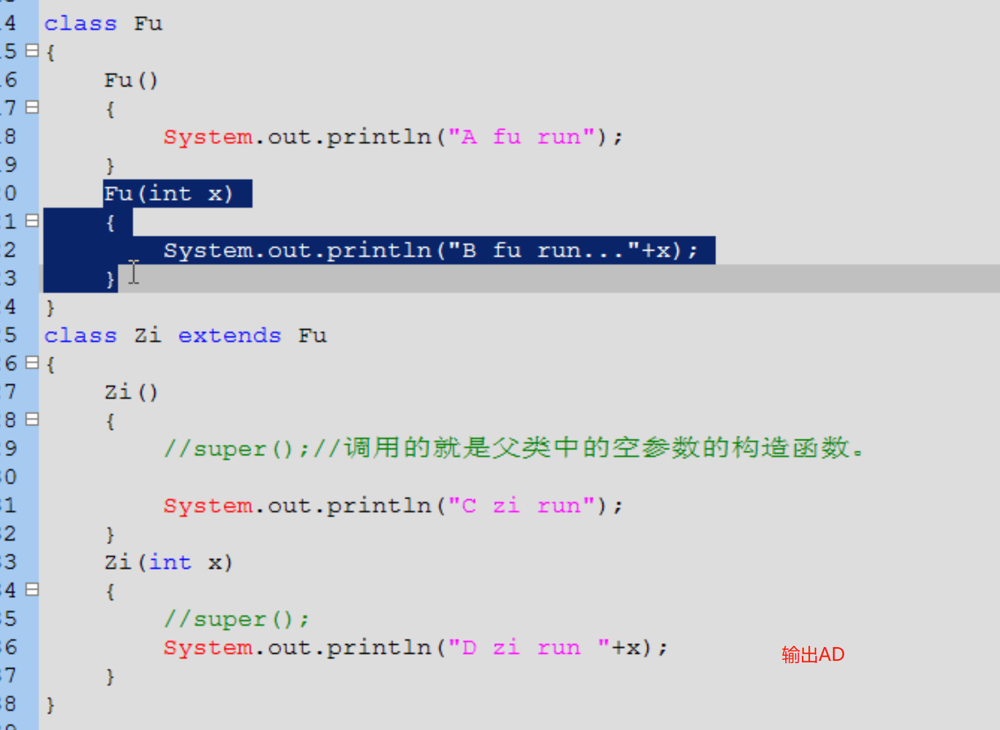
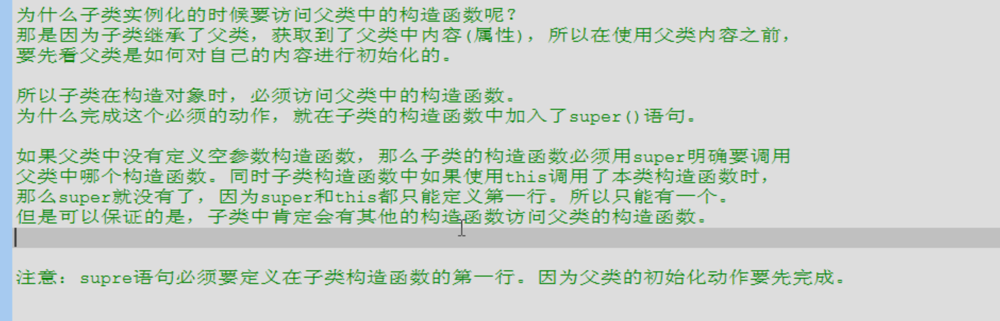
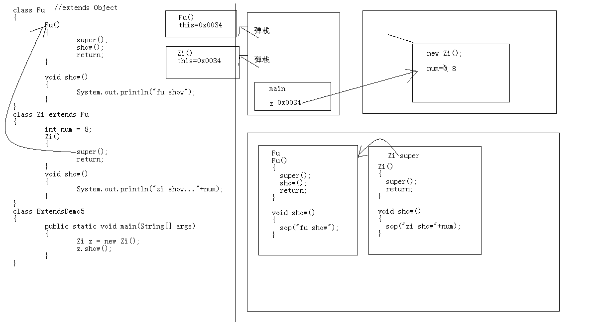

- ## 一、优缺点
  collapsed:: true
	- ## 优点
		- 1、提高代码复用性
		- 2、让[[#red]]==**类与类之间产生关系**==，给第三个特征多态提供了前提
	- ## 缺点
		- 打破了封装性
		- （子类继承父类 重写相关方法能覆盖父类）
- ## 二、单继承
  collapsed:: true
	-
- ## 三、使用场景
  collapsed:: true
	- 1、当类与类之间存在着所属关系的时候，就定义继承，x是y的一种， x extends y
		- 比如 大象 继承 动物
- ## 四、子父类中，成员的特点体现
  collapsed:: true
	- ## 1、成员变量
		- 
		- ## 内存中的体现
		  collapsed:: true
			- 
			- 底下方法区
			- ## 父类中num 和 子类中num都存在 堆中子类的对象、
				- 各自存一个空间中
	- ## 2、成员函数
	  collapsed:: true
		- 当子父类中出现成员函数一样的情况，子类覆盖父类
		- ## [[重写（override）]]
	- ## 3、构造函数
		- 构造函数不会覆盖，super调用
		- ## 子父类构造函的特点：
		  collapsed:: true
			- 
		- ## 子类的实例化过程：子类构造会访问super()
		  collapsed:: true
			- 子类中所有的构造函数默认都会访问父类中的空参数的构造函数。
			- 
			- ```java
			  new zi（6）   会输出AD
			  // 因为new子类   子类的构造函数 默认调用父类的无参构造
			  ```
		- ## 为什么子类构造会访问super
			- 
- ## 六、子类不具备父类private的内容，直接访问不到，只能内部提供方法访问
  collapsed:: true
	- assets:///I%3A/MyLogseq11/assets/image_1686972008796_0.png
- ## 七、子类实例化过程细节
  collapsed:: true
	- ### 代码
		- ```java
		  class Fu
		  {
		  	Fu()
		  	{
		  		super();
		  		show();
		  		return;
		  	}
		  
		  	void show()
		  	{
		  		System.out.println("fu show");
		  	}
		  }
		  class Zi extends Fu
		  {
		  	int num = 8;
		  	Zi()
		  	{
		  		super();
		  		//-->通过super初始化父类内容时，子类的成员变量并未显示初始化。等super()父类初始化完毕后，
		  		//才进行子类的成员变量显示初始化。
		  
		  		System.out.println("zi cons run...."+num);
		  		return;
		  	}
		  	void show()
		  	{
		  		System.out.println("zi show..."+num);
		  	}
		  }
		  class ExtendsDemo5 
		  {
		  	public static void main(String[] args) 
		  	{
		  		Zi z = new Zi();
		  		z.show();
		  	}
		  }
		  
		  ```
		-
	- ### 执行结果
		- zi show...0
		- zi cons fun...8
		- zi show...8
	- ### 对象创建图解
		- 
	- ### 子类对象初始化过程
		- 1、==main函数进栈==，执行 new zi()，先加载class，==先加载fu class 再加载zi class,就开始进内存了==
			- 因zi继承了fu。所以方法区 先加载父类空间，再加载子类空间
			- Zi类有super()持有fu类 引用
		- 2、 new zi()代码上述加载了class，现在可以创建对象了。
			- [[#green]]==堆中创建Zi类对象，同时加载成员变量num，并赋值0初始化值==
		- 3、Zi构造函数进栈，持有this，指向堆里的对象
		- 4、ZI无参构造调用super()，Fu()无参构造函数进栈，也持有this，Zi中的对象
		- 5、Fu无参构造调用show函数，运行时，子父类中含有同名函数，父类的会被覆盖，Fu进栈持有的this也是ZI对象。所以先输出zi show...0 (此时子类的成员还没初始化)
		- ### **[[#red]]==重点：super（）初始化完，Fu无参构造出栈。才开始子类属性初始化==**
		- 6、父类初始化完，子类属性初始化，num = 8赋值
			- 此时super()后输出num就已经初始化了
		- 7、ZI的构造函数初始完 弹栈
		- 8、执行zi,show（） 此时输出为zi show...8
	- 通常子类初始化过程
	  collapsed:: true
		- 一个对象实例化过程：
		  Person p = new Person();
		  1，JVM会读取指定的路径下的Person.class文件，并加载进内存，
		  	并会先加载Person的父类(如果有直接的父类的情况下).
		  2，在堆内存中的开辟空间，分配地址。
		  3，并在对象空间中，对对象中的属性进行默认初始化。
		  4，调用对应的构造函数进行初始化。
		  5，在构造函数中，第一行会先到调用父类中构造函数进行初始化。
		  6，父类初始化完毕后，在对子类的属性进行显示初始化。
		  7，在进行子类构造函数的特定初始化。
		  8，初始化完毕后，将地址值赋值给引用变量.
- ## 八、关键字final
  collapsed:: true
	- 1、可以修饰类、方法、变量
	- 2、final 修饰的类不可以被继承
	- 3、final修饰的方法 不能被重写
	- 4、final修饰的变量是常量，只能赋值一次
		-
- # [[抽象类]]
- # [[接口]]
- [[]]