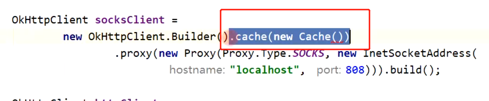

- CacheInterceptor ，在发出请求前，判断是否命中缓存。如果命中则可以不请求，直接使用缓存的响应。[[#red]]==** (只会存在Get请求的缓存)**==
- ## [[#red]]==**工作**==
	- 前置工作： 看有没有可用缓存
	- 中置工作： 向后传递请求
	- 后置工作 ：看是否能缓存   能缓存 就缓存下来
- ## 使用
	- 在创建okhttpClient时 配置缓存路径
	- 