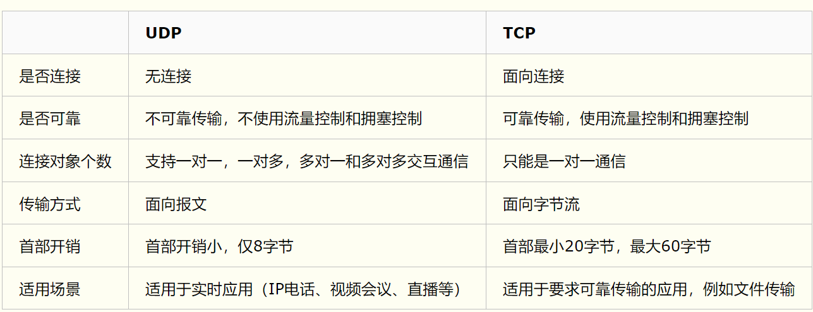
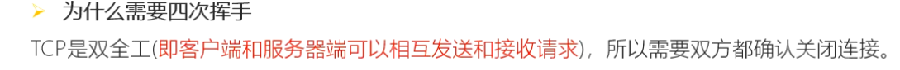
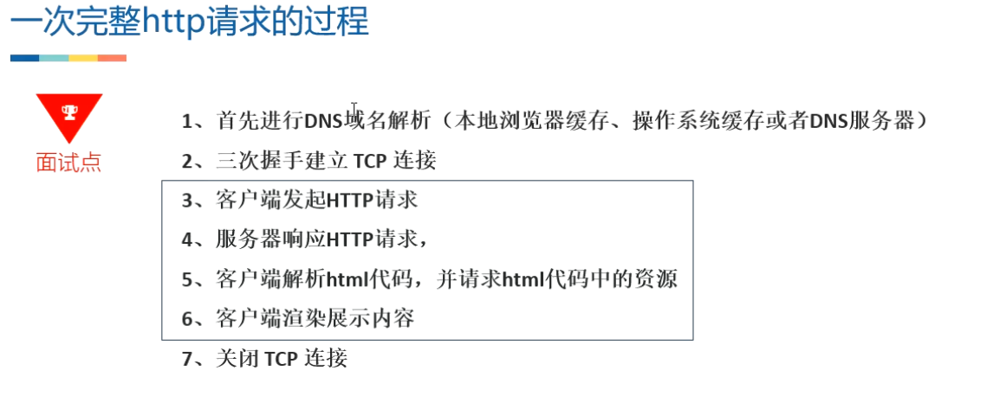

- >   熟悉Http 报⽂格式，了解常见请求⽅法的作⽤和区别，了解常⻅状态码的含义
         熟悉Tcp/Ip 协议 与 网络四层模
        了解 Https 的⼯作⽅式以及建立连接过程，熟悉数字签名与认证的完整流程
         熟悉 OAuth2 授权⼯作原理、以及 OAuth2在 Android 上的实现⽅式
- # 一、Http协议基础
  collapsed:: true
	- # 1、[[http定义]]： 超⽂本传输协议
	- # 2、[[url格式]]
	  collapsed:: true
		- ## `https://www.baidu.com/user`
		- 一个完整的url 分为三部分
		- 1、协议类型                                 如 http  还是 https
		- 2、服务器地址 ( 和端⼝号 ) 、    www,baidu,com
		- 3、路径(Path)                            /user
	- # 3、[[Http请求报文]]+请求方法Get..作用
	- # 4、[[Http响应报文]]+响应码
	- # 5、[[Header的各个作用]]
	- # 6、端口号
		- 
- # 二、加密
  collapsed:: true
	- ## 1、[[对称加密]]-[[非对称加密]]
	- ## 2、[[签名和验证原理]]
	- ## 3、签名验证 与非对称加密不一样的地方？
		- 签名验证 是为了证明 发的东西 是某个人发的，所以关键点不在于加密上，在于防止伪造，所以他会把 【原数据+ 数字签名 】一起发送
	- ## 4、[[哈希 hash]]
		- ### 1、作⽤ ：
			- 相当于从数据中提出摘要信息，因此最主要⽤途是[[#red]]==**数字指纹**==。
		- ### 2、[[#red]]==**经典算法**==： MD5，SHA1，SHA256
		- ### 3、用途
			- 1、数据完整性验证
			- 2、唯一性验证，java重写hashCode   hashMap快速查找
		- ### 4、hash不是编码不是加密算法，因为hash不可逆
- # 三、登录授权
  collapsed:: true
	- ### 1、[[OAuth2之微信登录授权流程]]
		- ### 前提
			- 公司APP在微信开方平台  申请第三方授权的合作， 得到  **client id【客户端用】 ** **和**** client secret【服务器用】**
		- ### 分段流程
			- ## 1、客户端用client id去获取Authorization code
				- 1、用户通过《58》app，==**点击「微信登录」**==，
					- 58 app 将通过微信SDK ==**跳转到微信页面**==，
					- ==**传⼊之前申请的client id**==作为身份标识
				- 2、微信SDK[[#red]]==**通过client id**==从微信服务器
					- [[#red]]==**获取《58同城》APP信息**==比如：图标名字并显示在界⾯中
					- 并**[[#red]]==询问⽤户是否同意该 App 使⽤微信登录==**
				- 3、⽤户点击[[#green]]==**「使⽤微信登录」**==后，微信  向  微信服务器[[#green]]==**提交用户授权信息**==。微信服务器[[#green]]==**返回 Authorization code**==，同时跳转回《58》App
			- ## 2、58 app请求58 服务器微信登录api
				- 4、《58》调⽤⾃⼰服务器的「微信登录」 Api ，并传⼊ [[#red]]==**Authorization  code**== ，然后等待服务器响应
					- 【剩下的登录操作都交给自己服务器 与微信服务器交互了】
				- 5、58 服务器拿 Authorization code 和⾃⼰的 client secret[[#red]]==**去请求微信第三 ⽅授权**==，微信在验证通过后，[[#red]]==**返回 access token**==  【授权完成了OAuth2 在这里就结束了 】
			- ## 3、下边处理登录逻辑
				- 6、58服务器==**通过access token**== 去向微信的⽤户信息接⼝发送请求，==**获取⽤户信息**==
				- 7 、58服务器收到用户信息后
					- 从数据库为用户创建账户、保存用户微信信息、关联用户id和微信id
				- 8、⽤户创建完成后，58服务器向58客户端的之前登录请求发送响应，传送回刚创建好的⽤户信息
				- 9 客户端收到服务器响应，⽤户登录成功
	- ### 2、面试题：为什么不直接通过client id  github返给token  而是  返回code  让服务器 用Authorization code  和 client secret  去换token?
		- [[#red]]==**OAuth 不强制授权流程必须使⽤ HTTPS**== ，因此需要保证当通信路径中存在窃听者时， 依然具有⾜够⾼的安全性,如果直接返回  token被窃取了，坏人拿token 可以获取用户信息了
	- ### 2、面试题：记住必须用让服务器去通过  Authorization code  和 client secret  去换token
	-
- # 四、网络分层模型
  collapsed:: true
	- ## 1、[[四层网络模型各个分层的作用]]
	- ## 2、[[为什么进行网络分层]]
	- ## 3、TCP、UDP区别[TCP和 UDP的区别](https://www.cnblogs.com/fundebug/p/differences-of-tcp-and-udp.html)
	  collapsed:: true
		- 
		- TCP
			- 1、数据传输失败重传
			- 2、面向连接的，发送数据前需要三次握手
			- 3、仅支持单播传输
		- UDP
			- 1、不需要重传 只需要最新状态  比如游戏直播
			- 2、面向无连接，不需要像TCP发送数据前三次握手
			- 3、UDP 不止支持一对一的传输方式，同样支持一对多，多对多，多对一的方式
	- ## 4、[[什么是TCP的链接？]]
		- ### 1、tcp是建立链接 才能通信的
		- ### 2、和外界对象建立链接  就创建一个收发器 ，这个收发器 只和链接对象做交互     收发器就是[[#red]]==**端口实现的 存了连接对象的信息**==
	- ## 5、[[TCP建立连接  和 关闭,3次握手,4次挥手]]
	- ## 6、为什么建立链接要三次握手？
		- TCP是面向连接的，所以需要双方都确认连接的建立
	- ## 7、为什么四次挥手？
		- 
	- ## 8、断开连接四次挥手后客户端为啥有个TIME_Waiting?
		- 1、确保可靠的终止TCP链接
		- 2、确保足够的时间对迟来的 报文，有足够的时间识别并且丢弃
	- ## 9、一次http请求
	  collapsed:: true
		- 
- # 五、[[Https]]
-