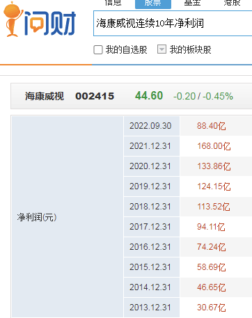

- # 一、选！
	- 选细分成长龙头，或是曾经的牛股，可以参考近5年或10年净利润看得出来。
	- 
	- ## 怎么选成长龙头？
		- 第一个、你可以选它的净利润连续十年增长的，用 i 问财去找。
		- 第二个，如果
		  你在这个市场走的比较久的话，待的比较久的话，随便都能说出来几个，细分行业的龙头
		  为什么选择成长的呢？因为处于成长的公司，某一年突然净利润同比下降，接下来一两年重回
		  成长的可能性较大，就算退一步也最多变成成熟公司，不太可能突变成衰退公司。（杀估值）
- # 二、买
- # 三、卖
-