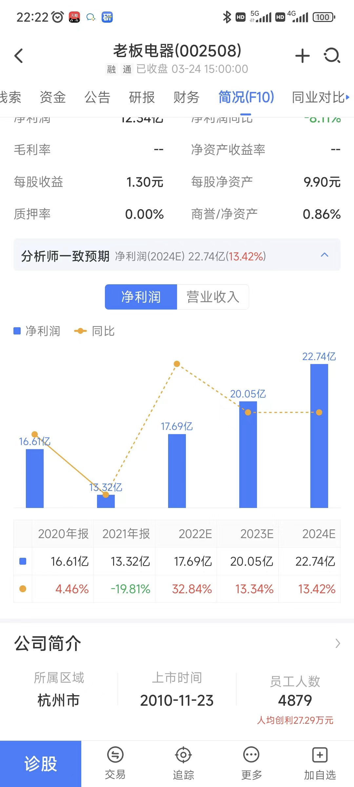

- # 一、选！
  collapsed:: true
	- 选细分成长龙头，或是曾经的牛股，可以参考近5年或10年净利润看得出来。
	- 
	- ## 怎么选成长龙头？
		- 第一个、你可以选它的净利润连续十年增长的，用 i 问财去找。
		- 第二个，如果你在这个市场走的比较久的话，待的比较久的话，随便都能说出来几个，细分行业的龙头、医药的、消费的、家电的
		- 为什么选择成长的呢？因为处于成长的公司，某一年突然净利润同比下降，接下来一两年重回
		  成长的可能性较大，就算退一步也最多变成成熟公司，不太可能突变成衰退公司。（杀估值）
	- ==当老龙某一年突然净利润同比下降或不增长了，列为观察对象。==
	- 成长股一般市场发现他不增长了，马上就来一波杀估值的
- # 二、等和买
	- 观察走势，找年报或等年报的数据，再等第一季报的数据（净利润），如发生重回成长，结合
	  历史市盈率在相对低位或绝对低位（20 倍-25 倍）即在季报发布时重仓进入。
- # 三、卖
	- 按价值中枢卖。即买入时的市盈率 1.8 倍卖出，2 倍市盈率清仓。
- # 四、实操举例-老板电器
	- 
	- 老板电器的净利润，近十年的，2013-2015 看净利润连续增长不少，一直往上看到 2017
	  跟 2018 年，到 2018 年就来一个不涨了，停止增长了，2017 年是 14.61，2018 年是 14.74，差
	  不多不涨了，开始停了。
	- 
	- 看老板电器的历史走势，2017 年前都涨的很好，但是到 2018 年 1 月份净利润开始下滑了，不
	  增长了，增长的很慢了，它的股价从哪个时候开始反应，可以对比一下。
	- 看出 2018 年的净利润不涨了，看下股价是从 2018 年 2 月开始下跌，当时市盈率约 35。相对
	  高位
	- 老板电器的历史走势图，2018 年的 11 月份就开始不不跌了跌不动了。开始前面都是比较大幅
	  的下跌，同时它的市盈率来到了比较低的位置，雪球 13 倍左右。
	- 接下来的 2019.2020 年净利润会不会往上走，这个时候可以观察他的年报出来，还有 1 季报出
	  来的时候再决定，因为 20191.31 已止跌，那就查看 2019 的 2.3.4 季度报告：
	- 还可以利用萝卜投研看预期
	  collapsed:: true
		- {:height 1599, :width 716}
	- 
	- 注意，一季度一般也是淡季。跟踪 1.2.3.季度报，有时只要模糊的正确，投资没 100%