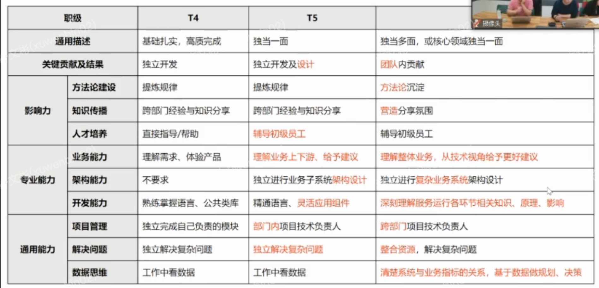
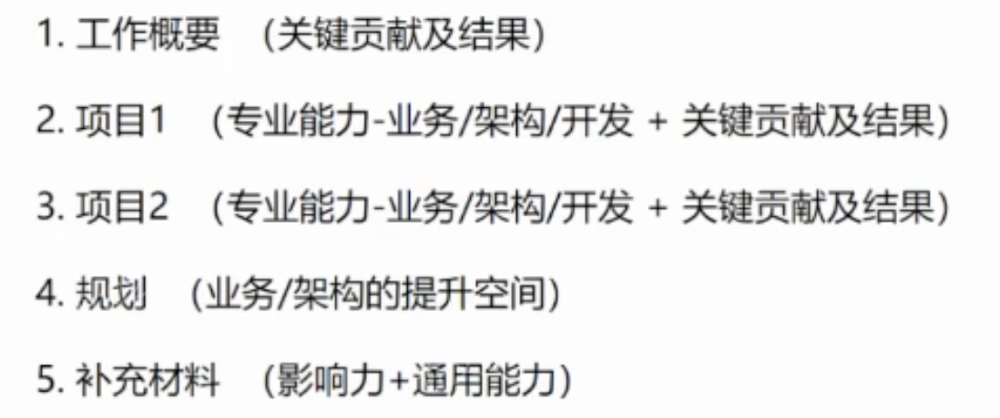
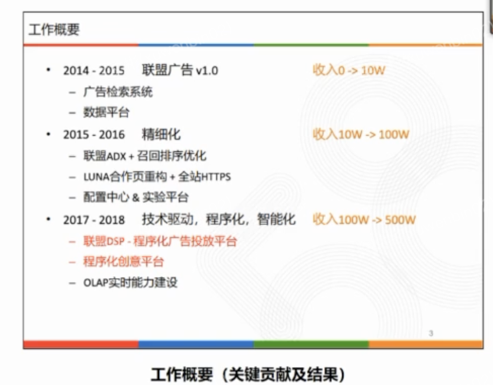
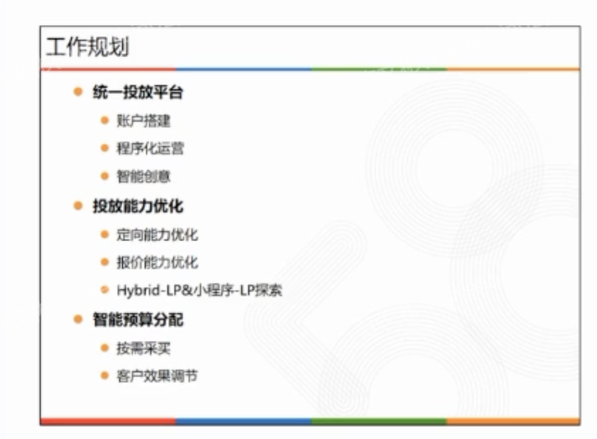
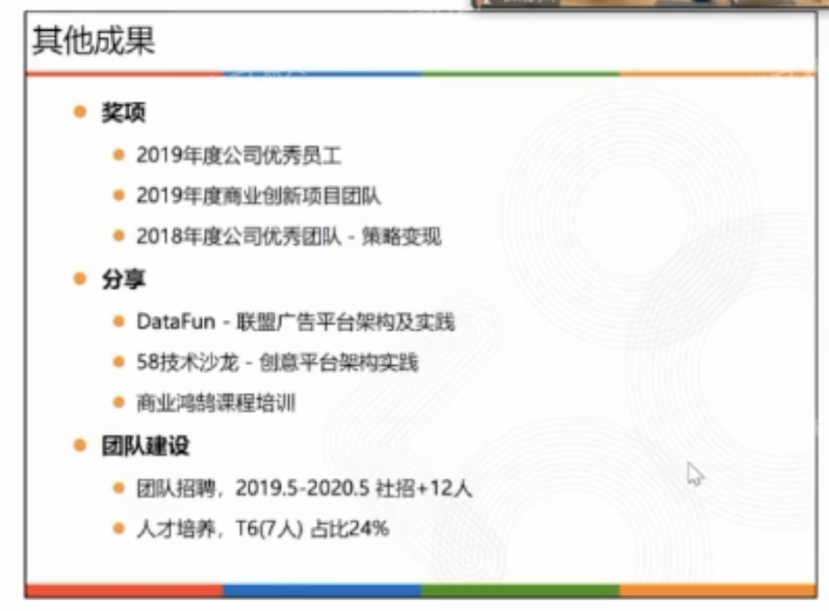

- [T5要求](https://ilearning.58corp.com/learn/online/play?p=2vg0pt)
- [各T要求](https://ilearning.58corp.com/learn/rank)
- [职级晋升公开课](https://ilearning.58corp.com/learn/online/play?p=2vcddm)
- # 一、晋升的能力模型
  collapsed:: true
	- 
- # 二、PPT结构
	- 
	- ## 2-1、工作概要(关键贡献及结果) [年份->哪个项目导致哪个结果，然后下面具体展开项目]
	  collapsed:: true
		- 首页改版 -> 提升的点击率   进而提升收入
		- metax -> 开发提效，具体哪个地方提效，开发时间节约，测试成本
		- 例子：年份->哪个项目导致哪个结果，然后下面具体展开项目
			- {:height 545, :width 686}
	- ## 2-2 1-2个项目的介绍
	  collapsed:: true
		- 结构：
			- 1、介绍项目背景/问题   尽量是可量化的，要有数据
			- 2、方案(图、专业能力-业务/架构/开发)
			- 3、效果(数据表格、展示关键贡献及结果，比如收入提升多少，性能提升多少)
	- ## 2-3、规划(基本上1页ppt就好)
	  collapsed:: true
		- 上边项目讲完，基于我们的项目业务认知，还有哪些优化空间
		- {:height 535, :width 716}
	- ## 2-4、其他结果(补充材料 影响力和通用能力 1页)
	  collapsed:: true
		- 获得奖项，表彰，团队发展的贡献，分享
		- {:height 536, :width 716}
- # 三、ppt讲述
	- ## 1、怎样体现方案难点
		- 避免1句话方案，