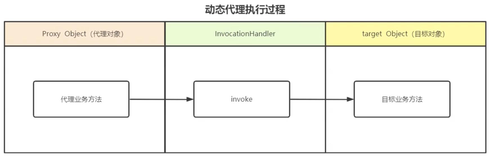

- ## 项目一：ConcatAdapter相关、RecyclerView相关
- ## 项目二：Metax相关、APT相关、AOP相关
	- 1、底层库到底有什么问题？
	- 2、老SDK切换metax的接入成本有多少？收益和付出的成本 性价比高不高，如何说服 业务线进行改造？ 范的问题
		- 对外只感知依赖的变化，api无变动，一次性成本
- ## 项目三：代理相关、静态代理动态代理、设计模式相关
  collapsed:: true
	- 问题1：为什么需要代理？
		- 1、原有功能增强或替换
		- 2、单一职责 降低耦合(新增功能代理类做扩展)
	- 问题2：JDK动态代理原理？
		- 1、基于拦截器和反射实现的
		- 2、Proxy位于反射包下，Proxy.newProxyInstance 用于运行时创建代理对象
		- 3、InvocationHandler 是专门用来做代理方法增强处理的
		- 4、被代理的对象必须要实现接口
		- 5、内部采用asm技术动态生成字节码
		- 
	- 问题3：动态生成代理对象的过程是怎样的？
	- 问题4：动态生成代理对象的结构是怎样的？
	-
-