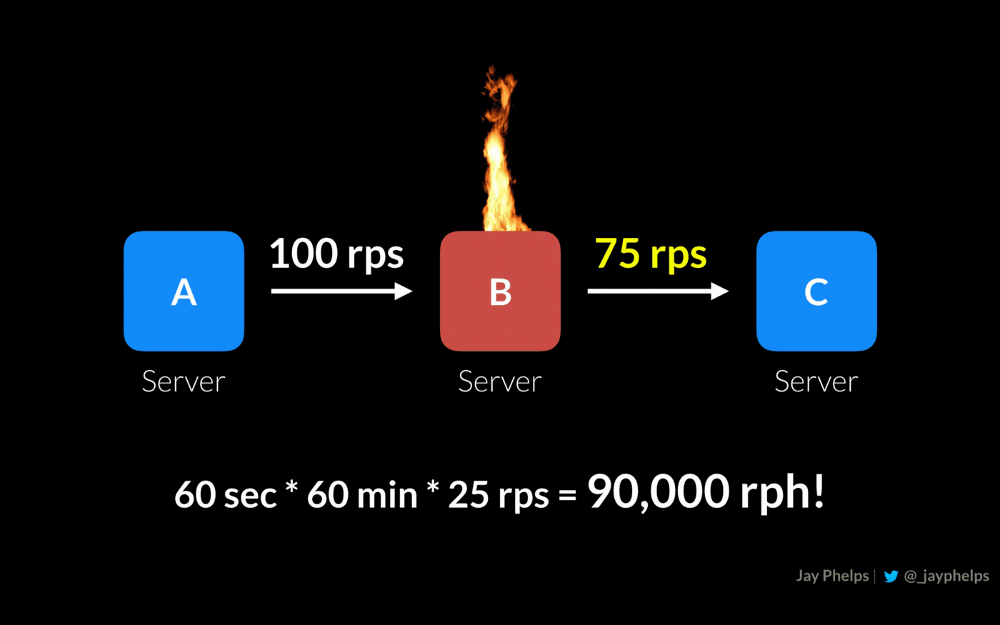
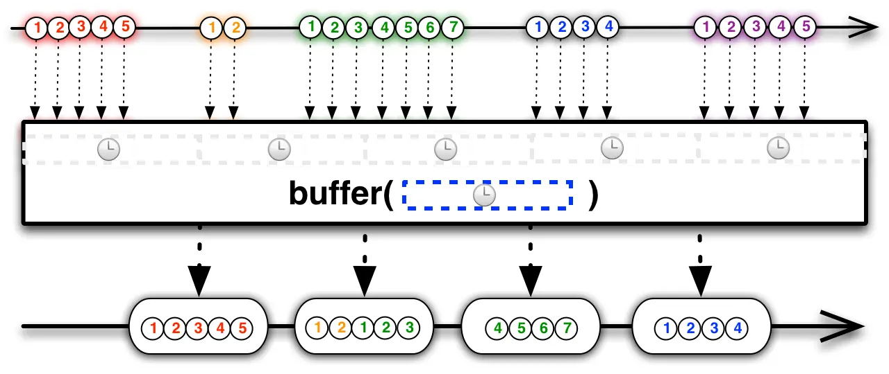
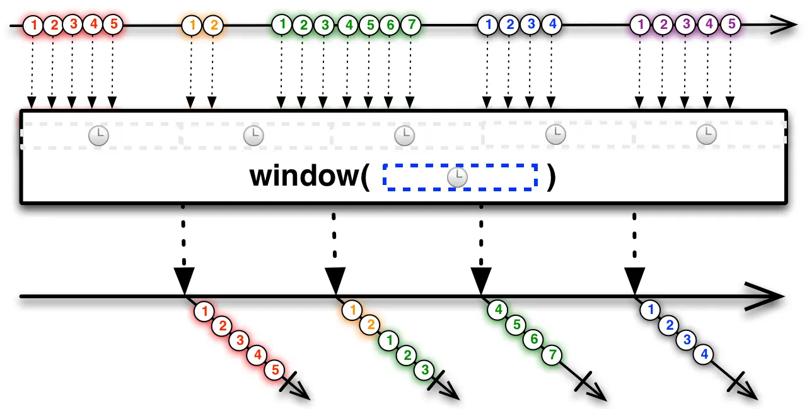

- 背压是什么？
  collapsed:: true
	- 初次听到“背压”这个词感觉像是“天王盖地虎”这样的行话，不知道是什么，感觉很高深的样子。
	- 网络上有很多关于背压的文章，但对背压这个词的解释各不相同。有的人把它看作一个需要避免的问题，或者程序的异常，描述语言类似于“…发生了背压”；有的人说背压是解决这种在异步场景中被观察者发送事件速度远快于观察者的处理速度的问题的策略；还有的人认为背压是具有解决这种问题的能力或机制，比如说某某库支持背压或不支持背压。
	- 维基百科上对 Backpressure 的定义是：Backpressure is a resistance or force opposing the desired flow of fluid through pipes（背压是抵抗所需的流体通过管道流动的阻力或反作用力），借用到软件领域它的定义应该是：Backpressure is a resistance or force opposing the desired flow of data through software。
	- 国内有位Android大咖扔物线在知乎上的一篇关于背压的回答我比较赞同，他说 Backpressure 其实是一种现象：在数据流从上游生产者向下游消费者传输的过程中，上游生产速度大于下游消费速度，导致下游的 Buffer 溢出，这种现象就叫做 Backpressure 出现。响应式编程中的【背压（Backpressure）】概念来源于流体力学的比喻，也和其他工程领域的背压概念相似，比如在管道运输中，气流或液流由于管道突然变细、急弯等原因导致由某处出现了下游向上游的逆向压力，这种情况称为 Backpressure。背压是我们在软件开发中经常遇到并且有时不得不处理的问题，但这个词以及表达的现象并没有被正确地理解和认识。背压并不是一种机制，也不是一种策略，背压现象中关键是下游的 Buffer 溢出。
- 背压的例子
  collapsed:: true
	- 读写文件
	  collapsed:: true
		- 一般写文件比读文件要慢，假设一个磁盘驱动有效的读文件速度是150MB/s，而写文件速度是100MB/s，如果要以最快的速度将文件读入内存，同时又以最快的速度将其写回磁盘，则必须每秒缓冲50MB，这样内存将被不断被堆积，在输入文件被完全读取之前，内存中还有大量的数据没有被写入文件。假设要读入一个6GB的文件然后将它写入磁盘，在你读完全部文件时，还有2GB的内容等待写入。
		- ```
		  6 GB / 150 MB/s = 40 s
		  150 MB - 100 MB = 50 MB
		  50 MB x 40 = 2 GB !!
		  ```
		- 这将浪费很多的内存，在一些系统上可能超出了可用内存，最终产生OutOfMemory Exception，这就是由于写文件速度慢于读文件速度产生了背压问题。
	- 服务器通信
	  collapsed:: true
		- 另一个关于背压问题的例子是服务器间的通信问题。在普遍采用的微服务架构中，各个服务器的职责一般是独立分散的，当一台服务器向另一台服务器发送请求的速度快于后者处理请求的速度时，通常会出现背压。
		  如果服务器A向服务器B发送100个rps（每秒请求数），但服务器B只能处理75个rps，那么对于服务器B就有25个rps的富余。此时服务器B可能会落后，因为它需要处理这些请求，或者还需要与下游的其他服务器通信。这是由于服务器处理能力的差异，导致上下游通信的服务器在处理请求时产生了背压问题。
		- 
	- 渲染UI
		- 在渲染UI方面也经常发生背压的现象，当程序无法以所需的速度渲染时，就会发生背压，比如Android App的卡顿现象是由于应用程序的渲染速度没有达到60fps。
- 如何解决背压?
  collapsed:: true
	- 可以看出背压现象在我们的程序开发中普遍存在，而且各个场景下处理背压的思路都差不多。除了扩展可用的计算资源外，如何处理背压问题可以概括为三种可能的选择：
	- 1、控制生产者产生数据的速度以适应消费者的响应速度
		- 控制生产者可能是处理背压问题的最优选择，如果这种方案可行的话，它只需要考虑设计好控制机制，而不会有内存和其他资源的开销。在数据消费端不需要额外的内存来缓存数据，也不需要顾虑丢弃数据。不幸的是控制生产者产生数据并不总是可行，比如数据的输入是用户操作，我们不能控制程序系统之外的数据生产者。
	- 2、缓存临时产生的大量数据
		- 缓存是大多数背压问题的解决方式。Backpressure 和 Buffer 是一对相生共存的概念，一方面只有设置了 Buffer，才有 Backpressure 出现；另一方面只要设置了 Buffer，一定存在出现 Backpressure 的风险。使用缓存时要考虑，缓冲区的增长速度有可能在相当长的一段时间内超过它的消耗速度吗？如果缓冲区是无界的，那么缓冲区可能是危险的，这意味着对缓冲区没有大小或时间限制。
	- 3、丢弃上游发出的事件（可能有多种策略）
		- 丢弃是最后一种策略，它也经常与缓存相结合。比如基于时间的采样，每秒丢弃10%的数据。丢弃的具体策略有多种。
- RxJava中如何解决背压？
	- RxJava是一个使用可观察序列组成异步和基于事件的程序的库，在RxJava中会经常遇到一种情况就是被观察者发送消息太快以至于它的操作符或订阅者不能及时处理相关的消息，那么随之而来的问题就是如何处理这些不断累积的未处理的消息？
	- RxJava从1.x到3.x不同版本对这个问题的应对方式和支持力度不同，很多文章说RxJava 1.x不支持背压，根据这些文章的描述，我理解不支持背压说的是RxJava 1.x版本的Observable不能直接添加解决背压的策略，而RxJava 2.x以后版本的Flowable可以通过参数设置背压策略，其实RxJava 1.x版本提供了支持解决背压的其他操作符，比如onBackpressureBuffer、onBackpressureDrop和onBackpressureLatest。在使用Observable发射数据后不使用解决背压的操作符进行处理，或者在使用了背压策略后观察者仍不能及时处理上游的数据的情况下，可能会抛出MissingBackpressureException表示发生了背压问题。
	- Observable 数据流可分为两种类型：Cold 和 Hot Observable，并不是严格的概念区分，它们只是对于两类被观察的数据流的形象描述。
	  collapsed:: true
		- Cold Observable：指的是被观察者发射数据的时机和频率由观察者决定，每个观察者都能接收到完整的事件序列，cold observable的示例包括数据库查询、文件检索和Web请求等
		- Hot Observable：指的是被观察者在被创建后就立即发射数据，观察者会在建立对被观察者的订阅关系时接收到数据，它不能干涉hot observable发射数据的行为，示例包括鼠标或键盘事件、系统事件等
	- Recative Pull
	  collapsed:: true
		- 用控制 的方式解决背压问题可以通过阻塞被观察者的线程来实现，这有个缺点就是违背了Rx的响应式和非阻塞的模式。如果被观察者生产数据和观察者接收数据都在同一个线程，这就天然地形成了通过阻塞方式来解决背压问题。RxJava 提供了一种响应式拉取（Reactive Pull）的方式实现异步线程阻塞以解决背压问题，通过实现Subscriber类来订阅Observable，在 subscriber 的 onStart()方法中调用Subscriber.request(n) 方法，其中n表示观察者在下次调用request方法前被观察者可发送的最大数据量。在subscriber 的 onNext()中处理完已发送的数据后，可以再次调用request()方法，以指示Observable再发射一些数据。
		- ```
		  someObservable.subscribe(new Subscriber<T>() {
		      @Override
		      public void onStart() {
		        request(1);
		      }
		  
		      @Override
		      public void onCompleted() {
		        // gracefully handle sequence-complete
		      }
		  
		      @Override
		      public void onError(Throwable e) {
		        // gracefully handle error
		      }
		  
		      @Override
		      public void onNext(T n) {
		        // do something with the emitted item "n"
		        // request another item:
		        request(1);
		      }
		  });
		  
		  ```
	- RxJava背压操作符
		- Cold Observables非常适合采用响应式拉取方式解决背压，Cold Observable可能会被转化成Hot Observable，而Hot Observable不适合用响应式拉取的方式。RxJava 提供了一些流控策略的操作符解决背压，这些操作符的基本原理都是采用缓存或丢弃策略，来调节被观察者发射数据的频率。
		- buffer
		  collapsed:: true
		  buffer 操作符可以使观察者以固定的时间间隔周期性地接收到被观察者发送的数据，被观察者发射的数据不会被丢失。
			- {:height 310, :width 716}
		- window
		  collapsed:: true
			- window 与 buffer 类似，一个窗口类型可以让被观察者以固定的时间间隔发射可观察到的窗口，还可以选择在每次从可观察源收集特定数量的数据项时发出一个新窗口。
			- {:height 356, :width 685}
		-