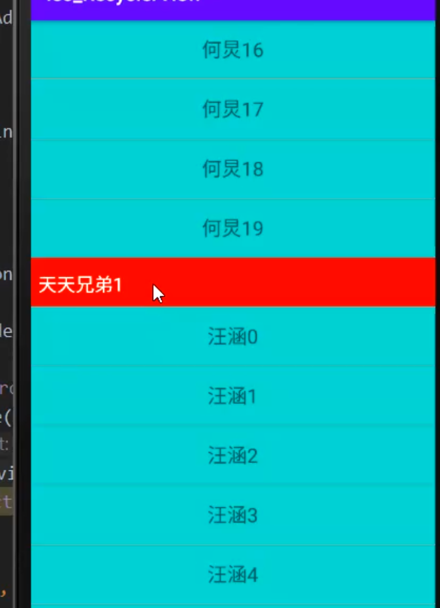

## 1、重写 getItemOffsets 判断item偏移，如果是分组的header 多预留空间
collapsed:: true
	- ## 思路
		- 重写 getItemOffsets 设置itemView偏移，如果是分组的header 多预留空间,否则正常细分割线
	- 
	- 代码
		- ```java
		      @Override
		      public void getItemOffsets(@NonNull Rect outRect, @NonNull View view, @NonNull RecyclerView parent, @NonNull RecyclerView.State state) {
		          super.getItemOffsets(outRect, view, parent, state);
		  
		          if (parent.getAdapter() instanceof StarAdapter) {
		              StarAdapter adapter = (StarAdapter) parent.getAdapter();
		              int position = parent.getChildLayoutPosition(view);
		              boolean isGroupHeader = adapter.isGourpHeader(position);
		              // 怎么判断 itemView是头部
		              if (isGroupHeader) {
		                  // 如果是头部，预留更大的地方
		                  outRect.set(0, groupHeaderHeight, 0, 0);
		              } else {
		                  // 1像素
		                  outRect.set(0, 4, 0, 0);
		              }
		          }
		      }
		  
		  
		      /**
		       * 是否是组的第一个item
		       *
		       * @param position
		       * @return
		       */
		      public boolean isGourpHeader(int position) {
		          if (position == 0) {
		              return true;
		          } else {
		              String currentGroupName = getGroupName(position);
		              String preGroupName = getGroupName(position - 1);
		              if (preGroupName.equals(currentGroupName)) {
		                  return false;
		              } else {
		                  return true;
		              }
		          }
		      }
		  ```
- ## 2、onDraw 上上边空出来的，绘制header 和 分割线。上边只是空出来的区域，显示的是recyclerView 的底色
  collapsed:: true
	- ## 思路
		- 1、onDraw 是绘制在ItemView之后的。itemView可以遮挡，OnDraw的绘制。这里看到可以跟着滑动
		- 2、遍历所有的子view
		- 3、找到分组中的第一个view。在上方绘制宽分割线，其他的都绘制细分割线
	- ## 容错代码
		- 效果
		  collapsed:: true
			- 
	- 代码
		- ```java
		      /**
		       * 是否是组的第一个item
		       *
		       * @param position
		       * @return
		       */
		      public boolean isGourpHeader(int position) {
		          if (position == 0) {
		              return true;
		          } else {
		              String currentGroupName = getGroupName(position);
		              String preGroupName = getGroupName(position - 1);
		              // 当前item和 上一个组名一样，肯定不是组内第一个item
		              if (preGroupName.equals(currentGroupName)) {
		                  return false;
		              } else { // 当前item  和 上一个不一样。则是组内第一个item。在他上方可以绘制宽组分割线
		                  return true;
		              }
		          }
		      }
		  ```
		- ```java
		   @Override
		      public void onDraw(@NonNull Canvas c, @NonNull RecyclerView parent, @NonNull RecyclerView.State state) {
		          super.onDraw(c, parent, state);
		          if (parent.getAdapter() instanceof StarAdapter) {
		              StarAdapter adapter = (StarAdapter) parent.getAdapter();
		              // 当前屏幕的item个数，屏幕外就不绘制了
		              int count = parent.getChildCount();
		              // 要绘制的左右和上下分割线 无关，那么可以直接拿
		              int left = parent.getPaddingLeft();
		              int right = parent.getWidth() - parent.getPaddingRight();
		  
		              for (int i = 0; i < count; i++) {
		                  // 获取对应i的View
		                  View view = parent.getChildAt(i);
		                  // 获取View的布局位置
		                  int position = parent.getChildLayoutPosition(view);
		                  // 是否是头部
		                  boolean isGroupHeader = adapter.isGourpHeader(position);
		                  // 当前position 是组内第一个view && 处理有padding的情况。到顶 了 recyclerview上方的padding部分就不绘制了
		                  if (isGroupHeader && view.getTop() - groupHeaderHeight - parent.getPaddingTop() >= 0) {
		                      // 这个是组的矩形区域。为宽分组矩形区域的顶部坐标。view.getTop()为矩形区域的底部坐标。因为当前position是itemView它是组内第一个
		                      // 在它上方绘制 宽分割线
		                      c.drawRect(left, view.getTop() - groupHeaderHeight, right, view.getTop(), headPaint);
		                      // 绘制文字
		                      String groupName = adapter.getGroupName(position);
		                      textPaint.getTextBounds(groupName, 0, groupName.length(), textRect);
		                      // 绘制文字 基线校正
		                      c.drawText(groupName, left + 20, view.getTop() -
		                              groupHeaderHeight / 2 + textRect.height() / 2, textPaint);
		                  } else if (view.getTop() - groupHeaderHeight - parent.getPaddingTop() >= 0) {
		                      // 分割线，使用画笔颜色绘制分割线
		                      c.drawRect(left, view.getTop() - 4, right, view.getTop(), headPaint);
		                  }
		              }
		          }
		      }
		  
		  ```
	- 
- ## 3、重写onDrawOver，绘制当前组的 吸顶效果
  collapsed:: true
	- ## 思路
		- 1、吸顶的位置固定的，需要通过onDrawOver绘制在上方。而跟随列表滑动的组分割线，是通过onDraw绘制的
		- 2、找到当前屏幕第一个可见的ItemVIew对应的position
		- 3、如果第一个可见item。下一个条目，是另一个组的第一个条目。
		  collapsed:: true
			- ```java
			      // 当第二个是组的头部的时候,开始第二个组，顶第一个组
			              boolean isGroupHeader = adapter.isGourpHeader(position + 1);
			  ```
		- 4、会出现下一组的组分割线，向上。正在吸顶的分割线被顶上去了（实际上绘制的区域变小而已）
		  collapsed:: true
			- 绘制区域逐渐变小
				- ```java
				   int bottom = Math.min(groupHeaderHeight, itemView.getBottom() - parent.getPaddingTop());
				  ```
		- 5、如果第一个可见item。下一个条目还是本组的，那么onDrawOver一直在顶上绘制当前吸顶效果的那个宽组
		- 6、当4中第二组往上顶第一组，其实是正在吸顶的绘制区域逐渐变小了。下一组的通过onDraw跟随滑动的逐渐上移。造成的顶上去的视觉、等到第一组的变小为0时。已经触发了isGroupHeader当前可见的下一个不是另一组了。于是用onDrawOver。绘制了新组区域了
	- 代码
		- ```java
		  @Override
		      public void onDrawOver(@NonNull Canvas c, @NonNull RecyclerView parent, @NonNull RecyclerView.State state) {
		          super.onDrawOver(c, parent, state);
		          if (parent.getAdapter() instanceof StarAdapter) {
		              StarAdapter adapter = (StarAdapter) parent.getAdapter();
		              // 返回可见区域内的第一个item的position
		              int position = ((LinearLayoutManager) parent.getLayoutManager()).findFirstVisibleItemPosition();
		              // 获取对应position的View.第一个可见的ItemView
		              View itemView = parent.findViewHolderForAdapterPosition(position).itemView;
		              // 左右就还是
		              int left = parent.getPaddingLeft();
		              int right = parent.getWidth() - parent.getPaddingRight();
		              // top 就是recyclerview 上的top
		              int top = parent.getPaddingTop();
		              // 当第二个是组的头部的时候,开始第二个组，顶第一个组
		              boolean isGroupHeader = adapter.isGourpHeader(position + 1);
		              if (isGroupHeader) {
		                  int bottom = Math.min(groupHeaderHeight, itemView.getBottom() - parent.getPaddingTop());
		  
		                  c.drawRect(left, top, right, top + bottom, headPaint);
		                  String groupName = adapter.getGroupName(position);
		                  textPaint.getTextBounds(groupName, 0, groupName.length(), textRect);
		                  c.drawText(groupName, left + 20, top + bottom
		                          - groupHeaderHeight / 2 + textRect.height() / 2, textPaint);
		              } else {
		                  // 绘制当前可见itemView  的 header  onDrawOver 会遮住ItemView
		                  c.drawRect(left, top, right, top + groupHeaderHeight, headPaint);
		                  String groupName = adapter.getGroupName(position);
		                  textPaint.getTextBounds(groupName, 0, groupName.length(), textRect);
		                  c.drawText(groupName, left + 20, top + groupHeaderHeight / 2 + textRect.height() / 2, textPaint);
		              }
		  
		          }
		      }
		  ```
-
- ## [[自定义ItemDecoration实现吸顶-面试]]