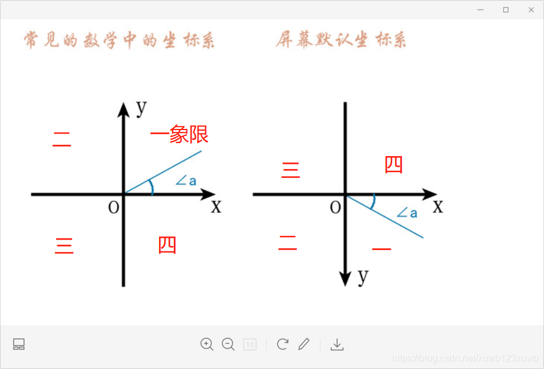
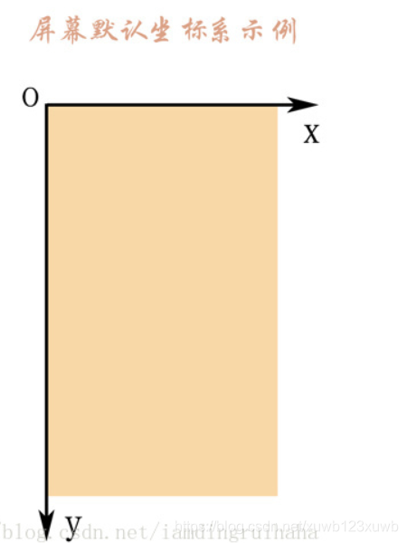
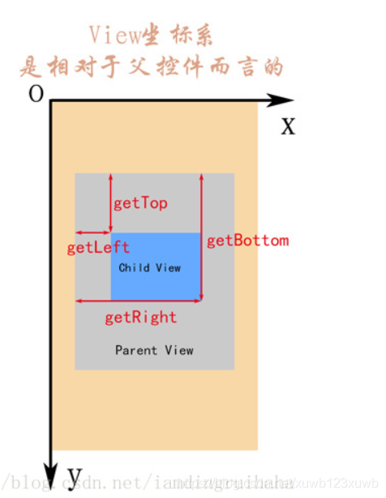
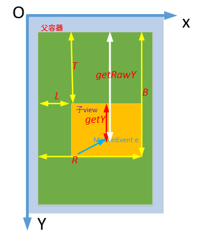
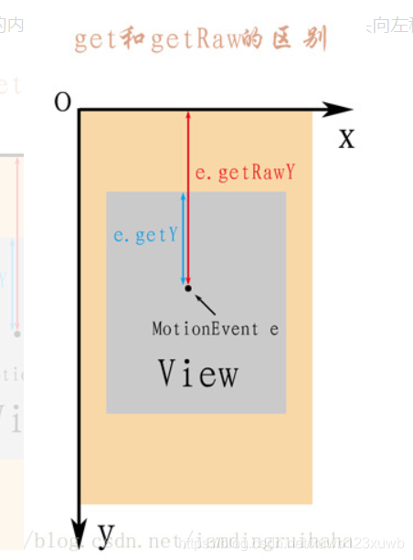

- # 一  屏幕坐标系和 数学坐标系的区别
  collapsed:: true
	- 由于移动设备一般定义屏幕左上角为坐标原点，向右为x轴增大方向，向下为y轴增大方向， 所以在手机屏幕上的坐标系与数学中常见的坐标系是稍微有点差别的，详情如下：
	- 其中的∠a 是对应的，注意y轴方向
	- 1 Android 坐标系 y轴  和 数学坐标系的Y轴是相反的
	- 2 安卓坐标系的角度向下转是正角度          数学坐标系向上转是正角度
	- 
	- ## 实际[[#red]]==屏幕坐标系== 以屏幕右上角为原点
		- 
- # 二 [[#red]]==**view的坐标系**==
	- 
	-
	- getTop();       //获取**子View左上角距父View顶部**的距离
	- getLeft();      //获取**子View左上角距父View左侧**的距离
	- getBottom();    //获取**子View右下角距父View顶部的**距离
	- getRight();     //获取**子View右下角距父View左侧**的距离
- # 三、MotionEvent中 get 和 getRaw 的区别
	- 
	- 
	- event.getX();       //触摸点相对于其所在组件坐标系的坐标
	- event.getY();
	- event.getRawX();    //触摸点相对于屏幕默认坐标系的坐标
	- event.getRawY();
- # 四、[[Android坐标系总结-面试]]