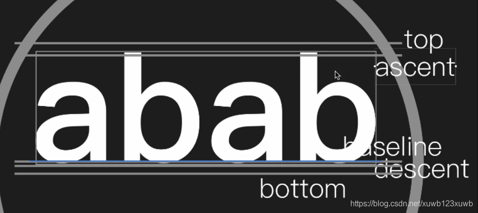

- 
- 文字 五条基准线：top  ascent    baseline  descent  bottom
- ascent   上升 ：表示文字 主体部分 核心部分的 顶 在哪里   并不会刚好把b的顶部盖住
- descent  下降 ：表示文字 主体部分 核心部分的 底 在哪里
- top  bottom  表示 最多 绘制到哪里
-
- ascent      descent  这两条基线  与绘制的文字 无关     与 设置的字体有关        解决办法：以ascent      descent   作为上下边界   则中心点就不会变了
- ```java
  canvas.drawText("abab", width / 2f, height / 2f-(fontMatrix.ascent+fontMatrix.descent)/2, paint)
  ```