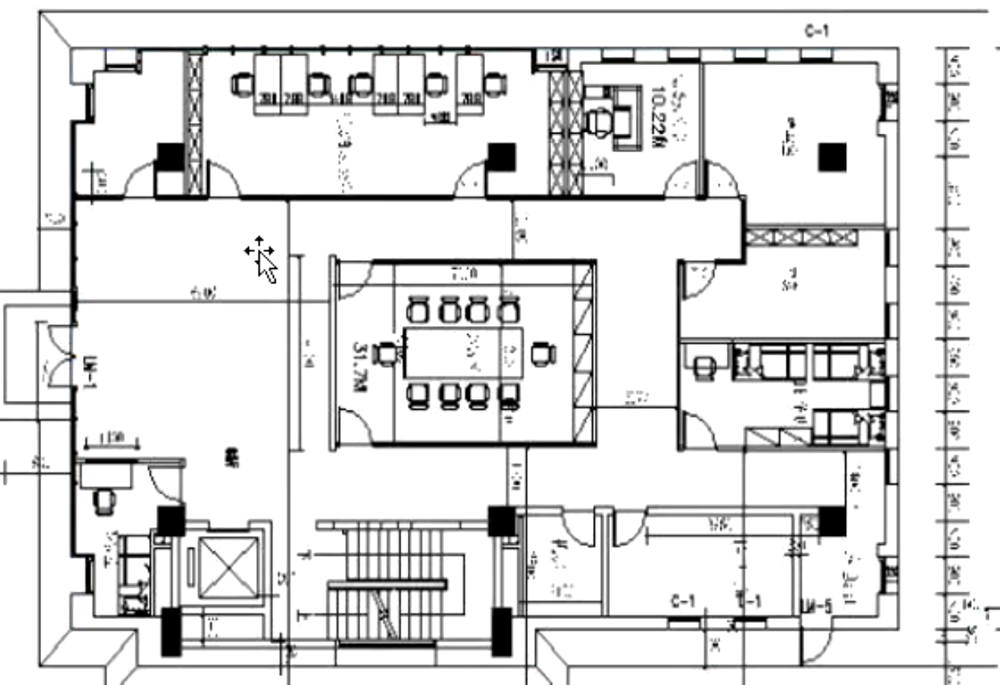

- # 背景
	- 有一套房子（ViewGroup），交房的时候给我说90平
- # 自定义ViewGroup
	- onMeasure测量：
	  collapsed:: true
		- 我需要测量实际有没有这么大需要测量多少平，房子又不是开间，有屋子（view）需要挨个测量view的大小，把子view 相加，就得到了总大小
	- onLayout布局
	  collapsed:: true
		- 相当于装修图纸，设计布局，将子view排好
		- 
	- 一般不需要实现绘制onDraw，如果实现就是绘制分割线
		- 是子view的内部绘制了
- # 自定义view需要实现
	- onMeasure
	- onDraw