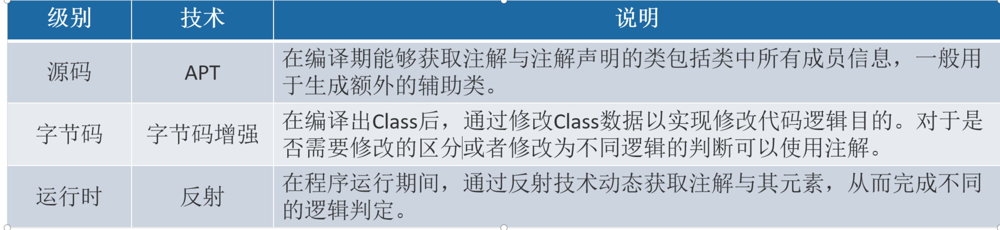

- 元注解是Java中用来定义其他注解的注解，它们具有特殊的作用，可以帮助我们更加灵活地定义注解。元注解有四种，分别是@Retention、@Target、@Documented和@Inherited。
## 1、@Retention：用于指定注解的生命周期，包括三种枚举值：
	- 
	- SOURCE：注解[[#red]]==**只存在于源代码中，在编译后被丢弃**==，不会出现在运行时环境中。
	- [[#red]]==**CLASS：注解存在于源代码和编译后的字节码中**==，在运行时环境中不会被加载，是默认值。
	- [[#red]]==**RUNTIME：注解存在于源代码、编译后的字节码和运行时环境中，可以在运行时被加载和使用。**==
	  使用场景：当我们需要在运行时反射获取注解信息时，必须将注解的Retention设置为RUNTIME，否则无法获取。
## 2、@Target：用于指定注解可以应用的目标类型，包括一些ElementType枚举值：
collapsed:: true
	- TYPE：可以应用在类、接口、枚举类上。
	- FIELD：可以应用在类的成员变量上。
	- METHOD：可以应用在类的方法上。
	- PARAMETER：可以应用在方法的参数上。
	- CONSTRUCTOR：可以应用在类的构造函数上。
	- LOCAL_VARIABLE：可以应用在局部变量上。
	- ANNOTATION_TYPE：可以应用在注解上。
	- PACKAGE：可以应用在包声明上。
	  使用场景：当我们定义自己的注解时，需要指定该注解可以应用的目标类型，避免不合法的使用。
	- ## 使用时可以一起定义多个
		- 
## 3、@Documented：用于指定注解是否包含在JavaDoc文档中，如果一个注解被@Documented注解修饰，则它会被包含在JavaDoc文档中。
collapsed:: true
	- 使用场景：当我们需要将注解的信息包含在文档中，方便其他人查看时，可以使用该元注解。
## 4、@Inherited：用于指定注解是否可被继承，默认情况下注解是不可继承的。
collapsed:: true
	- 使用场景：当我们需要将注解应用到父类上，并且希望子类自动继承该注解时，可以使用该元注解。
- 总的来说，元注解是用于修饰注解的注解，它们可以帮助我们更加灵活地定义注解，使得注解的作用更加精确、有效。