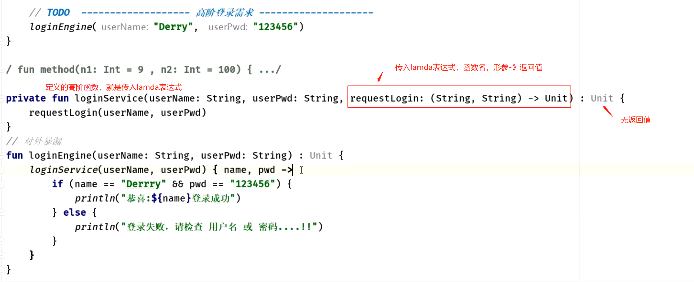
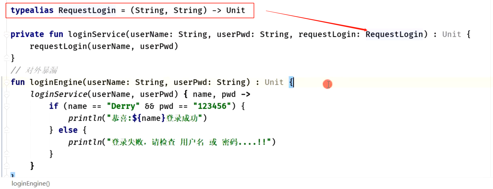

- ```kotlin
  // 源代码
  fun test(a : Int , b : Int) : Int{
      return a + b
  }
  
  fun sum(num1 : Int , num2 : Int) : Int{
      return num1 + num2
  }
  
  // 调用
  test(10,sum(3,5)) // 结果为：18
  
  // lambda
  fun test(a : Int , b : (num1 : Int , num2 : Int) -> Int) : Int{
      return a + b.invoke(3,5)
  }
  
  // 调用
  test(10,{ num1: Int, num2: Int ->  num1 + num2 })  // 结果为：18
  ```
- 可以看出上面的代码中，直接在我的方法体中写死了数值，这在开发中是很不合理的，并且也不会这么写。上面的例子只是在阐述`Lambda`的语法。接下来我另举一个例子：
- ## 示例1，定义有返回值的高阶函数
  collapsed:: true
	- ## 例1：传入两个参数，并传入一个函数来实现他们不同的逻辑
	  collapsed:: true
		- 例：
			- ```kotlin
			  // 定义高阶函数
			  private fun resultByOpt(num1 : Int , num2 : Int , result : (Int ,Int) -> Int) : Int{
			      return result(num1,num2)
			  }
			  
			  private fun testDemo() {
			      val result1 = resultByOpt(1,2){
			          num1, num2 ->  num1 + num2
			      }
			  
			      val result2 = resultByOpt(3,4){
			          num1, num2 ->  num1 - num2
			      }
			  
			      val result3 = resultByOpt(5,6){
			          num1, num2 ->  num1 * num2
			      }
			  
			      val result4 = resultByOpt(6,3){
			          num1, num2 ->  num1 / num2
			      }
			  
			      println("result1 = $result1")
			      println("result2 = $result2")
			      println("result3 = $result3")
			      println("result4 = $result4")
			  }
			  输出结果为：
			  result1 = 3
			  result2 = -1
			  result3 = 30
			  result4 = 2 
			  ```
		- 这个例子是根据传入不同的`Lambda`表达式，实现了两个数的`+、-、*、/`。
		  当然了，在实际的项目开发中，自己去定义高阶函数的实现是很少了，因为用系统给我们提供的高阶函数已经够用了。不过，当我们掌握了`Lambda`语法以及怎么去定义高阶函数的用法后。在实际开发中有了这种需求的时候也难不倒我们了。
	- ## 例2
	  collapsed:: true
		- ```kotlin
		  // 高阶函数的定义
		  // 定义：mm: ()-> Boolean 参数为L:  无参，返回值为Boolean  的 lamda函数
		  	需要调用方传入函数实体
		  // 整个高阶函数的返回值为int。
		  	
		  fun loginTest(mm: ()-> Boolean) : Int {
		      // 直接拿函数
		      val result = mm()
		      println("result:$result")
		  
		      return 99999
		  }
		  ```
		- 高阶函数loginTest的返回值为Int，传入函数的mm返回值为Boolean类型 。他们可以关联也可以不关联
		- ```kotlin
		      // 有返回值
		      val r = loginTest() { 
		          true
		      }
		      // 整体返回值为Int  内部返回值为Boolean
		  ```
- ## 示例2，定义无返回值的高阶函数
  collapsed:: true
	- ## 1、将函数传入的
	  collapsed:: true
		- 
	- ## 2、将函数提取出来，与1等价
		- 
- ## 示例3，[[模拟kt提供的标准高阶函数]]
- ## 示例4、定义高阶函数后，使用上几种写法
	- ## 示例1、lamda单参数可用it
	  collapsed:: true
		- ### 定义
			- ```kotlin
			  fun show1(name:String = "李连杰", mm: (String) -> Unit) {
			      mm(name)
			  }
			  ```
		- ### 使用
			- ### 写法1、高阶函数最后一个参数为 lamda表达式，可以放在最外层
				- ```kotlin
				      // 1、最后一个
				      show1("Derry") {
				          println("输出：$it")
				      }
				  ```
			- ### 写法2、放参数位置，定义变量名
				- ```kotlin
				  
				      show1("李元霸", mm = {
				          println("输出2：$it")
				      })
				  ```
			- ### 写法3、省略 =
				- ```kotlin
				    show1("雄霸", {
				          println("输出3：$it")
				      })
				  ```
			- ### 写法4、参数一有默认值，可以不填
				- ```kotlin
				      show1 {
				          println("输出4： $it")
				      }
				  ```
	- ## 示例2、lamda多参数，自己声明变量名
	  collapsed:: true
		- ```kotlin
		  fun sun2(mm: (Int, Boolean) -> Unit) {
		      mm(9, true)
		  }
		  ```
		- ```kotlin
		      // 两个参数的话，就没法默认it，就需要手动指定
		      sun2({ n1, b2 ->
		  
		      })
		  ```
	- ## 示例3、高阶函数，lamda参数通过`::` 传入函数代替
	  collapsed:: true
		- ### 高阶函数
			- ```kotlin
			  fun t01(mm: (Int) -> String) {
			      println(mm(88))
			  }
			  ```
		- ### 以前使用,直接用闭包
			- ```kotlin
			      // 以前 { 里面直接把事情干了 }
			      t01() {
			          ""
			      }
			  ```
		- ### 可以用：： 传递函数
			- 定义函数
				- ```kotlin
				  fun run01(number:Int) : String = "OK $number"
				  ```
			- ```kotlin
			     t01( ::run01 )
			  ```
		- ### :: 含义 拿到函数，变成函数类型的对象,可写成这样
			- ```kotlin
			      // ::  == 拿到 run01 函数  （run01 变成函数类型的对象）
			      val r01 = ::run01
			      val r02 = r01
			  
			      t01( r02 )
			  ```
- ## 实战:自定义轮循器
	- ```kotlin 
	  // 自定义轮询器  传入 9  我就给你 轮询9次
	  inline fun doCounts(counts: Int, mm:(Int) -> Unit) {
	  
	      // 0 1 2 3 4 5 6 7 8
	      for (index in 0 until counts) {
	          mm(index)
	      }
	  
	  }
	  
	  
	  使用
	          doCounts(100) {
	              println("执行了一次  下标是:$it")
	          }
	  ```
- ## 实战：自定义线程
	- ```kotlin
	  // 自定义线程封装
	  fun ktrun(
	      start: Boolean = true,
	      name: String ? = null,
	      // ... 省略
	      myRunAction: () -> Unit) : Thread {
	  
	      val thread = object : Thread() {
	          override fun run() {
	              super.run()
	  
	              myRunAction()
	          }
	      }
	  
	      name ?: "DerryThread"
	  
	      if (start)
	          thread.start()
	  
	      return thread
	  }
	  ```
	- ```kotlin
	   ktrun() {
	          doCounts(100) {
	              println("执行了一次  下标是:$it")
	          }
	      }
	  ```