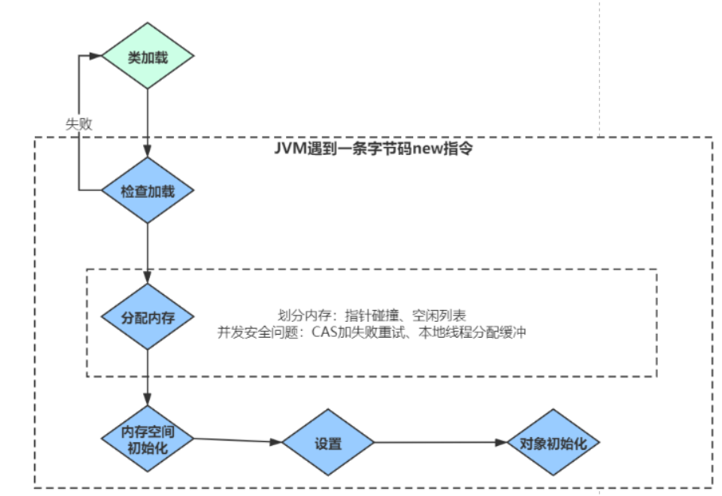

- 
- # 1）检查类是否加载
	- 虚拟机遇到一条new指令时，首先检查是否被类加载器加载，如果没有，类加载器把class加载到JVM的运行时数据区
	  collapsed:: true
		- 首先检查这个指令的参数是否能在常量池中定位到一个类的符号引用（**符号引用**** ****：**符号引用以一组符号来描述所引用的目标），并且检查类是否已经被加载、解析和初始化过，没有的话走类加载。
- #  2）[[分配内存]]
	- ## 分配内存方法-根据内存是否规整分为
		- ## 1、规整-指针碰撞
			- 所有用过的内存都放在一边，空闲的内存放在另一边，中间通过一个指针分离
			- 那分配内存就是把那个指针向空闲空间那边挪动一段与对象大小相等的距离
		- ## 2、不规整-空闲列表
			- 已使用的内存和空闲的内存相互交错，虚拟机就必须维护一个列表，记录上哪些内存块是可用的
			- 在分配的时候从列表中找到一块足够大的空间划分给对象实例，并更新列表上的记录，
	- ## 分配内存保证线程安全
		- ## 1、CAS
			- 对分配内存空间的动作进行同步处理——实际上虚拟机采用CAS+失败重试的方式保证更新操作的原子性
			  id:: 64ede0d8-d4a1-4cbf-b0a7-106368926ac0
		- ## 2、本地线程分配缓冲（Thread Local Allocation Buffer,TLAB），
			- 每个线程在线程初始化时，在Java堆中预先分配一小块私有内存，分配内存时只在自己私有内存中分配，这样不存在竞争的情况。
			- [[#red]]==**允许在年轻代空间中使用线程本地分配块**==（TLAB）。默认情况下启用此选项。要禁用TLAB，请指定-XX:-UseTLAB。
- # 3）内存空间初始化
	- 虚拟机将分配到的内存空间 进行[[#red]]==**默认值初始化**==：如int值为0，boolean值为false等等（注意不是构造方法）
	  collapsed:: true
		- [[#red]]==**虚拟机需要将分配到的内存空间都初始化为零值()。**== 初始化默认值
		- 这一步操作保证了对象的实例字段在Java代码中可以不赋初始值就直接使用，程序能访问到这些字段的数据类型所对应的零值。
- # 4）设置对象头信息：类的原数据信息、对象hashCode、GC分代年龄
  collapsed:: true
	- 接下来，虚拟机要对对象进行必要的设置，例如这个对象是哪个类的实例、如何才能找到类的元数据信息（Java classes在Java hotspot VM内部表示为类元数据）、对象的哈希码、对象的GC分代年龄等信息。[[#red]]==**这些信息存放在对象的对象头之中。**==
- # 5）对象初始化：按照构造方法进行对象初始化
  collapsed:: true
	- 在上面工作都完成之后，从虚拟机的视角来看，一个新的对象已经产生了，但从Java程序的视角来看，对象创建才刚刚开始，所有的字段都还为零值。所以，一般来说，执行new指令之后会接着把对象按照程序员的意愿进行初始化(构造方法)，这样一个真正可用的对象才算完全产生出来。