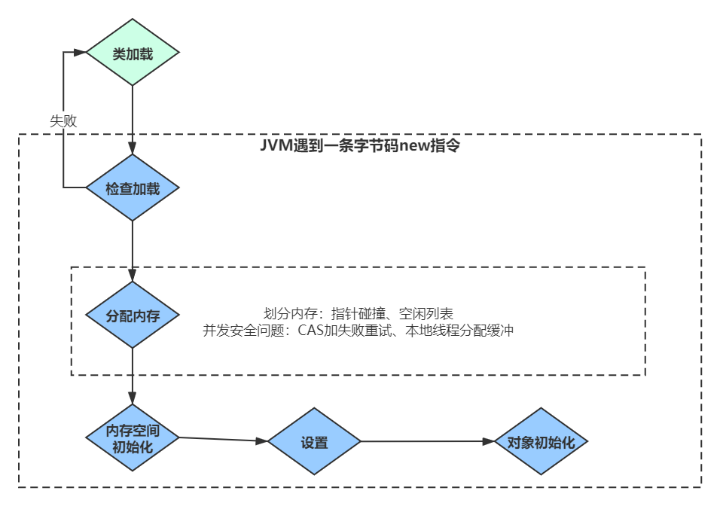

- ## **对象的分配**
  collapsed:: true
	- 虚拟机遇到一条new指令时，首先检查是否被类加载器加载，如果没有，那必须先执行相应的类加载过程。
	- 类加载就是把class加载到JVM的运行时数据区的过程。
- 
- ### **1）检查加载**
	- 首先检查这个指令的参数是否能在常量池中定位到一个类的符号引用（**符号引用**** ****：**符号引用以一组符号来描述所引用的目标），并且检查类是否已经被加载、解析和初始化过，没有的话走类加载。
### **2）[[分配内存]]**
	- 接下来虚拟机将为新生对象分配内存。为对象分配空间的任务等同于把一块确定大小的内存从Java堆中划分出来
### **3）内存空间初始化**
	- （注意不是构造方法）内存分配完成后，虚拟机需要将分配到的内存空间都初始化为零值(如int值为0，boolean值为false等等)。这一步操作保证了对象的实例字段在Java代码中可以不赋初始值就直接使用，程序能访问到这些字段的数据类型所对应的零值。
### **4）设置**
	- 接下来，虚拟机要对对象进行必要的设置，例如这个对象是哪个类的实例、如何才能找到类的元数据信息（Java classes在Java hotspot VM内部表示为类元数据）、对象的哈希码、对象的GC分代年龄等信息。[[#red]]==**这些信息存放在对象的对象头之中。**==
### **5）对象初始化**
	- 在上面工作都完成之后，从虚拟机的视角来看，一个新的对象已经产生了，但从Java程序的视角来看，对象创建才刚刚开始，所有的字段都还为零值。所以，一般来说，执行new指令之后会接着把对象按照程序员的意愿进行初始化(构造方法)，这样一个真正可用的对象才算完全产生出来。