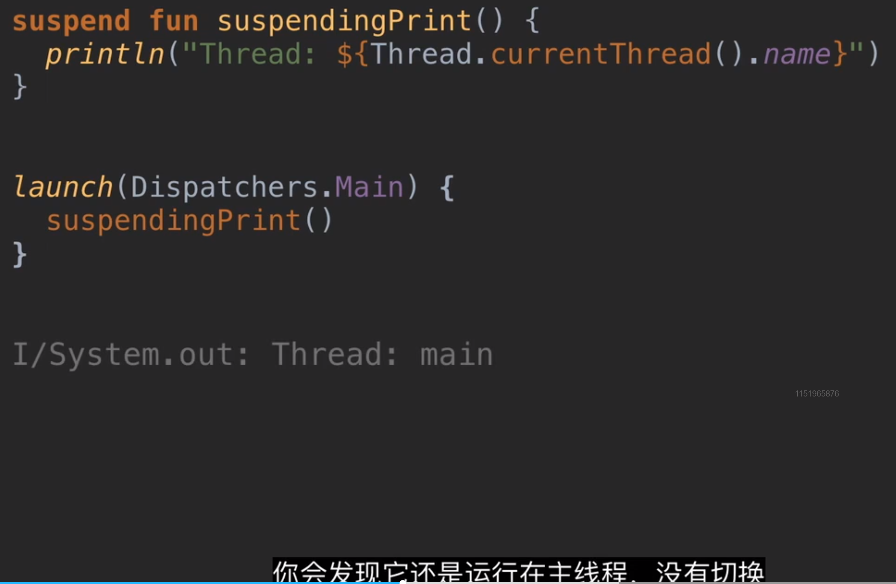

- 不能
- 因为真正触发挂起的，是协程里自带的挂起函数，只声明suspend不会进行线程切换和挂起例如：
  collapsed:: true
	- 
- ## 总结
	- 协程真正被挂起，或者切线程，并不是发生在外部这个挂起函数被调用的时候。
	- 而是协程里自带的一个挂起函数，内部实现了挂起代码的。
	- withContext 或者 其他挂起函数，内部会调用到真正能挂起，或者切换线程的代码。
	- 我们想要挂起。则需要调用到协程自带的挂起函数。
- ## 那suspend不能直接挂起，添加这个关键字的作用？
	- 是函数创建者，对函数调用者的提醒，
	- 提醒我是一个耗时函数，因此我被我的创建者用挂起的方式放在后台运行。
	- 所以请在协程里调用我。防止在主线程里调用了耗时函数
	-