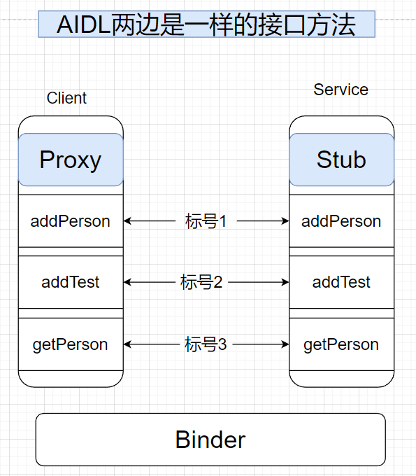

- # 一、参数解读
	- ```java
	  mRemote.transact(Stub.TRANSACTION_addPerson, _data, _reply, 0);
	  ```
	- ## 第一个参数：Stub中的常量Stub.TRANSACTION_addPerson
		- 代表方法标号，传个1给服务端，告诉他我调用的是addPerson这个方法，其实是个常量1
		- ```java
		    static final int TRANSACTION_addPerson = (android.os.IBinder.FIRST_CALL_TRANSACTION + 0);
		      static final int TRANSACTION_addTest = (android.os.IBinder.FIRST_CALL_TRANSACTION + 1);
		      static final int TRANSACTION_getPersonList = (android.os.IBinder.FIRST_CALL_TRANSACTION + 2);
		  ```
		- ## 解读
		  collapsed:: true
			- Proxy类相当于客户端侧的去调用
			- Stub相当于 服务端类的去调用
			- 
			- 当客户端通过Proxy（IPersonManaer.java）接口的代理对象，调用addPerson方法时，实际上通过传递标号1（Stub.TRANSACTION_addPerson）来告诉服务端的Stub，
			- Stub来根据1去匹配方法，得知客户端调用的addPerson，去具体处理
		- ## 优点
			- 节约内存，更加方便简单，发送1比发送字符串简单
- # 二、客户端调用transact方法后会被挂起
- # 三、然后进入服务端的Stub的onTransact()方法，处理客户端的具体请求
	- 代码
		- ```java
		      @Override
		      protected boolean onTransact(int code, Parcel data, Parcel reply, int flags) throws RemoteException {
		          switch (code) {
		              case INTERFACE_TRANSACTION:
		                  reply.writeString(DESCRIPTOR);
		                  return true;
		  
		              case TRANSACTION_addPerson:
		                  Log.e("leo", "Stub,TRANSACTION_addPerson: " + Thread.currentThread());
		                  data.enforceInterface(DESCRIPTOR);
		                  Person arg0 = null;
		                  if ((0 != data.readInt())) {
		                      arg0 = Person.CREATOR.createFromParcel(data);
		                  }
		                  this.addPerson(arg0);
		                  reply.writeNoException();
		                  return true;
		  
		              case TRANSACTION_getPersonList:
		                  data.enforceInterface(DESCRIPTOR);
		                  List<Person> result = this.getPersonList();
		                  reply.writeNoException();
		                  reply.writeTypedList(result);
		                  return true;
		          }
		          return super.onTransact(code, data, reply, flags);
		      }
		  ```
	- 客户端通过Proxy调用：mRemote.transact(Stub.TRANSACTION_addPerson, _data, _reply, 0);
	- 客户端挂起
	- 服务端进入onTransact（）方法，匹配TRANSACTION_addPerson，调用this.addPerson(arg0)
		- this，就是服务端RomeService中的 那个new Stub()对象,
		  collapsed:: true
			- ```java
			  package com.lemonydbook.server;
			  
			  import android.app.Service;
			  import android.content.Intent;
			  import android.os.IBinder;
			  import android.os.RemoteException;
			  import android.util.Log;
			  
			  import com.lemonydbook.IPersonManager;
			  import com.lemonydbook.bean.Personon;
			  import com.lemonydbook.bean.Test;
			  
			  import java.util.ArrayList;
			  import java.util.List;
			  
			  import androidx.annotation.Nullable;
			  
			  /**
			   *  另一个进程的远程服务
			   */
			  public class RemoteService extends Service {
			  
			      private ArrayList<Personon> Personons;
			      private ArrayList<Test> Tests;
			      @Nullable
			      @Override
			      public IBinder onBind(Intent intent) {
			          Personons = new ArrayList<>();
			          Tests = new ArrayList<>();
			          Log.e("LeoAidlService", "success onBind");
			          return iBinder;
			      }
			  
			      /**
			       * */
			      private IBinder iBinder = new IPersonManager.Stub() {
			  
			          @Override
			          public void addTest(Test test) throws RemoteException {
			              Tests.add(test);
			          }
			  
			          @Override
			          public void addPerson(Personon Personon) throws RemoteException {
			              Personons.add(Personon);
			          }
			  
			          @Override
			          public List<Personon> getPersonList() throws RemoteException {
			              return Personons;
			          }
			      };
			  }
			  
			  ```
		- 相当于调用到了服务端这里
	-